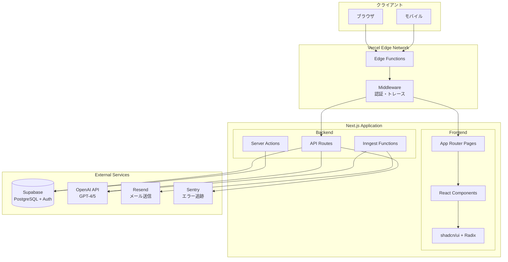
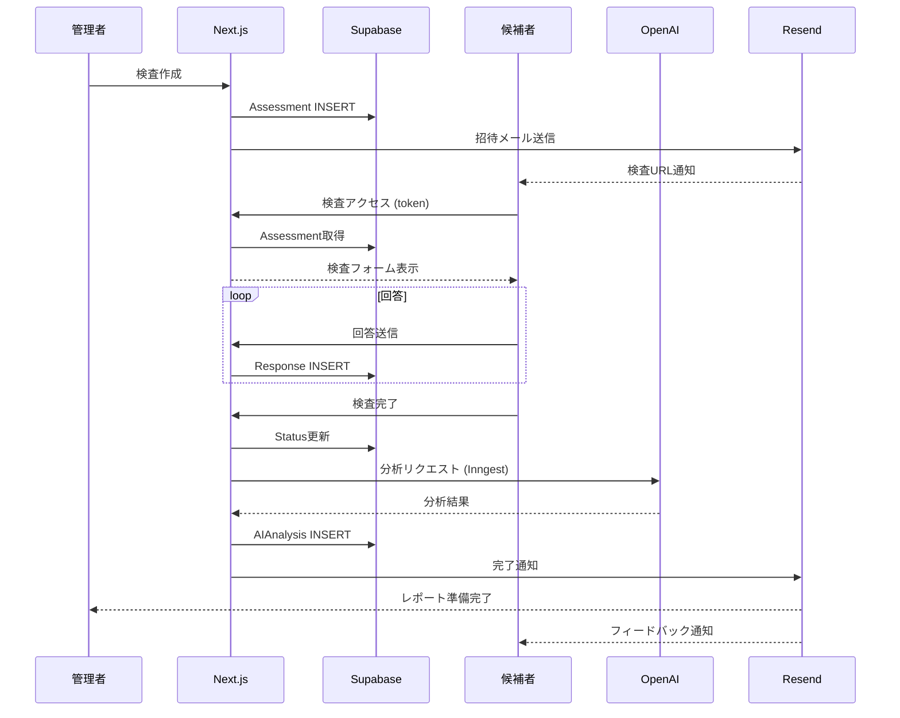
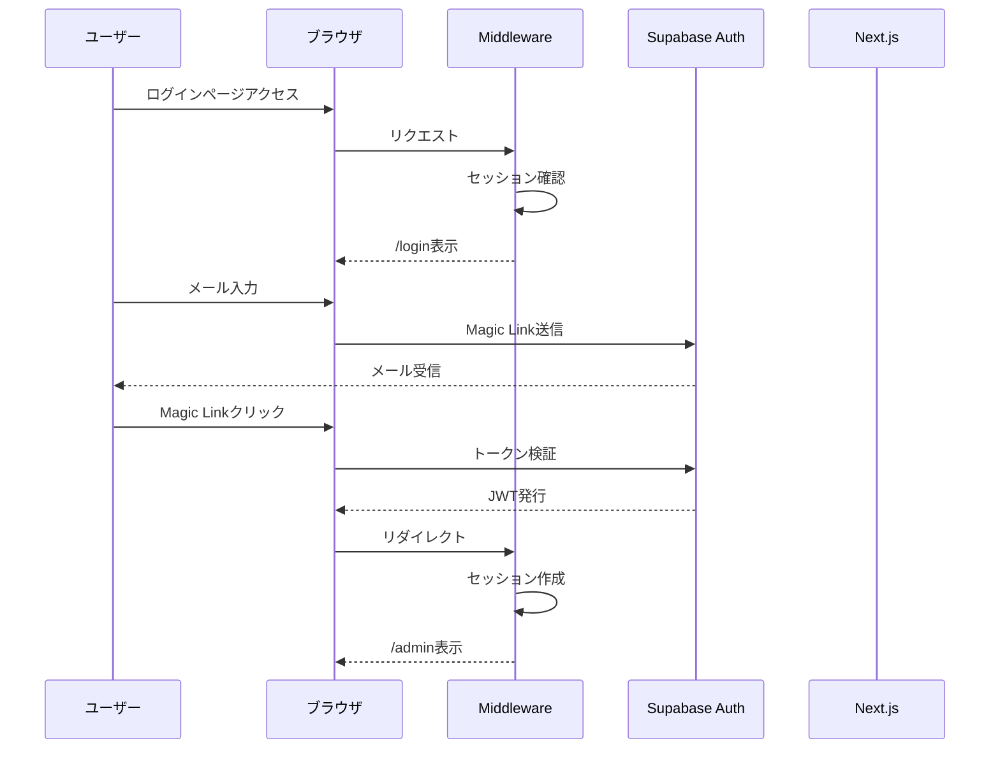
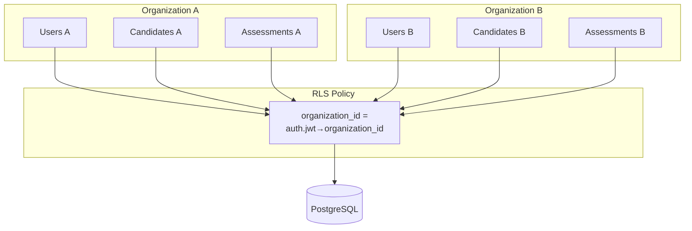
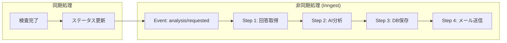
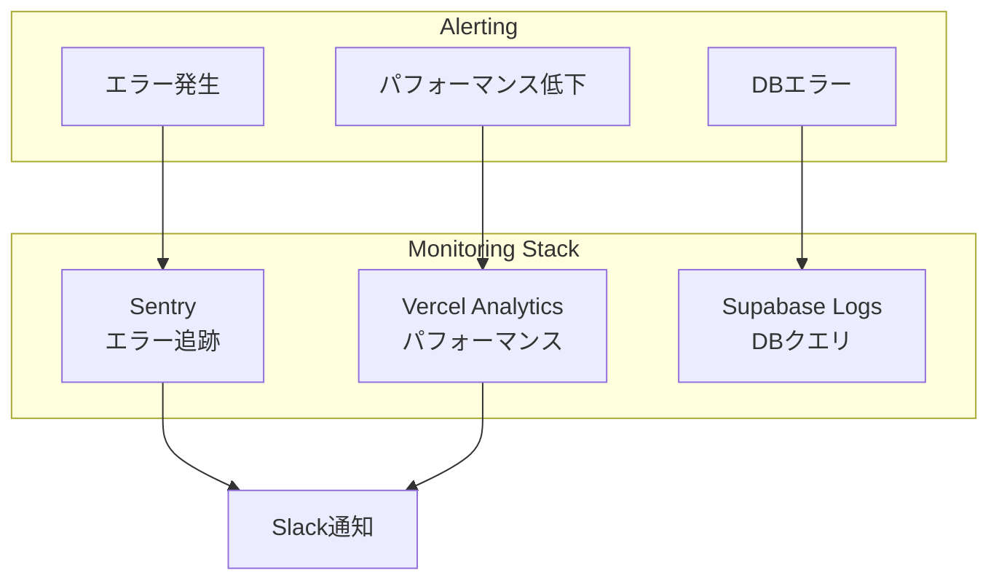

# システムアーキテクチャ

## 全体構成図



## 技術選定理由

### Next.js 16 (App Router)

| 選定理由 | 詳細 |
|---------|------|
| **Server Components** | DBアクセスをサーバーサイドで完結、バンドルサイズ削減 |
| **Server Actions** | フォーム処理の簡素化、型安全なAPI呼び出し |
| **Edge Runtime** | 認証ミドルウェアの高速化 |
| **Streaming** | AI分析結果の段階的表示 |

### Supabase

| 選定理由 | 詳細 |
|---------|------|
| **PostgreSQL** | 堅牢なRDBMS、複雑なクエリ対応 |
| **RLS** | テーブルレベルのマルチテナント分離 |
| **Auth** | JWT認証、Magic Link対応 |
| **リアルタイム** | 将来的なリアルタイム機能拡張 |

### OpenAI API

| 選定理由 | 詳細 |
|---------|------|
| **GPT-4/5** | 高精度な文章理解・分析 |
| **JSON Mode** | 構造化されたレスポンス |
| **Function Calling** | 複雑な分析タスクの分解 |

## レイヤー構成

```
┌─────────────────────────────────────────────────────────────┐
│ Presentation Layer                                          │
│ ┌─────────────┐ ┌─────────────┐ ┌─────────────┐            │
│ │   Pages     │ │  Components │ │     UI      │            │
│ │ (App Router)│ │   (React)   │ │(shadcn/Radix│            │
│ └─────────────┘ └─────────────┘ └─────────────┘            │
├─────────────────────────────────────────────────────────────┤
│ Application Layer                                           │
│ ┌─────────────┐ ┌─────────────┐ ┌─────────────┐            │
│ │   Actions   │ │     API     │ │   Inngest   │            │
│ │  (Server)   │ │   Routes    │ │  Functions  │            │
│ └─────────────┘ └─────────────┘ └─────────────┘            │
├─────────────────────────────────────────────────────────────┤
│ Domain Layer                                                │
│ ┌─────────────┐ ┌─────────────┐ ┌─────────────┐            │
│ │  Analysis   │ │   Scoring   │ │   Reports   │            │
│ │   Engine    │ │   Engine    │ │  Generator  │            │
│ └─────────────┘ └─────────────┘ └─────────────┘            │
├─────────────────────────────────────────────────────────────┤
│ Infrastructure Layer                                        │
│ ┌─────────────┐ ┌─────────────┐ ┌─────────────┐            │
│ │  Supabase   │ │   OpenAI    │ │   Resend    │            │
│ │   Client    │ │   Client    │ │   Client    │            │
│ └─────────────┘ └─────────────┘ └─────────────┘            │
└─────────────────────────────────────────────────────────────┘
```

## ディレクトリ構造

```
src/
├── app/                      # Next.js App Router
│   ├── admin/                # 管理画面（認証必須）
│   │   ├── candidates/       # 候補者管理
│   │   ├── assessments/      # 検査管理
│   │   ├── prompts/          # プロンプト管理
│   │   ├── compare/          # 候補者比較
│   │   └── settings/         # ユーザー設定
│   ├── assessment/[token]/   # 候補者検査ページ（公開）
│   ├── report/[token]/       # レポート閲覧（公開）
│   ├── auth/                 # 認証フロー
│   └── api/                  # APIエンドポイント
│
├── components/               # Reactコンポーネント
│   ├── ui/                   # shadcn/ui基盤
│   ├── analysis/             # 分析関連
│   ├── dashboard/            # ダッシュボード
│   └── candidates/           # 候補者管理
│
├── lib/                      # ビジネスロジック
│   ├── supabase/             # DB接続
│   ├── analysis/             # AI分析エンジン
│   ├── actions/              # Server Actions
│   ├── email/                # メール送信
│   └── validations/          # Zodスキーマ
│
└── types/                    # 型定義
    └── database.ts           # Supabase自動生成型
```

## データフロー

### 検査実施フロー



### 認証フロー



## マルチテナント設計



### RLSの仕組み

```sql
-- 例：candidates テーブル
CREATE POLICY "Users can view own organization candidates"
ON candidates FOR SELECT
USING (
  organization_id = (
    SELECT organization_id FROM users
    WHERE id = auth.uid()
  )
);
```

## 非同期処理



### なぜInngestか

| 課題 | Inngestの解決策 |
|-----|----------------|
| API timeout | バックグラウンド実行 |
| 失敗時のリトライ | 自動リトライ（3回） |
| 処理の可視化 | ダッシュボードでモニタリング |
| スケーラビリティ | サーバーレス実行 |

## セキュリティ設計

### 多層防御

```
┌────────────────────────────────────────┐
│ Layer 1: Edge (Vercel)                 │
│ - DDoS Protection                      │
│ - Rate Limiting                        │
└──────────────────┬─────────────────────┘
                   ↓
┌────────────────────────────────────────┐
│ Layer 2: Middleware                    │
│ - 認証チェック                          │
│ - トレースID付与                        │
│ - セキュリティヘッダー                   │
└──────────────────┬─────────────────────┘
                   ↓
┌────────────────────────────────────────┐
│ Layer 3: API Routes                    │
│ - Input Validation (Zod)               │
│ - 権限チェック                          │
└──────────────────┬─────────────────────┘
                   ↓
┌────────────────────────────────────────┐
│ Layer 4: Database (RLS)                │
│ - Row Level Security                   │
│ - Organization スコープ                 │
└────────────────────────────────────────┘
```

### セキュリティヘッダー

```typescript
// middleware.ts
headers: {
  'Strict-Transport-Security': 'max-age=63072000; includeSubDomains',
  'X-Content-Type-Options': 'nosniff',
  'X-Frame-Options': 'SAMEORIGIN',
  'X-XSS-Protection': '1; mode=block',
  'Referrer-Policy': 'strict-origin-when-cross-origin'
}
```

## パフォーマンス最適化

### キャッシュ戦略

| リソース | TTL | 戦略 |
|---------|-----|------|
| Static Assets | 1年 | immutable |
| API Responses | 0 | no-cache |
| ページ | ISR対応 | revalidate |

### コード分割

```typescript
// 動的インポートでバンドルサイズ削減
const SurveyComponent = dynamic(
  () => import('@/components/survey/SurveyRunner'),
  { loading: () => <Skeleton /> }
);
```

## 監視・運用



## 今後の拡張ポイント

1. **スケーラビリティ**
   - Edge Functions活用
   - DB接続プーリング
   - CDNキャッシュ強化

2. **機能拡張**
   - リアルタイム通知（Supabase Realtime）
   - 多言語対応（next-intl）
   - カスタムAIモデル統合

3. **運用改善**
   - Feature Flags（Vercel Edge Config）
   - A/Bテスト基盤
   - より詳細なログ分析
