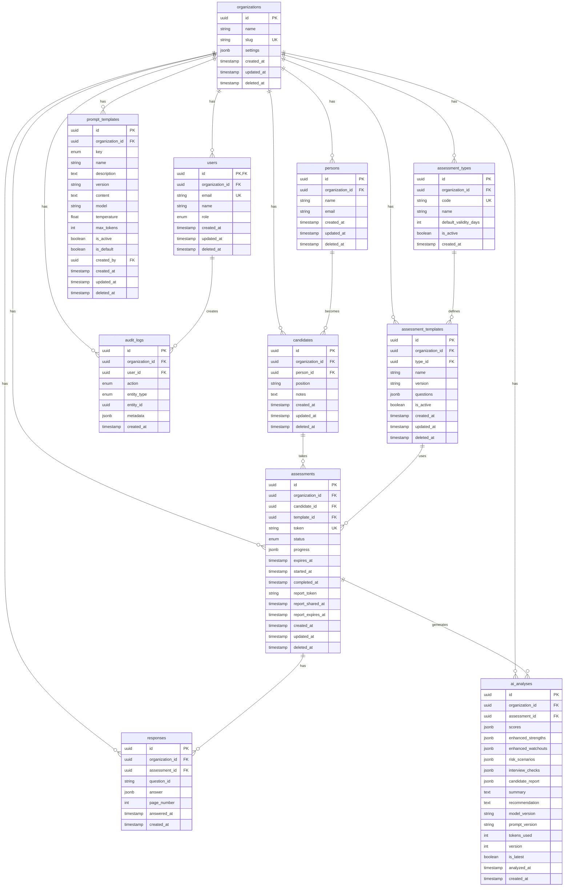

# データベース設計

## ER図



## テーブル詳細

### organizations（組織）

マルチテナントの基盤テーブル。すべてのデータはこのテーブルにリンク。

```sql
CREATE TABLE organizations (
    id UUID PRIMARY KEY DEFAULT gen_random_uuid(),
    name TEXT NOT NULL,
    slug TEXT NOT NULL UNIQUE,
    settings JSONB DEFAULT '{}',
    created_at TIMESTAMPTZ DEFAULT NOW(),
    updated_at TIMESTAMPTZ DEFAULT NOW(),
    deleted_at TIMESTAMPTZ
);
```

| カラム | 型 | 説明 |
|-------|-----|------|
| id | UUID | 主キー |
| name | TEXT | 組織名 |
| slug | TEXT | URLスラッグ（ユニーク） |
| settings | JSONB | 組織設定（カスタマイズ） |
| deleted_at | TIMESTAMPTZ | ソフトデリート用 |

### users（ユーザー）

Supabase Auth連携。`id`は`auth.users.id`と同じ。

```sql
CREATE TABLE users (
    id UUID PRIMARY KEY REFERENCES auth.users(id),
    organization_id UUID NOT NULL REFERENCES organizations(id),
    email TEXT NOT NULL UNIQUE,
    name TEXT NOT NULL,
    role user_role NOT NULL DEFAULT 'viewer',
    created_at TIMESTAMPTZ DEFAULT NOW(),
    updated_at TIMESTAMPTZ DEFAULT NOW(),
    deleted_at TIMESTAMPTZ
);

CREATE TYPE user_role AS ENUM ('admin', 'recruiter', 'viewer');
```

| ロール | 権限 |
|-------|------|
| admin | 全機能（ユーザー管理、設定変更） |
| recruiter | 候補者・検査管理、分析確認 |
| viewer | 読み取り専用 |

### candidates（候補者）

採用候補者。`person`と1:1で紐づく。

```sql
CREATE TABLE candidates (
    id UUID PRIMARY KEY DEFAULT gen_random_uuid(),
    organization_id UUID NOT NULL REFERENCES organizations(id),
    person_id UUID NOT NULL REFERENCES persons(id),
    position TEXT,
    notes TEXT,
    created_at TIMESTAMPTZ DEFAULT NOW(),
    updated_at TIMESTAMPTZ DEFAULT NOW(),
    deleted_at TIMESTAMPTZ
);
```

### assessments（検査セッション）

候補者が受ける検査のインスタンス。

```sql
CREATE TABLE assessments (
    id UUID PRIMARY KEY DEFAULT gen_random_uuid(),
    organization_id UUID NOT NULL REFERENCES organizations(id),
    candidate_id UUID NOT NULL REFERENCES candidates(id),
    template_id UUID NOT NULL REFERENCES assessment_templates(id),
    token TEXT NOT NULL UNIQUE,
    status assessment_status NOT NULL DEFAULT 'pending',
    progress JSONB DEFAULT '{}',
    expires_at TIMESTAMPTZ NOT NULL,
    started_at TIMESTAMPTZ,
    completed_at TIMESTAMPTZ,
    report_token TEXT,
    report_shared_at TIMESTAMPTZ,
    report_expires_at TIMESTAMPTZ,
    created_at TIMESTAMPTZ DEFAULT NOW(),
    updated_at TIMESTAMPTZ DEFAULT NOW(),
    deleted_at TIMESTAMPTZ
);

CREATE TYPE assessment_status AS ENUM (
    'pending',      -- 未開始
    'in_progress',  -- 回答中
    'completed',    -- 完了
    'expired'       -- 期限切れ
);
```

#### progressカラムの構造

```json
{
  "currentPage": 2,
  "answeredQuestions": 15,
  "totalQuestions": 50,
  "lastSavedAt": "2024-01-15T10:30:00Z"
}
```

### responses（回答データ）

候補者の回答。検査中に随時保存。

```sql
CREATE TABLE responses (
    id UUID PRIMARY KEY DEFAULT gen_random_uuid(),
    organization_id UUID NOT NULL REFERENCES organizations(id),
    assessment_id UUID NOT NULL REFERENCES assessments(id),
    question_id TEXT NOT NULL,
    answer JSONB NOT NULL,
    page_number INTEGER,
    answered_at TIMESTAMPTZ NOT NULL,
    created_at TIMESTAMPTZ DEFAULT NOW()
);
```

### ai_analyses（AI分析結果）

OpenAIによる分析結果。バージョン管理あり。

```sql
CREATE TABLE ai_analyses (
    id UUID PRIMARY KEY DEFAULT gen_random_uuid(),
    organization_id UUID NOT NULL REFERENCES organizations(id),
    assessment_id UUID NOT NULL REFERENCES assessments(id),

    -- スコア（6ドメイン）
    scores JSONB NOT NULL,

    -- Legacy v1 フォーマット
    strengths TEXT[],
    weaknesses TEXT[],

    -- Enhanced v2 フォーマット
    enhanced_strengths JSONB,
    enhanced_watchouts JSONB,
    risk_scenarios JSONB,
    interview_checks JSONB,
    candidate_report JSONB,

    -- 共通フィールド
    summary TEXT,
    recommendation TEXT,

    -- メタデータ
    model_version TEXT,
    prompt_version TEXT,
    tokens_used INTEGER,

    -- バージョン管理
    version INTEGER NOT NULL DEFAULT 1,
    is_latest BOOLEAN NOT NULL DEFAULT TRUE,

    analyzed_at TIMESTAMPTZ NOT NULL,
    created_at TIMESTAMPTZ DEFAULT NOW()
);
```

#### scoresカラムの構造

```json
{
  "GOV": 72,      // 自己統制
  "CONFLICT": 65, // 葛藤対処
  "REL": 78,      // 関係性構築
  "COG": 85,      // 認知スタイル
  "WORK": 70,     // 業務適性
  "VALID": 90     // 回答信頼性
}
```

#### enhanced_strengthsカラムの構造（v2）

```json
[
  {
    "title": "高い論理的思考力",
    "behavior": "複雑な問題を体系的に分解し解決する",
    "evidence": "Q15, Q23の回答パターンから推定"
  }
]
```

### prompt_templates（プロンプト管理）

AI分析用のプロンプトテンプレート。組織別カスタマイズ可能。

```sql
CREATE TABLE prompt_templates (
    id UUID PRIMARY KEY DEFAULT gen_random_uuid(),
    organization_id UUID REFERENCES organizations(id), -- NULLはシステム共通
    key prompt_key NOT NULL,
    name TEXT NOT NULL,
    description TEXT,
    version TEXT NOT NULL,
    content TEXT NOT NULL,
    model TEXT DEFAULT 'gpt-4',
    temperature FLOAT DEFAULT 0.3,
    max_tokens INTEGER DEFAULT 2000,
    is_active BOOLEAN NOT NULL DEFAULT TRUE,
    is_default BOOLEAN NOT NULL DEFAULT FALSE,
    created_by UUID REFERENCES users(id),
    created_at TIMESTAMPTZ DEFAULT NOW(),
    updated_at TIMESTAMPTZ DEFAULT NOW(),
    deleted_at TIMESTAMPTZ
);

CREATE TYPE prompt_key AS ENUM (
    'system',        -- メイン分析プロンプト
    'analysis_user', -- ユーザープロンプト
    'judgment',      -- 判定用
    'candidate'      -- 候補者フィードバック用
);
```

### audit_logs（監査ログ）

すべての操作を記録。改ざん不可（INSERT only）。

```sql
CREATE TABLE audit_logs (
    id UUID PRIMARY KEY DEFAULT gen_random_uuid(),
    organization_id UUID NOT NULL REFERENCES organizations(id),
    user_id UUID REFERENCES users(id),
    action audit_action NOT NULL,
    entity_type audit_entity NOT NULL,
    entity_id UUID,
    metadata JSONB DEFAULT '{}',
    created_at TIMESTAMPTZ DEFAULT NOW()
);

CREATE TYPE audit_action AS ENUM (
    'view', 'create', 'update', 'delete', 'export'
);

CREATE TYPE audit_entity AS ENUM (
    'candidate', 'assessment', 'analysis', 'user', 'organization'
);
```

## RLS（Row Level Security）ポリシー

### 基本方針

1. **Organization スコープ**: 自組織のデータのみアクセス可能
2. **Role ベース**: 役割に応じた権限制御
3. **公開ルート**: tokenベースの匿名アクセス（検査・レポート）

### 主要ポリシー

#### organizations

```sql
-- 自組織のみ表示
CREATE POLICY "Users can view own organization"
ON organizations FOR SELECT
USING (
  id = (SELECT organization_id FROM users WHERE id = auth.uid())
);
```

#### candidates

```sql
-- 自組織の候補者のみ表示
CREATE POLICY "Users can view own organization candidates"
ON candidates FOR SELECT
USING (
  organization_id = (SELECT organization_id FROM users WHERE id = auth.uid())
  AND deleted_at IS NULL
);

-- recruiter以上が作成可能
CREATE POLICY "Recruiters can create candidates"
ON candidates FOR INSERT
WITH CHECK (
  organization_id = (SELECT organization_id FROM users WHERE id = auth.uid())
  AND (SELECT role FROM users WHERE id = auth.uid()) IN ('admin', 'recruiter')
);
```

#### assessments

```sql
-- 自組織の検査のみ表示
CREATE POLICY "Users can view own organization assessments"
ON assessments FOR SELECT
USING (
  organization_id = (SELECT organization_id FROM users WHERE id = auth.uid())
  AND deleted_at IS NULL
);

-- tokenベースの公開アクセス（候補者用）
CREATE POLICY "Public access via token"
ON assessments FOR SELECT
USING (
  token IS NOT NULL
  AND status != 'expired'
);
```

#### responses

```sql
-- responsesはService Roleのみ書き込み可能
-- （ユーザーからの直接書き込みを防止）
CREATE POLICY "Service role only"
ON responses FOR ALL
USING (auth.role() = 'service_role');
```

#### audit_logs

```sql
-- 監査ログはadminのみ表示
CREATE POLICY "Admin can view audit logs"
ON audit_logs FOR SELECT
USING (
  (SELECT role FROM users WHERE id = auth.uid()) = 'admin'
);

-- 書き込みはService Roleのみ
CREATE POLICY "Service role can insert"
ON audit_logs FOR INSERT
WITH CHECK (auth.role() = 'service_role');
```

## インデックス

```sql
-- よく使うクエリを高速化
CREATE INDEX idx_candidates_organization ON candidates(organization_id);
CREATE INDEX idx_assessments_candidate ON assessments(candidate_id);
CREATE INDEX idx_assessments_token ON assessments(token);
CREATE INDEX idx_assessments_status ON assessments(status);
CREATE INDEX idx_responses_assessment ON responses(assessment_id);
CREATE INDEX idx_ai_analyses_assessment ON ai_analyses(assessment_id);
CREATE INDEX idx_ai_analyses_latest ON ai_analyses(assessment_id, is_latest);
CREATE INDEX idx_audit_logs_entity ON audit_logs(entity_type, entity_id);
```

## マイグレーション管理

```bash
# マイグレーションの場所
supabase/migrations/

# 新規マイグレーション作成
npx supabase migration new <name>

# ローカルでテスト
npx supabase db reset

# 本番適用（Supabase Dashboard推奨）
# または: npx supabase db push
```

### マイグレーション一覧

| ファイル | 内容 |
|---------|------|
| 20241222000001 | organizations作成 |
| 20241222000002 | persons作成 |
| 20241222000003 | users作成（Auth連携） |
| 20241222000004 | candidates作成 |
| 20241222000005 | assessment_types作成 |
| 20241222000006 | assessment_templates作成 |
| 20241222000007 | assessments作成 |
| 20241222000008 | responses作成 |
| 20241222000009 | ai_analyses作成 |
| 20241222000010 | audit_logs作成 |
| 20241222000011 | RLSポリシー設定 |
| 20241223000001 | desired_positions追加 |
| 20241223000002 | prompt_templates作成 |
| 20241224000001 | enhanced_analysis追加（v2） |
| 20251224000001 | report_sharing追加 |

## バックアップ・リストア

```bash
# バックアップ（Supabase Dashboard推奨）
# Settings > Database > Backups

# ローカルダンプ
pg_dump $DATABASE_URL > backup.sql

# リストア
psql $DATABASE_URL < backup.sql
```
