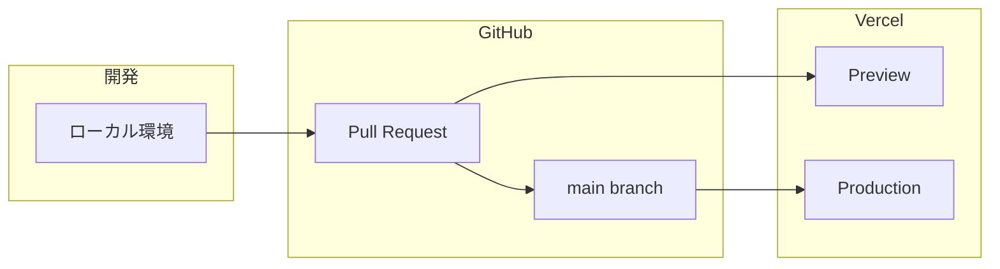
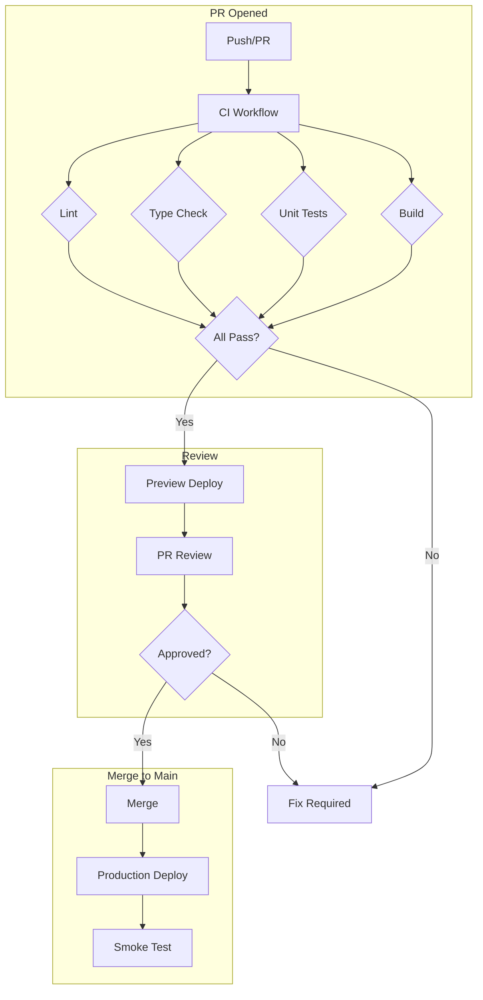

# デプロイ・運用ガイド

## 環境構成



| 環境 | URL | デプロイ条件 |
|-----|-----|------------|
| ローカル | localhost:3000 | 手動 |
| Preview | {pr-name}.vercel.app | PR作成時 |
| Production | hy-assessment.vercel.app | mainマージ時 |

## CI/CD パイプライン

### ワークフロー図



### GitHub Actions ワークフロー一覧

| ワークフロー | トリガー | 内容 |
|-------------|---------|------|
| `ci.yml` | PR / push to main,develop | Lint, 型チェック, 単体テスト, ビルド |
| `deploy-production.yml` | push to main | Vercel本番デプロイ |
| `quality-gate.yml` | CI完了後 | DoD判定・PRコメント投稿 |
| `pr-check.yml` | PR作成時 | 変更分析・E2Eテスト生成判定 |
| `e2e.yml` | 手動 / schedule | E2Eテスト実行 |
| `e2e-test-generation.yml` | pr-check後 | E2Eテスト自動生成 |
| `codeql.yml` | PR / schedule | セキュリティ分析 |
| `auto-approve.yml` | PR作成時 | chore/docs等の自動承認 |

#### ci.yml（メインCI）

```yaml
name: CI

on:
  push:
    branches: [main, develop]
  pull_request:
    branches: [main, develop]

jobs:
  lint:
    name: Lint
    runs-on: ubuntu-latest
    steps:
      - uses: actions/checkout@v6
      - uses: ./.github/actions/setup-node
      - run: npm run lint

  type-check:
    name: 型チェック
    runs-on: ubuntu-latest
    steps:
      - uses: actions/checkout@v6
      - uses: ./.github/actions/setup-node
      - run: npx tsc --noEmit

  unit-test:
    name: 単体テスト
    runs-on: ubuntu-latest
    steps:
      - uses: actions/checkout@v6
      - uses: ./.github/actions/setup-node
      - run: npm run test:coverage
      - uses: codecov/codecov-action@v5

  build:
    name: ビルド
    runs-on: ubuntu-latest
    needs: [lint, type-check, unit-test]
    steps:
      - uses: actions/checkout@v6
      - uses: ./.github/actions/setup-node
      - run: npm run build
```

#### e2e.yml（E2Eテスト）

```yaml
name: E2E Tests

on:
  workflow_dispatch:  # 手動実行
  schedule:
    - cron: '0 0 * * *'  # 毎日実行

jobs:
  e2e:
    runs-on: ubuntu-latest
    steps:
      - uses: actions/checkout@v6
      - uses: ./.github/actions/setup-node
      - name: Install Playwright
        run: npx playwright install --with-deps
      - name: Run E2E tests
        run: npm run test:e2e
        env:
          E2E_TEST_EMAIL: ${{ secrets.E2E_TEST_EMAIL }}
          E2E_TEST_PASSWORD: ${{ secrets.E2E_TEST_PASSWORD }}
```

#### codeql.yml（セキュリティ分析）

```yaml
name: CodeQL

on:
  push:
    branches: [main]
  pull_request:
    branches: [main]
  schedule:
    - cron: '0 0 * * 0'  # 毎週日曜

jobs:
  analyze:
    runs-on: ubuntu-latest
    steps:
      - uses: actions/checkout@v6
      - uses: github/codeql-action/init@v3
        with:
          languages: typescript
      - uses: github/codeql-action/analyze@v3
```

## Vercel設定

### 環境変数

Vercel Dashboard → Project → Settings → Environment Variables

| 変数名 | 環境 | 説明 |
|-------|-----|------|
| `NEXT_PUBLIC_SUPABASE_URL` | All | Supabase URL |
| `NEXT_PUBLIC_SUPABASE_ANON_KEY` | All | Supabase Anon Key |
| `SUPABASE_SERVICE_ROLE_KEY` | Production, Preview | Service Role Key |
| `OPENAI_API_KEY` | Production, Preview | OpenAI API Key |
| `RESEND_API_KEY` | Production | Resend API Key |
| `NEXT_PUBLIC_SENTRY_DSN` | Production | Sentry DSN |

### vercel.json

```json
{
  "framework": "nextjs",
  "buildCommand": "npm run build",
  "outputDirectory": ".next",
  "headers": [
    {
      "source": "/(.*)",
      "headers": [
        { "key": "X-Content-Type-Options", "value": "nosniff" },
        { "key": "X-Frame-Options", "value": "SAMEORIGIN" }
      ]
    }
  ]
}
```

## GitHub Secrets

リポジトリ → Settings → Secrets and variables → Actions

| Secret名 | 用途 |
|---------|------|
| `VERCEL_TOKEN` | Vercel APIトークン |
| `VERCEL_ORG_ID` | Vercel Org ID |
| `VERCEL_PROJECT_ID` | Vercel Project ID |
| `APPROVE_PAT` | PR自動承認用（未使用） |
| `VERCEL_AUTOMATION_BYPASS_SECRET` | E2E Preview用 |
| `E2E_TEST_EMAIL` | E2Eテスト用 |
| `E2E_TEST_PASSWORD` | E2Eテスト用 |

## Supabase

### 本番設定

- **Project**: kiqlyeoxccuxtofktwlm
- **Region**: ap-northeast-1 (Tokyo)
- **Dashboard**: https://supabase.com/dashboard/project/kiqlyeoxccuxtofktwlm

### マイグレーション

```bash
# ローカル確認
npx supabase db reset

# 本番適用（推奨：Dashboard経由）
# SQL Editor → New Query → マイグレーションSQL実行

# または CLI
npx supabase db push
```

### バックアップ

- **自動バックアップ**: Supabase Pro プラン（7日間）
- **手動バックアップ**: Dashboard → Settings → Database → Backups

## 監視・アラート

### Sentry

```typescript
// sentry.client.config.ts
Sentry.init({
  dsn: process.env.NEXT_PUBLIC_SENTRY_DSN,
  tracesSampleRate: 0.1,
  replaysOnErrorSampleRate: 1.0,
});
```

**アラート設定**:
- エラー発生時 → Slack通知
- パフォーマンス低下時 → メール通知

### Vercel Analytics

- **Core Web Vitals**: 自動計測
- **Real User Monitoring**: 有効

## ロールバック手順

### Vercelでのロールバック

```bash
# 1. デプロイ一覧確認
vercel ls

# 2. 前のデプロイにロールバック
vercel rollback <deployment-url>

# または Dashboard
# Deployments → 対象デプロイ → Promote to Production
```

### 緊急対応

```bash
# 1. 問題のある変更をRevert
git revert <commit-hash>
git push origin main

# 2. 自動デプロイを待つ
# または手動デプロイ
vercel --prod
```

## 本番チェックリスト

### デプロイ前

- [ ] ローカルでビルド成功
- [ ] 型チェック通過
- [ ] Lint通過
- [ ] ユニットテスト通過
- [ ] E2Eテスト通過（重要機能）

### デプロイ後

- [ ] 本番アクセス確認
- [ ] ログインフロー確認
- [ ] 主要機能動作確認
- [ ] Sentryエラー確認

## スケーリング

### 現在の構成

```
Vercel Hobby Plan
├── Serverless Functions
├── Edge Functions
└── Static Assets (CDN)

Supabase Free Plan
├── PostgreSQL (500MB)
├── Auth (50,000 MAU)
└── Storage (1GB)
```

### スケールアップ時

```
Vercel Pro ($20/月)
├── より多くのServerless実行時間
├── チーム機能
└── 高度な分析

Supabase Pro ($25/月)
├── PostgreSQL (8GB)
├── 自動バックアップ（7日間）
└── メールサポート
```

## トラブルシューティング

### デプロイ失敗

```bash
# ビルドログ確認
vercel logs <deployment-url>

# ローカルで再現
npm run build
```

### 環境変数の問題

```bash
# Vercel環境変数確認
vercel env ls

# ローカルに同期
vercel env pull .env.local
```

### DBマイグレーション失敗

```sql
-- 問題のマイグレーションを手動ロールバック
DROP TABLE IF EXISTS problem_table;

-- 再適用
-- Supabase Dashboard → SQL Editor
```
