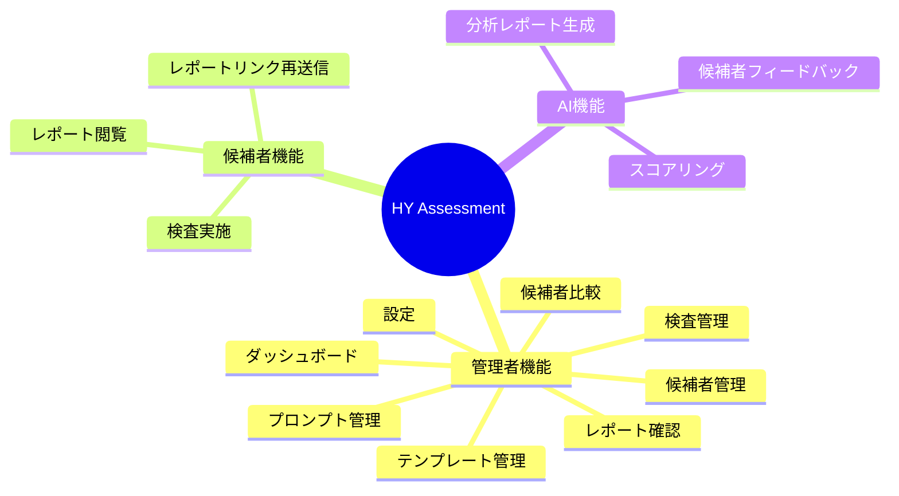
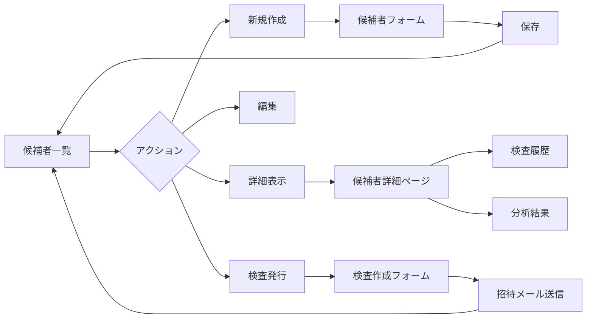
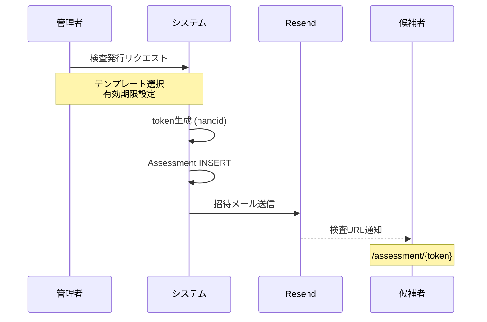
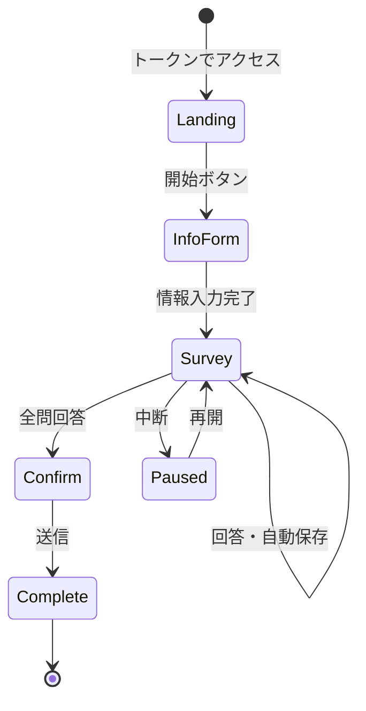
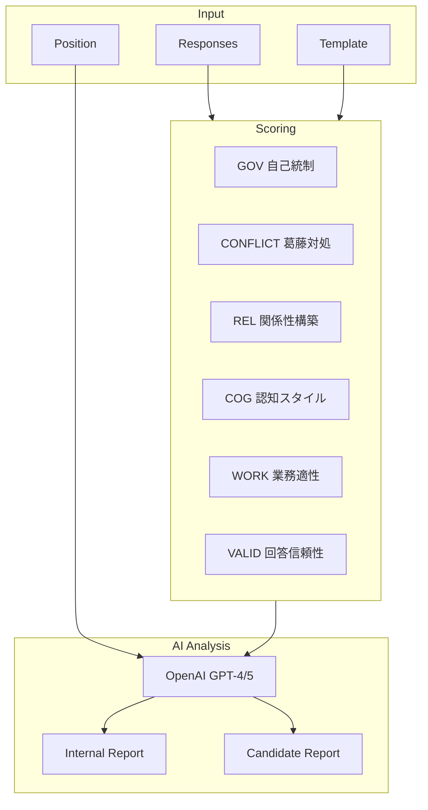

# 機能詳細

## 機能一覧



## 1. ダッシュボード

**URL**: `/admin`

### 画面構成

```
┌─────────────────────────────────────────────────────────────┐
│ HY Assessment                           [設定] [ログアウト] │
├─────────────────────────────────────────────────────────────┤
│                                                             │
│ ┌─────────────┐ ┌─────────────┐ ┌─────────────┐ ┌─────────┐│
│ │ 候補者数    │ │ 検査数      │ │ 完了数      │ │ 未完了  ││
│ │    42       │ │    38       │ │    30       │ │    8    ││
│ └─────────────┘ └─────────────┘ └─────────────┘ └─────────┘│
│                                                             │
│ ┌─────────────────────────────┐ ┌─────────────────────────┐│
│ │ パイプライン                │ │ 注目候補者              ││
│ │ ■ 未検査: 4                 │ │ ★ 田中太郎 (82%)        ││
│ │ ■ 回答中: 8                 │ │ ★ 山田花子 (79%)        ││
│ │ ■ 完了: 26                  │ │                         ││
│ │ ■ 分析済: 24                │ │ 要注意                  ││
│ └─────────────────────────────┘ │ ⚠ 佐藤次郎 (45%)        ││
│                                 └─────────────────────────┘│
│ ┌─────────────────────────────────────────────────────────┐│
│ │ 14日間トレンド                                          ││
│ │ [グラフ: 検査開始数 / 完了数]                           ││
│ └─────────────────────────────────────────────────────────┘│
│                                                             │
└─────────────────────────────────────────────────────────────┘
```

### 機能詳細

| セクション | 説明 |
|-----------|------|
| **Stats Cards** | 候補者数、検査数、完了数、未完了数を表示 |
| **Pipeline** | 検査ステータス別の件数（ファネル表示） |
| **注目候補者** | スコア80%以上 / 50%以下を自動抽出 |
| **トレンド** | 14日間の検査開始・完了推移グラフ |

### データ取得

```typescript
// src/app/admin/page.tsx
const stats = await getOrganizationStats(organizationId);
const pipeline = await getAssessmentPipeline(organizationId);
const trends = await getAssessmentTrends(organizationId, 14);
```

## 2. 候補者管理

**URL**: `/admin/candidates`

### ユーザーフロー



### 一覧画面

```
┌─────────────────────────────────────────────────────────────┐
│ 候補者管理                              [+ 新規候補者追加]  │
├─────────────────────────────────────────────────────────────┤
│ [検索...] [職種フィルター ▼] [ステータス ▼]                │
├─────────────────────────────────────────────────────────────┤
│ 名前         │ メール            │ 職種    │ ステータス  │ 操作│
│──────────────│───────────────────│─────────│─────────────│─────│
│ 田中 太郎    │ tanaka@...        │ エンジニア│ 分析済 ✓  │ ... │
│ 山田 花子    │ yamada@...        │ デザイナー│ 回答中 ○  │ ... │
│ 佐藤 次郎    │ sato@...          │ PM      │ 未検査 -   │ ... │
└─────────────────────────────────────────────────────────────┘
```

### 新規作成フォーム

| フィールド | 必須 | バリデーション |
|-----------|------|---------------|
| 氏名 | ○ | 2-50文字 |
| メールアドレス | ○ | 有効なメール形式 |
| 応募職種 | - | 選択式 or 自由入力 |
| メモ | - | 最大1000文字 |

## 3. 検査管理

**URL**: `/admin/assessments`

### 検査発行フロー



### 検査テンプレート

```json
{
  "name": "適性検査 v2.0",
  "questions": {
    "pages": [
      {
        "name": "page1",
        "elements": [
          {
            "type": "rating",
            "name": "q1",
            "title": "チームで協力して作業することを好む",
            "rateMin": 1,
            "rateMax": 5
          }
        ]
      }
    ]
  }
}
```

## 4. 検査実施（候補者側）

**URL**: `/assessment/[token]`

### フロー



### 画面遷移

1. **Landing**: 検査説明・開始ボタン
2. **InfoForm**: 候補者情報入力（名前確認等）
3. **Survey**: SurveyJSフォーム（複数ページ）
4. **Confirm**: 回答確認・送信
5. **Complete**: 完了メッセージ

### 自動保存

```typescript
// 回答変更時に自動保存
const handleValueChanged = debounce(async (data) => {
  await saveResponse(assessmentId, data);
}, 1000);
```

## 5. AI分析

### 分析パイプライン



### スコアリングエンジン

```typescript
// src/lib/analysis/scoring-engine.ts
export function calculateScores(responses: Response[]): ScoringResult {
  return {
    GOV: calculateGOV(responses),      // 自己統制
    CONFLICT: calculateConflict(responses), // 葛藤対処
    REL: calculateREL(responses),      // 関係性構築
    COG: calculateCOG(responses),      // 認知スタイル
    WORK: calculateWORK(responses),    // 業務適性
    VALID: calculateVALID(responses),  // 回答信頼性
  };
}
```

### 分析出力フォーマット

#### v2 Internal Report

```json
{
  "enhanced_strengths": [
    {
      "title": "高い論理的思考力",
      "behavior": "複雑な問題を体系的に分解し解決する",
      "evidence": "Q15, Q23の回答パターンから推定"
    }
  ],
  "enhanced_watchouts": [
    {
      "title": "ストレス耐性への注意",
      "risk": "高負荷時にパフォーマンス低下の可能性",
      "evidence": "CONFLICT領域のスコア傾向"
    }
  ],
  "risk_scenarios": [
    {
      "scenario": "急な納期変更への対応",
      "likelihood": "中",
      "impact": "業務品質への影響",
      "mitigation": "事前の優先順位設定を促す"
    }
  ],
  "interview_checks": [
    {
      "question": "過去に予期せぬ変更があった際、どう対応しましたか？",
      "purpose": "ストレス対処能力の確認",
      "lookFor": "具体的な対処行動と振り返り"
    }
  ],
  "summary": "論理的思考力が高く...",
  "recommendation": "採用を推奨。ただし..."
}
```

#### v2 Candidate Report

```json
{
  "feedback_strengths": [
    {
      "title": "分析力",
      "description": "複雑な情報を整理し本質を捉える力があります",
      "leverage_tip": "問題解決の場面で積極的に発言を"
    }
  ],
  "stress_tips": [
    {
      "trigger": "急な変更",
      "response": "深呼吸して優先順位を再確認",
      "prevention": "日頃からバッファを設ける"
    }
  ],
  "values_tags": ["論理性", "チームワーク", "成長志向"],
  "overall_message": "あなたの強みは..."
}
```

## 6. レポート機能

### 内部レポート（管理者向け）

**URL**: `/admin/candidates/[id]`

```
┌─────────────────────────────────────────────────────────────┐
│ 田中 太郎 - 分析レポート                          [PDF出力] │
├─────────────────────────────────────────────────────────────┤
│                                                             │
│ スコアサマリー                                              │
│ ┌─────┬─────┬─────┬─────┬─────┬─────┐                     │
│ │ GOV │CONFL│ REL │ COG │WORK │VALID│                     │
│ │ 72% │ 65% │ 78% │ 85% │ 70% │ 90% │                     │
│ └─────┴─────┴─────┴─────┴─────┴─────┘                     │
│                                                             │
│ 強み                                                        │
│ ● 高い論理的思考力                                          │
│   複雑な問題を体系的に分解し解決する                        │
│                                                             │
│ 注意点                                                      │
│ ⚠ ストレス耐性への注意                                     │
│   高負荷時にパフォーマンス低下の可能性                      │
│                                                             │
│ リスクシナリオ                                              │
│ ━━━━━━━━━━━━━━━━━━━━━━━━━━━━━━━━━━━━━━━━━━━━━━━━━━━━━━━│
│                                                             │
│ 面接確認ポイント                                            │
│ 1. 過去に予期せぬ変更があった際、どう対応しましたか？       │
│    目的: ストレス対処能力の確認                             │
│                                                             │
│ 総合判定                                                    │
│ [採用推奨] 論理的思考力が高く、チームへの貢献が期待できる   │
│                                                             │
└─────────────────────────────────────────────────────────────┘
```

### 候補者レポート

**URL**: `/report/[token]`

候補者向けのポジティブなフィードバック。

```
┌─────────────────────────────────────────────────────────────┐
│ あなたの適性検査結果                                        │
├─────────────────────────────────────────────────────────────┤
│                                                             │
│ あなたの強み                                                │
│ ┌─────────────────────────────────────────────────────────┐│
│ │ 🎯 分析力                                               ││
│ │ 複雑な情報を整理し本質を捉える力があります              ││
│ │                                                         ││
│ │ 💡 活かし方                                             ││
│ │ 問題解決の場面で積極的に発言してみましょう              ││
│ └─────────────────────────────────────────────────────────┘│
│                                                             │
│ ストレス対策                                                │
│ ┌─────────────────────────────────────────────────────────┐│
│ │ 急な変更があったとき                                    ││
│ │ → 深呼吸して優先順位を再確認しましょう                  ││
│ └─────────────────────────────────────────────────────────┘│
│                                                             │
│ あなたを表すキーワード                                      │
│ [論理性] [チームワーク] [成長志向]                          │
│                                                             │
└─────────────────────────────────────────────────────────────┘
```

## 7. プロンプト管理

**URL**: `/admin/prompts`

### 機能

- プロンプトテンプレートのCRUD
- バージョン管理
- テストラン（プレビュー）
- 組織別カスタマイズ

### プロンプトキー

| Key | 用途 |
|-----|------|
| `system` | AI分析メインプロンプト |
| `analysis_user` | 分析リクエスト用 |
| `judgment` | 判定ロジック用（予約） |
| `candidate` | 候補者フィードバック生成用 |

## 8. 候補者比較

**URL**: `/admin/compare`

複数候補者のスコアを並べて比較。

```
┌─────────────────────────────────────────────────────────────┐
│ 候補者比較                                                  │
├─────────────────────────────────────────────────────────────┤
│ [候補者選択: ☑田中 ☑山田 ☐佐藤]                            │
├─────────────────────────────────────────────────────────────┤
│                                                             │
│ レーダーチャート                                            │
│ ┌─────────────────────────────────────────────────────────┐│
│ │           GOV                                           ││
│ │            ▲                                            ││
│ │       ╱    │    ╲                                       ││
│ │   VALID    │    CONFLICT                                ││
│ │      ╲     │     ╱                                      ││
│ │       ╲    │    ╱                                       ││
│ │        ╲   │   ╱                                        ││
│ │   WORK ─── ● ─── REL                                    ││
│ │            │                                            ││
│ │           COG                                           ││
│ │                                                         ││
│ │   ── 田中  -- 山田                                      ││
│ └─────────────────────────────────────────────────────────┘│
│                                                             │
│ スコア詳細                                                  │
│ ┌───────┬───────┬───────┬───────┬───────┬───────┬───────┐│
│ │       │  GOV  │CONFL  │  REL  │  COG  │ WORK  │ VALID ││
│ ├───────┼───────┼───────┼───────┼───────┼───────┼───────┤│
│ │ 田中  │  72%  │  65%  │  78%  │  85%  │  70%  │  90%  ││
│ │ 山田  │  68%  │  72%  │  82%  │  75%  │  78%  │  88%  ││
│ └───────┴───────┴───────┴───────┴───────┴───────┴───────┘│
│                                                             │
└─────────────────────────────────────────────────────────────┘
```

## 9. 設定

**URL**: `/admin/settings`

### 機能

- ユーザープロフィール編集
- パスワード変更
- 通知設定
- （将来）組織設定

### APIエンドポイント

```
GET  /api/settings/profile    # プロフィール取得
PUT  /api/settings/profile    # プロフィール更新
POST /api/settings/password   # パスワード変更
```

## 10. テンプレート管理

**URL**: `/admin/templates`

### 機能

検査テンプレート（質問セット）の管理。

```
┌─────────────────────────────────────────────────────────────┐
│ テンプレート管理                              [新規作成]     │
├─────────────────────────────────────────────────────────────┤
│                                                             │
│ ┌─────────────────────────────────────────────────────────┐│
│ │ 適性検査 v2.0                            [有効] [編集]  ││
│ │ 質問数: 50問 / 所要時間: 約30分                         ││
│ │ 最終更新: 2024-01-15                                    ││
│ ├─────────────────────────────────────────────────────────┤│
│ │ 適性検査 v1.0 (レガシー)                 [無効] [複製]  ││
│ │ 質問数: 40問 / 所要時間: 約25分                         ││
│ │ 最終更新: 2023-06-01                                    ││
│ └─────────────────────────────────────────────────────────┘│
│                                                             │
└─────────────────────────────────────────────────────────────┘
```

### 操作

| 操作 | 説明 |
|------|------|
| 編集 | SurveyJS Creatorで質問を編集 |
| 複製 | テンプレートをコピーして新規作成 |
| 有効/無効 | 検査発行時の選択肢に表示/非表示 |

### APIエンドポイント

```
GET    /api/templates/[id]        # テンプレート取得
PUT    /api/templates/[id]        # テンプレート更新
POST   /api/templates/[id]/toggle # 有効/無効切替
POST   /api/templates/[id]/copy   # テンプレート複製
```

## 11. レポートリンク再送信（候補者向け）

**URL**: `/report/resend`

候補者が検査結果レポートのリンクを紛失した場合に、メールアドレスを入力して再送信をリクエストできる機能。

```
┌─────────────────────────────────────────────────────────────┐
│                                                             │
│                  レポートリンク再送信                       │
│                                                             │
│  検査結果レポートへのリンクを再送信します。                 │
│  登録時に使用したメールアドレスを入力してください。         │
│                                                             │
│  ┌─────────────────────────────────────────────────────┐   │
│  │ メールアドレス                                       │   │
│  │ ┌─────────────────────────────────────────────────┐ │   │
│  │ │ example@email.com                               │ │   │
│  │ └─────────────────────────────────────────────────┘ │   │
│  └─────────────────────────────────────────────────────┘   │
│                                                             │
│                    [ 送信する ]                             │
│                                                             │
│  ※ レート制限: 1時間に3回まで                              │
│  ※ プライバシー保護のため、送信結果は常に同じ表示          │
│                                                             │
└─────────────────────────────────────────────────────────────┘
```

### セキュリティ考慮

- **レート制限**: 同一メールアドレスに対して1時間に3回まで
- **プライバシー保護**: メールアドレスの存在有無に関わらず同じレスポンスを返す（列挙攻撃対策）
- **有効期限チェック**: 期限切れレポートは送信しない

### APIエンドポイント

```
POST /api/report/resend   # レポートリンク再送信
```
