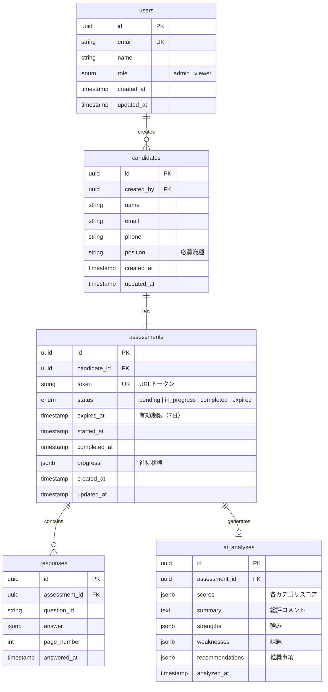

# ER図（データベース設計）

## テーブル構成

## テーブル詳細

### users（管理者）
Supabase Authと連携。管理者アカウント情報を保持。

| カラム | 型 | 説明 |
|--------|-----|------|
| id | uuid | Supabase Auth UID |
| email | string | メールアドレス |
| name | string | 表示名 |
| role | enum | admin（管理者）/ viewer（閲覧者） |

### candidates（候補者）
検査を受ける候補者の基本情報。

| カラム | 型 | 説明 |
|--------|-----|------|
| id | uuid | 候補者ID |
| created_by | uuid | 登録した管理者 |
| name | string | 氏名 |
| email | string | メールアドレス |
| phone | string | 電話番号（任意） |
| position | string | 応募職種 |

### assessments（検査セッション）
候補者ごとの検査状態を管理。

| カラム | 型 | 説明 |
|--------|-----|------|
| id | uuid | 検査ID |
| candidate_id | uuid | 候補者 |
| token | string | URLアクセス用トークン |
| status | enum | pending / in_progress / completed / expired |
| expires_at | timestamp | 有効期限（作成から7日） |
| progress | jsonb | 途中保存用の進捗データ |

### responses（回答データ）
検査の各質問への回答。

| カラム | 型 | 説明 |
|--------|-----|------|
| id | uuid | 回答ID |
| assessment_id | uuid | 検査セッション |
| question_id | string | SurveyJSの質問ID |
| answer | jsonb | 回答内容 |
| page_number | int | ページ番号 |

### ai_analyses（AI分析結果）
OpenAI APIによる分析結果。

| カラム | 型 | 説明 |
|--------|-----|------|
| id | uuid | 分析ID |
| assessment_id | uuid | 検査セッション |
| scores | jsonb | カテゴリ別スコア |
| summary | text | 総評コメント |
| strengths | jsonb | 強みリスト |
| weaknesses | jsonb | 課題リスト |
| recommendations | jsonb | 推奨事項 |
