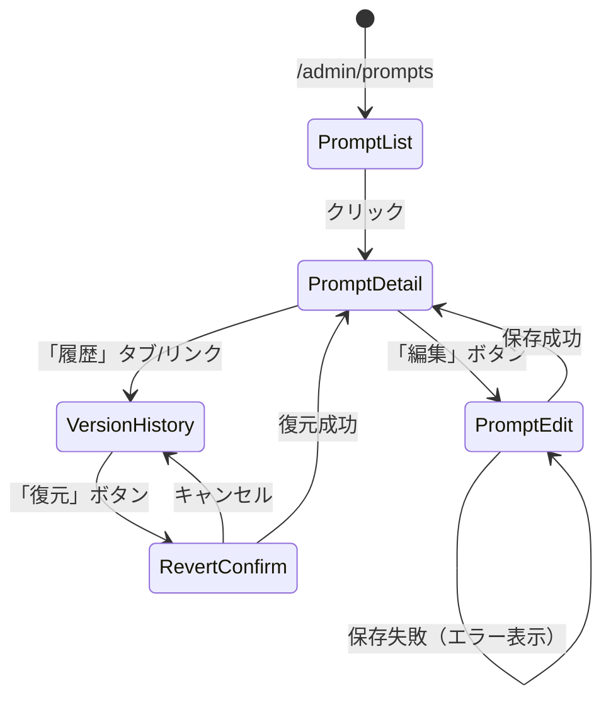

## 📋 概要

Issue #139 プロンプト直接編集機能 **Phase 2: バージョン管理・履歴機能** の要件定義です。

**関連Issue**: Issue #139
**先行PR**: #190（Phase 1 要件定義）

---

## 1. 調査レポート

**調査レポートリンク**: Issue #139 + PR #190 に記載済み

### Investigation Report v2 要約（Phase 2 追加調査）

| 項目 | 内容 |
|------|------|
| 既存システム名 | HY Assessment プロンプト管理 (`/admin/prompts`) |
| エントリーポイント | UI: `/admin/prompts/[id]/edit` / API: **未実装** |
| 主要データモデル | `prompt_templates`（既存）, `prompt_versions`（新規） |
| キーファイル（既存） | `src/app/admin/prompts/[id]/edit/page.tsx`, `src/components/prompts/PromptEditForm.tsx`, `src/components/prompts/PromptEditor.tsx` |
| 拡張ポイント | 編集フォームをAPI経由に変更、履歴タブ追加 |
| 破壊ポイント | 既存の直接DB更新をAPI経由に移行 |
| やりたいこと（1行） | プロンプト更新時のバージョン履歴保存・復元機能の実装 |

### 既存実装状況（再調査結果）

| コンポーネント | ファイル | 状態 | 備考 |
|---------------|---------|------|------|
| 編集ページ | `src/app/admin/prompts/[id]/edit/page.tsx` | ✅ 実装済み | Server Component |
| 編集フォーム | `src/components/prompts/PromptEditForm.tsx` | ✅ 実装済み | **直接Supabase更新**（要API移行） |
| Monaco Editor | `src/components/prompts/PromptEditor.tsx` | ✅ 実装済み | 変数ハイライト機能付き |
| prompt_templates | `supabase/migrations/20241223000002_create_prompt_templates.sql` | ✅ 実装済み | - |
| **PUT API** | `src/app/api/prompts/[id]/route.ts` | ❌ 未実装 | 新規作成必要 |
| **履歴API** | `src/app/api/prompts/[id]/versions/route.ts` | ❌ 未実装 | 新規作成必要 |
| **復元API** | `src/app/api/prompts/[id]/versions/[version]/revert/route.ts` | ❌ 未実装 | 新規作成必要 |
| **prompt_versions** | - | ❌ 未実装 | マイグレーション必要 |
| **履歴表示UI** | `src/app/admin/prompts/[id]/history/page.tsx` | ❌ 未実装 | 新規作成必要 |

---

## 2. Phase 2: 要件定義・ユースケース

### 2.1 機能概要

| 項目 | 内容 |
|------|------|
| **なぜ必要か（Why）** | プロンプト編集時にバージョン履歴が保存されず、変更追跡・復元ができない |
| **誰が使うか（Who）** | 組織管理者（Admin） |
| **何を達成するか（What）** | バージョン履歴の自動保存、履歴確認UI、過去バージョンへの復元 |

### 2.2 ユースケース定義（Role × Outcome）

| UC-ID | Role | Outcome | Channel | 説明 |
|-------|------|---------|---------|------|
| UC-PROMPT-ADMIN-SAVE-WEB | Admin | プロンプトを保存（バージョン自動作成） | WEB | 編集内容保存時にバージョン履歴を自動作成 |
| UC-PROMPT-ADMIN-HISTORY-WEB | Admin | バージョン履歴を確認する | WEB | 過去の変更一覧・変更者・日時を確認 |
| UC-PROMPT-ADMIN-DIFF-WEB | Admin | バージョン間の差分を確認する | WEB | 2つのバージョンの差分表示 |
| UC-PROMPT-ADMIN-REVERT-WEB | Admin | 過去バージョンに復元する | WEB | 確認ダイアログ後、過去内容で更新 |

### 2.3 Role × Value マトリクス

| Role | 提供する価値 | 受け取る価値 | 関連Outcome |
|------|-------------|-------------|-------------|
| Admin | プロンプト管理操作 | 変更追跡・復元可能性・監査証跡 | SAVE, HISTORY, REVERT |
| System | バージョンデータ保存 | — | SAVE |

### 2.4 カバレッジマトリクス（MECE証明）

| Role＼Outcome | SAVE | HISTORY | DIFF | REVERT |
|---------------|:----:|:-------:|:----:|:------:|
| Admin | 🟡 Silver | 🟡 Silver | 🟡 Silver | 🟡 Silver |
| System | ✅ | — | — | — |

### 2.5 入力ソースチェックリスト（要件網羅性証明）

| 入力ソース | 確認状態 | 抽出UC数 | 備考 |
|-----------|---------|---------|------|
| Issue #139 機能要求 | ✅ | 4 | 全UC抽出済み |
| PR #190 要件定義 | ✅ | 4 | Phase 1 の未実装部分 |
| 既存コード調査 | ✅ | 1 | 直接DB更新→API移行 |
| DBスキーマ | ✅ | 1 | prompt_versions 新規追加 |

### 2.6 外部整合性チェック

- [x] Issue #139 の要件に全UCが対応している
- [x] PR #190 の未実装項目がカバーされている
- [x] 既存の編集フォームとの整合性確認済み

---

## 3. Phase 3: 品質基準

### 3.1 DoD Level 選択

- [ ] Bronze (27観点: 80%カバレッジ)
- [x] Silver (31観点: 85%カバレッジ) ← 選択
- [ ] Gold (19観点: 95%カバレッジ)

**選定理由**: プロンプト編集はAI分析品質に直結するが、バージョン管理による復旧可能性があるためGoldほどの厳格さは不要。履歴・復元機能は確実に動作する必要がある。

### 3.2 Pre-mortem（失敗シナリオ）

| # | 失敗シナリオ | 発生確率 | 対策 | 確認方法 |
|---|-------------|---------|------|---------|
| 1 | 編集保存時にバージョン履歴が作成されない | 中 | トランザクション処理でprompt_templates更新とprompt_versions挿入を同時実行 | 単体テストで履歴作成確認 |
| 2 | 復元時に現行バージョンが上書きされデータ消失 | 低 | 復元前に現行バージョンを履歴として保存してから復元 | E2Eテストで復元前後の履歴件数確認 |
| 3 | RLSにより他組織のプロンプト履歴が見える | 低 | RLSポリシーでorganization_idチェック | RLS統合テスト |
| 4 | 大量の履歴でパフォーマンス劣化 | 中 | インデックス最適化・履歴取得時ページネーション（デフォルト20件） | 負荷テスト（履歴100件） |
| 5 | 既存の直接DB更新コードがAPI移行後も残る | 中 | PromptEditFormを完全にAPI経由に書き換え、レビューで確認 | コードレビュー・E2Eテスト |

---

## 4. Phase 4: 技術設計

### 4.1 データベース設計

**新規テーブル:**

| テーブル名 | 用途 | RLSポリシー |
|-----------|------|------------|
| `prompt_versions` | バージョン履歴保存 | organization_id による組織分離 |

**既存テーブル拡張:**

| テーブル名 | 変更内容 |
|-----------|---------|
| `prompt_templates` | `current_version` カラム追加 |

#### prompt_versions スキーマ

```sql
CREATE TABLE prompt_versions (
    id UUID PRIMARY KEY DEFAULT gen_random_uuid(),
    prompt_id UUID NOT NULL REFERENCES prompt_templates(id) ON DELETE CASCADE,
    version VARCHAR(20) NOT NULL,  -- "1.0.0", "1.0.1", etc.
    content TEXT NOT NULL,
    change_summary TEXT,           -- 変更内容の要約（任意）
    created_by UUID REFERENCES auth.users(id),
    created_at TIMESTAMPTZ NOT NULL DEFAULT NOW(),

    UNIQUE(prompt_id, version)
);

CREATE INDEX idx_prompt_versions_prompt ON prompt_versions(prompt_id);
CREATE INDEX idx_prompt_versions_created ON prompt_versions(created_at DESC);
```

#### CRUD操作マトリクス

| テーブル | Create | Read | Update | Delete | 担当API |
|---------|:------:|:----:|:------:|:------:|---------|
| prompt_templates | — | ✅ | ✅ | — | GET/PUT /api/prompts/[id] |
| prompt_versions | ✅ | ✅ | ❌ | ❌ | POST（PUT時自動）/ GET /api/prompts/[id]/versions |

#### RLSテスト観点

| ポリシー名 | 対象操作 | 許可条件 | テストケース |
|-----------|---------|---------|-------------|
| `prompt_versions_select_own` | SELECT | prompt_templates.organization_id一致 or null（システム） | 他組織の履歴が見えないこと |
| `prompt_versions_insert_own` | INSERT | prompt_templates.organization_id一致 | 他組織のプロンプトに履歴追加不可 |

### 4.2 API設計

| Method | Path | 説明 | 認証 |
|--------|------|------|------|
| GET | `/api/prompts/[id]` | プロンプト詳細取得 | 必要 |
| PUT | `/api/prompts/[id]` | プロンプト更新（バージョン自動作成） | 必要 |
| GET | `/api/prompts/[id]/versions` | バージョン履歴取得 | 必要 |
| GET | `/api/prompts/[id]/versions/[version]` | 特定バージョン取得 | 必要 |
| POST | `/api/prompts/[id]/versions/[version]/revert` | 過去バージョンに復元 | 必要 |

#### エラーハンドリング設計

| API | エラーケース | HTTPステータス | レスポンス |
|-----|------------|--------------|-----------|
| PUT /api/prompts/[id] | バリデーションエラー（content空） | 400 | `{ error: "content_required" }` |
| PUT /api/prompts/[id] | 認証エラー | 401 | `{ error: "unauthorized" }` |
| PUT /api/prompts/[id] | 権限エラー（他組織） | 403 | `{ error: "forbidden" }` |
| PUT /api/prompts/[id] | システムプロンプト編集 | 403 | `{ error: "system_prompt_readonly" }` |
| GET /api/prompts/[id] | 存在しない | 404 | `{ error: "not_found" }` |
| POST .../revert | バージョン存在しない | 404 | `{ error: "version_not_found" }` |

#### 非機能要件（API）

| 観点 | 要件 | 検証方法 |
|------|------|---------|
| **レート制限** | 60回/min | 負荷テストで確認 |
| **タイムアウト** | 10秒 | 負荷テストで確認 |
| **最大ペイロード** | 1MB（プロンプト内容） | 境界値テストで確認 |

### 4.3 UI設計

#### 画面一覧

| 画面名 | パス | コンポーネント | 状態 |
|-------|------|---------------|------|
| プロンプト編集 | `/admin/prompts/[id]/edit` | PromptEditForm | ✅ 実装済み（API移行必要） |
| バージョン履歴 | `/admin/prompts/[id]/history` | VersionHistoryPage | ❌ 新規作成 |

#### バリアント実装チェック

| バリアント | 用途 | 実装確認 |
|-----------|------|---------|
| Default | 正常データ表示 | [ ] |
| Loading | スケルトンUI | [ ] |
| Empty | 履歴なし状態 | [ ] |
| Error | API失敗 + 再試行ボタン | [ ] |

#### data-testid命名規則

```
# 編集フォーム（既存に追加）
data-testid="prompt-save-button"         # 保存ボタン

# 履歴ページ
data-testid="version-history-page"       # ページ全体
data-testid="version-history-list"       # 履歴一覧
data-testid="version-item-{version}"     # 履歴アイテム（例: version-item-1.0.0）
data-testid="version-revert-button"      # 復元ボタン
data-testid="version-diff-button"        # 差分表示ボタン
data-testid="revert-confirm-dialog"      # 復元確認ダイアログ
data-testid="revert-confirm-button"      # 復元確定ボタン
```

#### 画面遷移図（State Machine）



| 遷移元 | 遷移先 | トリガー | 条件 | テストケース |
|-------|-------|---------|------|-------------|
| PromptDetail | PromptEdit | 編集ボタン | 組織固有プロンプト | システムプロンプトは複製へリダイレクト |
| PromptEdit | PromptDetail | 保存 | 保存成功 | バージョン番号がインクリメント |
| VersionHistory | RevertConfirm | 復元ボタン | 過去バージョン選択 | 確認ダイアログ表示 |
| RevertConfirm | PromptDetail | 確定 | 復元成功 | 現行バージョンが復元内容に更新 |

### 4.4 変更ファイル一覧

| ファイルパス | 変更種別 | 概要 |
|-------------|---------|------|
| `supabase/migrations/xxx_add_prompt_versions.sql` | 新規 | prompt_versionsテーブル・RLS |
| `src/types/database.ts` | 修正 | PromptVersion型追加 |
| `src/app/api/prompts/[id]/route.ts` | 新規 | GET/PUT API |
| `src/app/api/prompts/[id]/versions/route.ts` | 新規 | 履歴一覧API |
| `src/app/api/prompts/[id]/versions/[version]/route.ts` | 新規 | 特定バージョンGET |
| `src/app/api/prompts/[id]/versions/[version]/revert/route.ts` | 新規 | 復元API |
| `src/app/admin/prompts/[id]/history/page.tsx` | 新規 | 履歴表示ページ |
| `src/components/prompts/VersionHistory.tsx` | 新規 | 履歴一覧コンポーネント |
| `src/components/prompts/VersionDiff.tsx` | 新規 | 差分表示コンポーネント |
| `src/components/prompts/RevertConfirmDialog.tsx` | 新規 | 復元確認ダイアログ |
| `src/components/prompts/PromptEditForm.tsx` | 修正 | API経由に変更 |
| `src/lib/prompts/version-utils.ts` | 新規 | バージョン番号ユーティリティ |

---

## 5. Phase 5: テスト設計

### 5.1 Gold E2E候補評価（4つのレンズ）

| レンズ | 質問 | 回答 |
|--------|------|------|
| 行動フォーカス | 実装ではなくユーザー目標を検証しているか？ | はい（プロンプト編集・履歴確認の目標検証） |
| 欺瞞耐性 | モック/スタブでは通過できないか？ | はい（実DB・実APIが必要） |
| 明確な失敗説明 | 失敗理由を1文で説明できるか？ | はい（「バージョンが保存されない」等） |
| リスク明示 | このテストがないと何を犠牲にするか説明できるか？ | はい（AI分析の品質管理不能） |

**結論**: 4つのレンズすべて「はい」→ Gold E2E候補だが、Silver+推奨E2Eとして実装

### 5.2 トリアージスコアリング

| 軸 | 説明 | 評価（1-5） | 理由 |
|----|------|-----------|------|
| **Impact（影響度）** | 壊れた時の影響 | 4 | AI分析結果の品質低下 |
| **Frequency（頻度）** | どれくらい使われるか | 3 | 管理者が定期的に利用 |
| **Detectability（検知性）** | 他で検知できるか | 2 | 分析結果異常で発覚 |
| **Recovery Cost（復旧コスト）** | 壊れた時の修復難易度 | 3 | バージョン管理で復旧可能 |
| **合計** | | 12/20 | → Silver + E2E推奨 |

### 5.3 GWT仕様

```gherkin
# =============================================================================
# Silver E2E: プロンプト編集・バージョン管理
# =============================================================================
# Role: Admin
# Outcome: プロンプトを直接編集し、バージョン履歴を確認・復元できる
# Triage Score: 12 (I:4/F:3/D:2/R:3)
# =============================================================================

Feature: プロンプト編集・バージョン管理

  Background:
    Given 管理者としてログインしている
    And 組織固有のプロンプトが存在する

  Scenario: プロンプトを編集して保存する
    Given プロンプト詳細ページを開いている
    When 「編集」ボタンをクリックする
    And プロンプト内容を変更する
    And 「保存」ボタンをクリックする
    Then 保存成功メッセージが表示される
    And バージョン番号がインクリメントされている

  Scenario: バージョン履歴を確認する
    Given プロンプト詳細ページを開いている
    When 「履歴」リンクをクリックする
    Then バージョン一覧が表示される
    And 各バージョンの変更日時・変更者が表示される

  Scenario: 過去バージョンに復元する
    Given 履歴ページを開いている
    And 過去バージョンが2件以上存在する
    When 過去バージョンの「復元」ボタンをクリックする
    And 確認ダイアログで「復元」をクリックする
    Then 復元成功メッセージが表示される
    And 現行バージョンが復元内容に更新されている
```

#### Playwrightマッピング

| GWT Step | Playwright実装 | data-testid |
|----------|---------------|-------------|
| Given プロンプト詳細ページを開いている | `await page.goto('/admin/prompts/{id}')` | - |
| When 「編集」ボタンをクリックする | `await page.click('[data-testid="prompt-edit-button"]')` | prompt-edit-button |
| And プロンプト内容を変更する | `await page.fill('.monaco-editor textarea', 'new content')` | - |
| And 「保存」ボタンをクリックする | `await page.click('[data-testid="prompt-save-button"]')` | prompt-save-button |
| Then バージョン番号がインクリメント | `await expect(page.getByText('v1.0.1')).toBeVisible()` | - |
| When 「履歴」リンクをクリック | `await page.click('[data-testid="prompt-history-link"]')` | prompt-history-link |
| Then バージョン一覧が表示される | `await expect(page.getByTestId('version-history-list')).toBeVisible()` | version-history-list |
| When 「復元」ボタンをクリック | `await page.click('[data-testid="version-revert-button"]')` | version-revert-button |
| And 確認ダイアログで「復元」 | `await page.click('[data-testid="revert-confirm-button"]')` | revert-confirm-button |

### 5.4 単体テスト設計

| 対象関数/コンポーネント | テストケース | 期待結果 |
|----------------------|------------|---------|
| `incrementVersion()` | 正常系: v1.0.0 → v1.0.1 | パッチバージョン増加 |
| `incrementVersion()` | 境界値: v1.0.9 → v1.0.10 | 10以上も正常処理 |
| `incrementVersion()` | 異常系: 不正フォーマット | v1.0.1 へフォールバック |
| `parseVersion()` | 正常系: "v1.2.3" | `{ major: 1, minor: 2, patch: 3 }` |
| `VersionHistory` | 正常系: 3バージョン表示 | 3行レンダリング、最新にバッジ |
| `VersionHistory` | 空状態: 0バージョン | 「履歴がありません」表示 |
| `RevertConfirmDialog` | 正常系: 復元確認 | ダイアログ表示、ボタン動作 |

### 5.5 トレーサビリティ（UC → テスト追跡）

| UC-ID | GS-ID | PW File | CI Stage |
|-------|-------|---------|----------|
| UC-PROMPT-ADMIN-SAVE-WEB | GS-001 | prompt-version.spec.ts | Silver E2E |
| UC-PROMPT-ADMIN-HISTORY-WEB | GS-002 | prompt-version.spec.ts | Silver E2E |
| UC-PROMPT-ADMIN-DIFF-WEB | GS-003 | prompt-version.spec.ts | Silver E2E |
| UC-PROMPT-ADMIN-REVERT-WEB | GS-004 | prompt-version.spec.ts | Silver E2E |

### 5.6 統合テスト設計

#### 5.6.1 DB統合テスト

| テスト対象 | テスト内容 | 前提条件 | 期待結果 |
|-----------|-----------|---------|---------|
| Create操作 | prompt_versionsにレコード挿入 | 認証済みAdmin | 201 Created + DB反映 |
| Read操作 | prompt_versionsからレコード取得 | レコード存在 | 200 OK + 正しいバージョン一覧 |
| RLS検証 | 他組織のバージョン取得 | 非所有組織として認証 | 0件返却（403ではない） |
| トランザクション | PUT時のprompt_templates+versions同時更新 | 正常条件 | 両方成功 or 両方ロールバック |

#### 5.6.2 API統合テスト

| テスト対象 | テスト内容 | 入力 | 期待結果 |
|-----------|-----------|------|---------|
| 認証フロー | 未認証でPUT | Authヘッダーなし | 401 Unauthorized |
| 権限チェック | 他組織プロンプト編集 | 他組織のprompt_id | 403 Forbidden |
| 権限チェック | システムプロンプト編集 | organization_id=null | 403 system_prompt_readonly |
| バリデーション | content空でPUT | `{ content: "" }` | 400 content_required |
| 復元 | 存在しないバージョン復元 | 無効なversion | 404 version_not_found |
| 復元 | 正常復元 | 有効なversion | 200 + 新バージョン作成 |

#### 5.6.3 UI統合テスト

| テスト対象 | テスト内容 | 操作 | 期待結果 |
|-----------|-----------|------|---------|
| 画面遷移 | 編集→保存→詳細 | 編集保存 | 詳細画面に遷移 + 新バージョン表示 |
| フォーム→API | 編集内容送信 | フォーム送信 | PUT API呼出 + 成功表示 |
| 履歴表示 | 履歴ページ表示 | 履歴リンククリック | GET versions API呼出 + 一覧表示 |
| 復元フロー | 復元確認→実行 | 復元ボタン→確認 | POST revert API呼出 + 成功表示 |
| エラー表示 | APIエラー時 | 500エラー | エラーメッセージ表示 |
| ローディング | 非同期処理中 | API呼出中 | スケルトン/スピナー表示 |

#### 5.6.4 統合テスト実装ファイル

| カテゴリ | ファイルパス | フレームワーク |
|---------|-------------|---------------|
| DB統合 | `src/lib/prompts/__tests__/versions.integration.test.ts` | Vitest + Supabase |
| API統合 | `src/app/api/prompts/[id]/__tests__/route.integration.test.ts` | Vitest + MSW |
| UI統合 | `e2e/integration/prompt-version.spec.ts` | Playwright |

---

## 6. 受け入れ条件

- [ ] PUT /api/prompts/[id] でプロンプト更新時にバージョン履歴が自動作成される
- [ ] GET /api/prompts/[id]/versions でバージョン一覧が取得できる
- [ ] POST /api/prompts/[id]/versions/[version]/revert で過去バージョンに復元できる
- [ ] 復元前に現行バージョンが履歴として保存される
- [ ] /admin/prompts/[id]/history でバージョン一覧が表示される
- [ ] 各バージョンの変更日時・変更者が表示される
- [ ] 復元ボタンクリック時に確認ダイアログが表示される
- [ ] RLSで他組織のデータにアクセスできない
- [ ] システムプロンプト（organization_id=null）は編集不可
- [ ] ローディング・エラー・空状態のバリアント表示
- [ ] E2Eテスト追加

---

## 7. 依存関係

**先行（このPRの前提）:**
- PR #190（Phase 1 要件定義）← マージ済み

**後続（このPRに依存）:**
- 実装PR（DB→API→UI→E2E の順でマージ）
- プレビュー機能（UC-PROMPT-ADMIN-PREVIEW-WEB）は将来対応

**マージ順序（Stacked PR）:**
```
#192 (requirements) ← このPR
    ↓
実装PR #1 (DB: migration + types)
    ↓
実装PR #2 (API: PUT + GET versions + revert)
    ↓
実装PR #3 (UI: history page + components)
    ↓
実装PR #4 (E2E: prompt-version.spec.ts)
```

---

## Step 4.5: V0 UI生成（実装時に実施）

履歴表示UI・復元確認ダイアログは実装PR作成時に `/v0-generate` で生成予定。

- [ ] VersionHistory コンポーネント
- [ ] RevertConfirmDialog コンポーネント
- [ ] VersionDiff コンポーネント（差分表示）

---

## ✅ レビューチェックリスト

- [ ] Phase 1-5 の内容が妥当か
- [ ] DB設計（RLS含む）が適切か
- [ ] API設計が RESTful か
- [ ] UIバリアント（Loading/Error等）が考慮されているか
- [ ] Pre-mortem の対策が妥当か
- [ ] 統合テスト設計が網羅的か
