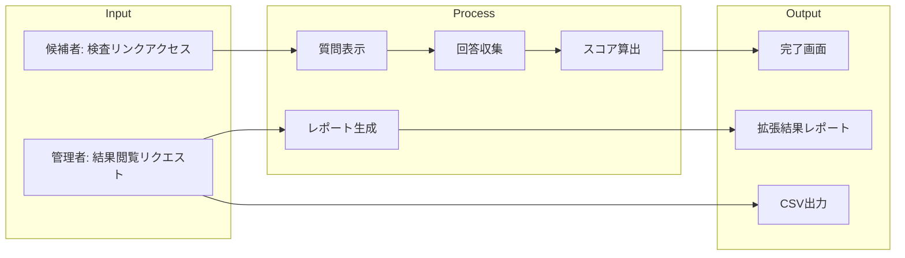

# REQ-148: 性格検査拡張 - 行動特性・ストレス耐性・EQ・価値観診断

**Issue**: #148
**作成日**: 2025-12-30
**作成者**: @claude-code
**ステータス**: Draft

---

## Phase 2: 要件定義・ユースケース

### 2.1 機能概要

**目的（Why）**:
Big5性格検査のみでは採用判断の材料として不十分であり、競合サービス（SPI、CUBIC、ミキワメ等）との差別化が困難。多面的な性格検査を実装し、採用精度を向上させる。

**対象ユーザー（Who）**:
- 採用担当者
- 人事部門
- 候補者（検査受験者）

**達成したい価値（What）**:
- より多面的な人物理解
- 採用精度の向上
- 競合サービスとの機能パリティ達成

---

### 2.2 ユースケース定義（Role × Outcome）

#### UC-ID体系

| フィールド | 値 | 説明 |
|-----------|-----|------|
| DOMAIN | ASSESS | 適性検査ドメイン |
| ROLE | ADMIN / CANDIDATE | 管理者 / 候補者 |
| OUTCOME | CONDUCT / VIEW / ANALYZE | 実施 / 閲覧 / 分析 |
| CHANNEL | WEB | Webチャネル |

#### ユースケース一覧

| UC-ID | Role | Outcome | 説明 |
|-------|------|---------|------|
| UC-ASSESS-CAND-CONDUCT-WEB | Candidate | 検査実施 | 候補者が行動特性・ストレス耐性・EQ・価値観検査を実施する |
| UC-ASSESS-ADMIN-VIEW-WEB | Admin | 結果閲覧 | 管理者が候補者の拡張検査結果を閲覧する |
| UC-ASSESS-ADMIN-ANALYZE-WEB | Admin | 比較分析 | 管理者が複数候補者の検査結果を比較分析する |
| UC-ASSESS-ADMIN-EXPORT-WEB | Admin | CSV出力 | 管理者が拡張検査結果を含むCSVを出力する |

---

### 2.3 カバレッジマトリクス（MECE証明）

| Role \ Outcome | 検査実施 | 結果閲覧 | 比較分析 | CSV出力 |
|----------------|----------|----------|----------|---------|
| Admin          | —        | ✅       | 🟡       | 🟡      |
| Candidate      | ✅       | —        | —        | —       |

**凡例**:
- ✅ Gold E2E対象
- 🟡 Bronze/Silver対象（Gold対象外）
- — 該当なし

**該当なしの理由**:
- Admin → 検査実施: 管理者は検査を受験しない
- Candidate → 結果閲覧/比較分析/CSV出力: 候補者は自分の結果を見られない（将来機能）

---

### 2.4 価値フローマップ



---

## Phase 3: 品質基準

### 3.1 DoD Level

**選択した DoD Level**: [x] Silver

| Level | 観点数 | カバレッジ | 用途 |
|-------|--------|-----------|------|
| Bronze | 27 | 80% | プロトタイプ・緊急修正 |
| **Silver** | **31** | **85%** | **推奨（通常開発）** ← 選択 |
| Gold | 19 | 95% | 本番リリース・重要機能 |

**選択理由**:
- 新規機能追加だが、既存の検査フローを拡張する形
- 4つの検査を段階的に実装するため、各フェーズでSilver品質を担保
- 全フェーズ完了後にGold昇格を検討

---

### 3.2 Pre-mortem（失敗シナリオ）

| # | 失敗シナリオ | 発生確率 | 対策 |
|---|------------|---------|------|
| 1 | 質問数が多すぎて候補者が離脱 | High | 各検査15-25問に制限、進捗バー表示、中断・再開機能 |
| 2 | スコア算出ロジックの信頼性不足 | Med | 心理学的根拠に基づく設計、専門家レビュー、テストケース充実 |
| 3 | 既存Big5との整合性問題 | Med | DB設計時に拡張性を考慮、既存テーブルへの影響を最小化 |
| 4 | 結果レポートの情報過多 | Med | タブ/アコーディオンでセクション分割、サマリービュー優先 |
| 5 | パフォーマンス劣化（質問数増加） | Low | ページネーション、遅延読み込み、キャッシュ戦略 |

---

## Phase 4: 技術設計

### 4.1 DB設計

#### 新規テーブル

```sql
-- 検査タイプマスタ
CREATE TABLE assessment_types (
    id UUID PRIMARY KEY DEFAULT gen_random_uuid(),
    code TEXT UNIQUE NOT NULL, -- 'big5', 'disc', 'stress', 'eq', 'values'
    name TEXT NOT NULL,
    description TEXT,
    question_count INT NOT NULL,
    estimated_minutes INT NOT NULL,
    is_active BOOLEAN DEFAULT true,
    display_order INT DEFAULT 0,
    created_at TIMESTAMPTZ DEFAULT NOW(),
    updated_at TIMESTAMPTZ DEFAULT NOW()
);

-- 質問マスタ（全検査タイプ統合）
CREATE TABLE assessment_questions (
    id UUID PRIMARY KEY DEFAULT gen_random_uuid(),
    assessment_type_id UUID REFERENCES assessment_types(id),
    question_text TEXT NOT NULL,
    question_order INT NOT NULL,
    dimension TEXT NOT NULL, -- 'D', 'I', 'S', 'C' for DISC, etc.
    reverse_scored BOOLEAN DEFAULT false,
    created_at TIMESTAMPTZ DEFAULT NOW(),
    updated_at TIMESTAMPTZ DEFAULT NOW()
);

-- 回答（既存テーブル拡張 or 新規）
CREATE TABLE assessment_responses (
    id UUID PRIMARY KEY DEFAULT gen_random_uuid(),
    candidate_id UUID REFERENCES candidates(id) ON DELETE CASCADE,
    assessment_type_id UUID REFERENCES assessment_types(id),
    question_id UUID REFERENCES assessment_questions(id),
    answer_value INT NOT NULL CHECK (answer_value BETWEEN 1 AND 5),
    answered_at TIMESTAMPTZ DEFAULT NOW(),
    created_at TIMESTAMPTZ DEFAULT NOW()
);

-- 検査結果スコア
CREATE TABLE assessment_scores (
    id UUID PRIMARY KEY DEFAULT gen_random_uuid(),
    candidate_id UUID REFERENCES candidates(id) ON DELETE CASCADE,
    assessment_type_id UUID REFERENCES assessment_types(id),
    dimension TEXT NOT NULL,
    raw_score DECIMAL(5,2) NOT NULL,
    normalized_score DECIMAL(5,2) NOT NULL, -- 0-100
    percentile INT, -- 母集団比較用（将来）
    calculated_at TIMESTAMPTZ DEFAULT NOW(),
    created_at TIMESTAMPTZ DEFAULT NOW(),
    UNIQUE (candidate_id, assessment_type_id, dimension)
);

-- RLS有効化
ALTER TABLE assessment_types ENABLE ROW LEVEL SECURITY;
ALTER TABLE assessment_questions ENABLE ROW LEVEL SECURITY;
ALTER TABLE assessment_responses ENABLE ROW LEVEL SECURITY;
ALTER TABLE assessment_scores ENABLE ROW LEVEL SECURITY;

-- RLSポリシー: assessment_types（全員閲覧可）
CREATE POLICY "Anyone can view active assessment types"
    ON assessment_types FOR SELECT
    USING (is_active = true);

-- RLSポリシー: assessment_questions（全員閲覧可）
CREATE POLICY "Anyone can view questions"
    ON assessment_questions FOR SELECT
    USING (true);

-- RLSポリシー: assessment_responses
CREATE POLICY "Candidates can insert own responses"
    ON assessment_responses FOR INSERT
    WITH CHECK (true); -- 候補者トークン認証で制御

CREATE POLICY "Admins can view all responses"
    ON assessment_responses FOR SELECT
    USING (auth.role() = 'authenticated');

-- RLSポリシー: assessment_scores
CREATE POLICY "Admins can view all scores"
    ON assessment_scores FOR SELECT
    USING (auth.role() = 'authenticated');

CREATE POLICY "System can insert scores"
    ON assessment_scores FOR INSERT
    WITH CHECK (true); -- Edge Function経由
```

#### インデックス

```sql
CREATE INDEX idx_assessment_questions_type ON assessment_questions(assessment_type_id);
CREATE INDEX idx_assessment_responses_candidate ON assessment_responses(candidate_id);
CREATE INDEX idx_assessment_responses_type ON assessment_responses(assessment_type_id);
CREATE INDEX idx_assessment_scores_candidate ON assessment_scores(candidate_id);
CREATE INDEX idx_assessment_scores_type ON assessment_scores(assessment_type_id);
```

---

### 4.2 API設計

#### 新規エンドポイント

| Method | Path | 説明 | 認証 |
|--------|------|------|------|
| GET | /api/assessment/types | 利用可能な検査タイプ一覧 | Public |
| GET | /api/assessment/types/:code/questions | 検査の質問一覧 | Token |
| POST | /api/assessment/responses | 回答を保存 | Token |
| POST | /api/assessment/complete | 検査完了・スコア算出 | Token |
| GET | /api/admin/candidates/:id/scores | 候補者の全検査スコア | Admin |
| GET | /api/admin/candidates/:id/report | 統合レポートデータ | Admin |

#### zodスキーマ

```typescript
import { z } from 'zod';

// 回答送信
export const submitResponseSchema = z.object({
  candidateId: z.string().uuid(),
  assessmentTypeCode: z.enum(['big5', 'disc', 'stress', 'eq', 'values']),
  responses: z.array(z.object({
    questionId: z.string().uuid(),
    value: z.number().int().min(1).max(5),
  })),
});

// 検査完了
export const completeAssessmentSchema = z.object({
  candidateId: z.string().uuid(),
  assessmentTypeCode: z.enum(['big5', 'disc', 'stress', 'eq', 'values']),
});

// スコア結果
export const scoreResultSchema = z.object({
  assessmentType: z.string(),
  dimensions: z.array(z.object({
    name: z.string(),
    rawScore: z.number(),
    normalizedScore: z.number(),
    interpretation: z.string(),
  })),
  calculatedAt: z.string().datetime(),
});
```

---

### 4.3 UI設計

#### デザインモック

**Figma Link**: （作成予定）
**v0 Link**: （作成予定）

#### v0プロンプト案

```
Create an assessment page for personality tests.
Requirements:
- Progress bar showing current question / total questions
- Question text with 5-point Likert scale (strongly disagree to strongly agree)
- Previous / Next navigation buttons
- Save & Continue later button
- Assessment type indicator (DISC, Stress, EQ, Values)

Use shadcn/ui Card, RadioGroup, Button, Progress.
Japanese UI labels.
```

#### 画面一覧

| 画面 | パス | 状態 |
|------|------|------|
| 検査選択 | /assessment/:token | 新規 |
| 検査実施 | /assessment/:token/:type | 新規 |
| 検査完了 | /assessment/:token/complete | 既存拡張 |
| 結果詳細（管理者） | /admin/candidates/:id | 既存拡張 |

#### data-testid 命名

| 要素 | data-testid |
|------|-------------|
| 質問テキスト | `question-text` |
| 回答選択肢 | `answer-option-{1-5}` |
| 次へボタン | `next-button` |
| 前へボタン | `prev-button` |
| 進捗バー | `progress-bar` |
| 完了ボタン | `complete-button` |
| 結果タブ（DISC） | `result-tab-disc` |
| 結果タブ（Stress） | `result-tab-stress` |
| 結果タブ（EQ） | `result-tab-eq` |
| 結果タブ（Values） | `result-tab-values` |

---

### 4.4 変更ファイル一覧

| パス | 変更種別 | 説明 |
|-----|---------|------|
| `supabase/migrations/xxx_add_assessment_types.sql` | 新規 | 検査タイプ・質問テーブル |
| `supabase/migrations/xxx_add_assessment_responses.sql` | 新規 | 回答・スコアテーブル |
| `supabase/seed.sql` | 変更 | 質問データ投入 |
| `src/lib/validations/assessment.ts` | 新規 | zodスキーマ |
| `src/lib/assessment/scoring/` | 新規 | スコア算出ロジック |
| `src/lib/assessment/scoring/disc.ts` | 新規 | DISC理論スコア算出 |
| `src/lib/assessment/scoring/stress.ts` | 新規 | ストレス耐性スコア算出 |
| `src/lib/assessment/scoring/eq.ts` | 新規 | EQスコア算出 |
| `src/lib/assessment/scoring/values.ts` | 新規 | 価値観スコア算出 |
| `src/app/assessment/[token]/[type]/page.tsx` | 新規 | 検査実施画面 |
| `src/components/assessment/QuestionCard.tsx` | 新規 | 質問カードコンポーネント |
| `src/components/assessment/ProgressBar.tsx` | 新規 | 進捗バーコンポーネント |
| `src/app/admin/candidates/[id]/page.tsx` | 変更 | 結果表示拡張 |
| `src/components/admin/results/ExtendedResults.tsx` | 新規 | 拡張結果表示 |
| `src/components/admin/results/DISCChart.tsx` | 新規 | DISCチャート |
| `src/components/admin/results/EQRadar.tsx` | 新規 | EQレーダーチャート |

---

## Phase 5: テスト設計

### 5.1 Gold E2E 候補判定

**Gold E2E 対象か？**: [x] はい

#### 5つのレンズ評価

| # | レンズ | Yes/No | 根拠 |
|---|--------|--------|------|
| 1 | 壊れたら困るか？ | Yes | 検査結果が不正確だと採用判断に影響 |
| 2 | 実装ではなく振る舞いを見てるか？ | Yes | 検査実施→結果表示のフロー検証 |
| 3 | 嘘をついて通れないか？ | Yes | 実際の回答データがDBに保存・計算される必要 |
| 4 | 落ちた理由を1文で説明できるか？ | Yes | 「候補者が検査を完了し結果が表示される」 |
| 5 | 無いと何を諦めるか？ | Yes | 性格検査の信頼性保証を諦める |

**判定**: 5つすべて Yes → **Gold E2E 採用**

---

### 5.2 トリアージスコアリング

| 軸 | スコア (1-5) | 根拠 |
|----|-------------|------|
| Impact（売上/顧客体験への影響） | 5 | 検査結果の信頼性は採用判断の根幹 |
| Frequency（使用頻度） | 5 | 全候補者が検査を受験 |
| Detectability（検知の難しさ） | 4 | スコア算出ロジックのバグは発見困難 |
| Recovery Cost（復旧コスト） | 4 | 誤った結果が採用判断に使われると取り返しがつかない |
| **合計** | **18/20** | **必須（Gold E2E 確定）** |

---

### 5.3 GWT仕様（Gold E2E）

#### GS-148-001: 候補者が拡張検査を完了する

```gherkin
Feature: 拡張性格検査
  As a 候補者
  I want to 行動特性・ストレス耐性・EQ・価値観の検査を受ける
  So that 自分の特性を企業に伝えられる

  Scenario: DISC行動特性検査を完了する
    Given 候補者が検査リンクからアクセスしている
      And Big5検査が完了している
    When 「行動特性検査を開始」をクリックする
      And 全ての質問に回答する
      And 「完了」をクリックする
    Then 「検査が完了しました」が表示される
      And 次の検査（ストレス耐性）が選択可能になる
```

#### GS-148-002: 管理者が拡張検査結果を閲覧する

```gherkin
Feature: 拡張検査結果閲覧
  As a 管理者
  I want to 候補者の拡張検査結果を確認する
  So that 多面的な人物理解に基づいて採用判断できる

  Scenario: 全検査結果を閲覧する
    Given 管理者がログインしている
      And 候補者が全ての検査を完了している
    When 候補者詳細ページにアクセスする
    Then Big5結果が表示される
      And DISC結果タブが表示される
      And ストレス耐性タブが表示される
      And EQタブが表示される
      And 価値観タブが表示される
```

#### Playwrightマッピング

| GWT Step | Playwright実装 |
|----------|---------------|
| Given 候補者が検査リンクからアクセス | `await page.goto('/assessment/:token')` |
| When 「行動特性検査を開始」をクリック | `await page.click('[data-testid="start-disc"]')` |
| And 全ての質問に回答する | `for (q of questions) { await page.click('[data-testid="answer-option-3"]'); await page.click('[data-testid="next-button"]'); }` |
| Then 「検査が完了しました」が表示 | `await expect(page.getByText('検査が完了しました')).toBeVisible()` |

---

### 5.4 単体テスト設計

| 対象関数/コンポーネント | テストケース | 期待結果 |
|----------------------|------------|---------|
| `calculateDISCScore()` | 正常系: 全回答あり | 4次元スコア算出 |
| | 異常系: 回答欠損 | エラースロー |
| | 境界値: 全て1 / 全て5 | 極端なスコア |
| `calculateStressScore()` | 正常系: 全回答あり | 耐性・回復力スコア |
| `calculateEQScore()` | 正常系: 全回答あり | 4領域スコア |
| `calculateValuesScore()` | 正常系: 全回答あり | 価値観プロファイル |
| `QuestionCard` | レンダリング | 質問テキスト表示 |
| | 回答選択 | 選択状態変更 |
| `ProgressBar` | 進捗表示 | 正しいパーセンテージ |

---

### 5.5 トレーサビリティ

```
UC-ASSESS-CAND-CONDUCT-WEB
  └─→ GS-148-001: 候補者が拡張検査を完了する
       └─→ PW: e2e/gold/assessment-extended.spec.ts
            └─→ CI: e2e.yml (Gold E2E Stage)

UC-ASSESS-ADMIN-VIEW-WEB
  └─→ GS-148-002: 管理者が拡張検査結果を閲覧する
       └─→ PW: e2e/gold/admin-results-extended.spec.ts
            └─→ CI: e2e.yml (Gold E2E Stage)
```

| UC-ID | GS-ID | PW File | CI Stage |
|-------|-------|---------|----------|
| UC-ASSESS-CAND-CONDUCT-WEB | GS-148-001 | assessment-extended.spec.ts | Gold E2E |
| UC-ASSESS-ADMIN-VIEW-WEB | GS-148-002 | admin-results-extended.spec.ts | Gold E2E |

---

### 5.6 Gold実装チェックリスト

- [ ] Secrets: ハードコードなし、環境変数使用
- [ ] Selectors: data-testid ベース、class/xpath 禁止
- [ ] Local: `npx playwright test assessment-extended.spec.ts` 成功
- [ ] CI: GitHub Actions E2E 成功

---

## 実装フェーズ分割

Issue #148 は大規模なため、以下のサブタスクに分割：

| Phase | 内容 | 見積り | 依存 |
|-------|------|--------|------|
| 1 | DB設計・マイグレーション | - | - |
| 2 | 行動特性（DISC）実装 | - | Phase 1 |
| 3 | ストレス耐性実装 | - | Phase 1 |
| 4 | EQ実装 | - | Phase 1 |
| 5 | 価値観診断実装 | - | Phase 1 |
| 6 | 結果表示統合・E2Eテスト | - | Phase 2-5 |

---

## 承認

| ロール | 名前 | 承認日 | ステータス |
|--------|------|--------|-----------|
| 作成者 | @claude-code | 2025-12-30 | Draft |
| レビュアー | | | |
| 承認者 | | | |

---

## 更新履歴

| 日付 | 内容 | 更新者 |
|-----|------|--------|
| 2025-12-30 | 初版作成 | @claude-code |
