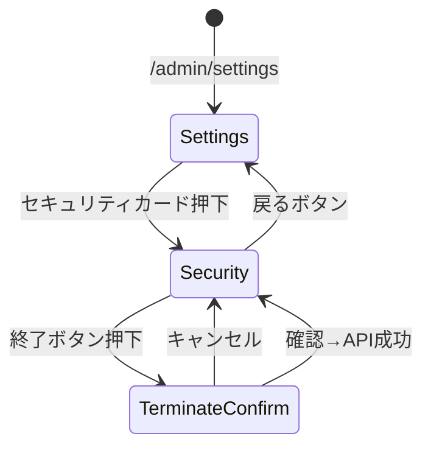

# Issue #134: セキュリティページの実装 - 要件定義

## 1. 調査レポート

**調査方法**: コードベース分析・設計ドキュメント参照
**調査日**: 2026-01-06
**調査レポートリンク**: [docs/plans/SETTINGS_IMPLEMENTATION_PLAN.md](https://github.com/PROLE-ISLAND/hy-assessment/blob/main/docs/plans/SETTINGS_IMPLEMENTATION_PLAN.md)

### Investigation Report 要約

| 項目 | 内容 |
|------|------|
| 既存システム名 | HY Assessment 設定ページ |
| エントリーポイント | UI: `/admin/settings/security` / API: `/api/settings/security/*` |
| 主要データモデル | login_history, user_sessions |
| キーファイル | `src/app/admin/settings/page.tsx`, `src/lib/supabase/` |
| 拡張ポイント | セッショントラッカー、ログイン履歴記録 |
| 破壊ポイント | Supabase Auth hookとの統合 |
| やりたいこと | ログイン履歴とアクティブセッション管理機能を実装する |

---

## 2. Phase 2: 要件定義・ユースケース

### 2.1 機能概要

| 項目 | 内容 |
|------|------|
| **なぜ必要か（Why）** | ユーザーがアカウントのセキュリティ状態を監視・制御できない |
| **誰が使うか（Who）** | 管理者ユーザー |
| **何を達成するか（What）** | ログイン履歴確認、不審なセッションの終了、セキュリティ監視 |

### 2.2 ユースケース定義（Role × Outcome）

| UC-ID | Role | Outcome | Channel | 説明 |
|-------|------|---------|---------|------|
| UC-SEC-ADMIN-VIEW-SESSIONS-WEB | Admin | セッション確認 | WEB | 現在のアクティブセッション一覧を表示 |
| UC-SEC-ADMIN-TERMINATE-SESSION-WEB | Admin | セッション終了 | WEB | 特定のセッションを強制終了 |
| UC-SEC-ADMIN-TERMINATE-ALL-WEB | Admin | 一括終了 | WEB | 現在以外の全セッションを終了 |
| UC-SEC-ADMIN-VIEW-HISTORY-WEB | Admin | 履歴確認 | WEB | ログイン履歴を時系列で確認 |

### 2.3 Role × Value マトリクス

| Role | 提供する価値 | 受け取る価値 | 関連Outcome |
|------|-------------|-------------|-------------|
| Admin | セキュリティ監視 | 不審アクセスの検知・対処 | VIEW-SESSIONS, VIEW-HISTORY |
| Admin | アクセス制御 | 不要セッションの排除 | TERMINATE-SESSION, TERMINATE-ALL |
| System | セッション追跡 | — | — |

### 2.4 カバレッジマトリクス

| Role＼Outcome | VIEW-SESSIONS | TERMINATE-SESSION | TERMINATE-ALL | VIEW-HISTORY |
|---------------|:-------------:|:-----------------:|:-------------:|:------------:|
| Admin | ✅ Phase 3 | ✅ Phase 3 | ✅ Phase 3 | ✅ Phase 3 |

### 2.5 入力ソースチェックリスト

| 入力ソース | 確認状態 | 抽出UC数 | 備考 |
|-----------|---------|---------|------|
| Issue #134 本文 | ✅ | 4 | UC定義済み |
| SETTINGS_IMPLEMENTATION_PLAN.md | ✅ | - | DB/API設計参照 |
| 既存設定ページ構造 | ✅ | - | パターン確認 |
| 競合サービス調査 | ✅ | - | GitHub, Google等のセッション管理UI参照 |

### 2.6 外部整合性チェック

- [x] 設計ドキュメントの仕様と整合している
- [x] 既存の設定ページパターンに従っている
- [x] Supabase Auth機能との統合を考慮している

---

## 3. Phase 3: 品質基準

### 3.1 DoD Level 選択

- [ ] Bronze (27観点: 80%カバレッジ)
- [x] Silver (31観点: 85%カバレッジ) ← 選択
- [ ] Gold (19観点: 95%カバレッジ)

**選定理由**: セキュリティ機能だが、頻度・ビジネスインパクトは中程度。Silver基準で十分な品質を確保。

### 3.2 Pre-mortem（失敗シナリオ）

| # | 失敗シナリオ | 発生確率 | 対策 | 確認方法 |
|---|-------------|---------|------|---------|
| 1 | 現在のセッションを誤って終了 | 中 | is_current フラグで保護、終了不可に | 単体テストで検証 |
| 2 | セッショントークンの不整合 | 中 | Supabase Auth sessionと同期 | 統合テストで検証 |
| 3 | IP/位置情報取得失敗 | 高 | フォールバック値を設定（"不明"） | 異常系テストで検証 |
| 4 | 大量のログイン履歴でパフォーマンス劣化 | 低 | ページネーション実装、90日以上は削除 | 負荷テストで検証 |

---

## 4. Phase 4: 技術設計

### 4.1 データベース設計

#### 新規テーブル

| テーブル名 | 用途 | RLSポリシー |
|-----------|------|------------|
| `login_history` | ログイン履歴記録 | user_id = auth.uid() |
| `user_sessions` | アクティブセッション管理 | user_id = auth.uid() |

#### login_history テーブル

```sql
CREATE TABLE login_history (
    id UUID PRIMARY KEY DEFAULT gen_random_uuid(),
    user_id UUID NOT NULL REFERENCES auth.users(id) ON DELETE CASCADE,
    ip_address INET,
    user_agent TEXT,
    device_type TEXT,  -- 'desktop', 'mobile', 'tablet'
    browser TEXT,      -- 'Chrome', 'Safari', 'Firefox'
    os TEXT,           -- 'macOS', 'Windows', 'iOS', 'Android'
    country TEXT,
    city TEXT,
    success BOOLEAN NOT NULL DEFAULT true,
    failure_reason TEXT,
    created_at TIMESTAMPTZ NOT NULL DEFAULT NOW()
);

CREATE INDEX idx_login_history_user ON login_history(user_id);
CREATE INDEX idx_login_history_created ON login_history(created_at DESC);

ALTER TABLE login_history ENABLE ROW LEVEL SECURITY;

CREATE POLICY "Users can view own login history" ON login_history
    FOR SELECT USING (auth.uid() = user_id);
```

#### user_sessions テーブル

```sql
CREATE TABLE user_sessions (
    id UUID PRIMARY KEY DEFAULT gen_random_uuid(),
    user_id UUID NOT NULL REFERENCES auth.users(id) ON DELETE CASCADE,
    session_token TEXT NOT NULL UNIQUE,
    ip_address INET,
    user_agent TEXT,
    device_type TEXT,
    browser TEXT,
    os TEXT,
    country TEXT,
    city TEXT,
    is_current BOOLEAN NOT NULL DEFAULT false,
    last_active_at TIMESTAMPTZ NOT NULL DEFAULT NOW(),
    expires_at TIMESTAMPTZ NOT NULL,
    created_at TIMESTAMPTZ NOT NULL DEFAULT NOW()
);

CREATE INDEX idx_user_sessions_user ON user_sessions(user_id);
CREATE INDEX idx_user_sessions_token ON user_sessions(session_token);
CREATE INDEX idx_user_sessions_expires ON user_sessions(expires_at);

ALTER TABLE user_sessions ENABLE ROW LEVEL SECURITY;

CREATE POLICY "Users can view own sessions" ON user_sessions
    FOR SELECT USING (auth.uid() = user_id);

CREATE POLICY "Users can delete own sessions" ON user_sessions
    FOR DELETE USING (auth.uid() = user_id);
```

#### CRUD操作マトリクス

| テーブル | Create | Read | Update | Delete | 担当API |
|---------|:------:|:----:|:------:|:------:|---------|
| login_history | ✅ | ✅ | ❌ | ❌ | Auth hook / GET /api/settings/security/login-history |
| user_sessions | ✅ | ✅ | ✅ | ✅ | Auth hook / GET,DELETE /api/settings/security/sessions |

#### RLSテスト観点

| ポリシー名 | 対象操作 | 許可条件 | テストケース |
|-----------|---------|---------|-------------|
| Users can view own login history | SELECT | auth.uid() = user_id | 自分の履歴のみ取得できること |
| Users can view own sessions | SELECT | auth.uid() = user_id | 自分のセッションのみ取得できること |
| Users can delete own sessions | DELETE | auth.uid() = user_id | 自分のセッションのみ削除できること |

### 4.2 API設計

| Method | Path | 説明 | 認証 |
|--------|------|------|------|
| GET | `/api/settings/security/sessions` | アクティブセッション一覧 | 必要 |
| DELETE | `/api/settings/security/sessions/:id` | 特定セッション終了 | 必要 |
| DELETE | `/api/settings/security/sessions` | 他の全セッション終了 | 必要 |
| GET | `/api/settings/security/login-history` | ログイン履歴取得 | 必要 |

#### エラーハンドリング設計

| API | エラーケース | HTTPステータス | レスポンス |
|-----|------------|--------------|-----------|
| GET /sessions | 認証エラー | 401 | `{ error: "unauthorized" }` |
| DELETE /sessions/:id | セッション存在しない | 404 | `{ error: "session_not_found" }` |
| DELETE /sessions/:id | 現在のセッション終了試行 | 400 | `{ error: "cannot_terminate_current_session" }` |
| DELETE /sessions/:id | 他ユーザーのセッション | 403 | `{ error: "forbidden" }` |

#### 非機能要件（API）

| 観点 | 要件 | 検証方法 |
|------|------|---------|
| レート制限 | 60 req/min | 負荷テストで確認 |
| タイムアウト | 10秒 | 統合テストで確認 |
| 最大ペイロード | 1MB | 境界値テストで確認 |
| ページネーション | login-history: 20件/page | 単体テストで確認 |

### 4.3 UI設計

#### 画面一覧

| 画面名 | パス | コンポーネント | 説明 |
|-------|------|---------------|------|
| セキュリティ設定 | /admin/settings/security | SecuritySettingsPage | メイン画面 |

#### バリアント実装チェック

| バリアント | 用途 | data-testid |
|-----------|------|-------------|
| Default | 正常データ表示 | `security-settings` |
| Loading | スケルトンUI | `security-settings-skeleton` |
| Empty | セッション/履歴なし | `security-settings-empty` |
| Error | API失敗 + 再試行ボタン | `security-settings-error` |

#### data-testid命名規則

```
data-testid="session-list"              # セッション一覧
data-testid="session-item-{id}"         # セッション行
data-testid="session-terminate-{id}"    # 終了ボタン
data-testid="session-terminate-all"     # 全終了ボタン
data-testid="login-history-table"       # 履歴テーブル
data-testid="login-history-row-{id}"    # 履歴行
```

#### 画面遷移図（State Machine）



### 4.4 変更ファイル一覧

| ファイルパス | 変更種別 | 概要 |
|-------------|---------|------|
| `supabase/migrations/xxx_login_history.sql` | 新規 | login_historyテーブル |
| `supabase/migrations/xxx_user_sessions.sql` | 新規 | user_sessionsテーブル |
| `src/types/database.ts` | 修正 | 型定義追加 |
| `src/app/api/settings/security/sessions/route.ts` | 新規 | セッションAPI |
| `src/app/api/settings/security/login-history/route.ts` | 新規 | ログイン履歴API |
| `src/app/admin/settings/security/page.tsx` | 新規 | セキュリティ設定画面 |
| `src/components/settings/SessionList.tsx` | 新規 | セッション一覧コンポーネント |
| `src/components/settings/LoginHistoryTable.tsx` | 新規 | ログイン履歴テーブル |
| `src/lib/auth/session-tracker.ts` | 新規 | セッション追跡ロジック |
| `src/lib/utils/device-parser.ts` | 新規 | User-Agent解析 |

---

## 5. Phase 5: テスト設計

### 5.1 Gold E2E候補評価（4つのレンズ）

| レンズ | 質問 | 回答 |
|--------|------|------|
| 行動フォーカス | 実装ではなくユーザー目標を検証しているか？ | はい |
| 欺瞞耐性 | モック/スタブでは通過できないか？ | いいえ（DBモックで検証可能） |
| 明確な失敗説明 | 失敗理由を1文で説明できるか？ | はい |
| リスク明示 | このテストがないと何を犠牲にするか？ | 中程度（セキュリティUI） |

### 5.2 トリアージスコアリング

| 軸 | 説明 | 評価（1-5） | 理由 |
|----|------|-----------|------|
| Impact | 壊れた時の影響 | 3 | セキュリティ監視が不可 |
| Frequency | どれくらい使われるか | 2 | 管理者が時々確認 |
| Detectability | 他で検知できるか | 3 | UIエラーで気づく |
| Recovery Cost | 復旧難易度 | 2 | UIのみ、データ影響なし |
| **合計** | | 10/20 | → **Silver基準（Gold不要）** |

### 5.3 単体テスト設計

| 対象関数/コンポーネント | テストケース | 期待結果 |
|----------------------|------------|---------|
| `parseUserAgent()` | Chrome on macOS | `{ browser: 'Chrome', os: 'macOS', deviceType: 'desktop' }` |
| `parseUserAgent()` | Safari on iOS | `{ browser: 'Safari', os: 'iOS', deviceType: 'mobile' }` |
| `parseUserAgent()` | 不明なUA | `{ browser: '不明', os: '不明', deviceType: 'desktop' }` |
| `formatLocation()` | 東京, 日本 | `"東京, 日本"` |
| `formatLocation()` | null値 | `"不明"` |
| `SessionList` | セッション3件 | 3行表示、現在セッションにバッジ |
| `SessionList` | 空配列 | Empty状態表示 |
| `LoginHistoryTable` | 履歴5件 | 5行表示、成功/失敗アイコン |

### 5.4 トレーサビリティ（UC → テスト追跡）

| UC-ID | 実装ファイル | テストファイル |
|-------|-------------|---------------|
| UC-SEC-ADMIN-VIEW-SESSIONS-WEB | sessions/route.ts, SessionList.tsx | sessions.test.ts |
| UC-SEC-ADMIN-TERMINATE-SESSION-WEB | sessions/route.ts | sessions.test.ts |
| UC-SEC-ADMIN-TERMINATE-ALL-WEB | sessions/route.ts | sessions.test.ts |
| UC-SEC-ADMIN-VIEW-HISTORY-WEB | login-history/route.ts, LoginHistoryTable.tsx | login-history.test.ts |

### 5.5 統合テスト設計

#### DB統合テスト

| テスト対象 | テスト内容 | 前提条件 | 期待結果 |
|-----------|-----------|---------|---------|
| login_history INSERT | ログイン記録追加 | 認証済みユーザー | レコード作成成功 |
| user_sessions SELECT | セッション取得 | 複数セッション存在 | 自分のセッションのみ取得 |
| user_sessions DELETE | セッション削除 | 他ユーザーのセッション | 403エラー |
| RLS検証 | 他ユーザーデータ | 非所有者として認証 | 0件取得 |

#### API統合テスト

| テスト対象 | テスト内容 | 入力 | 期待結果 |
|-----------|-----------|------|---------|
| GET /sessions | 認証なしアクセス | Authヘッダーなし | 401 |
| DELETE /sessions/:id | 現在セッション終了 | is_current=true | 400 |
| DELETE /sessions/:id | 存在しないID | 無効UUID | 404 |
| GET /login-history | ページネーション | page=2 | offset=20のデータ |

---

## 6. 受け入れ条件

- [ ] 現在のセッションが「現在のセッション」とマークされる
- [ ] 他のセッションを個別に終了できる
- [ ] 他のセッションを一括で終了できる（確認ダイアログ付き）
- [ ] ログイン履歴が新しい順に表示される（最大20件）
- [ ] 成功/失敗が視覚的に区別される（✅/❌）
- [ ] 2FA設定ボタンは「準備中」として無効表示
- [ ] ローディング・エラー・空状態のバリアント表示
- [ ] TypeScript型チェック（`npx tsc --noEmit`）通過
- [ ] ESLint（`npm run lint`）通過
- [ ] 単体テスト通過

---

## 7. 依存関係

**先行（このPRの前提）:**
- なし（独立して開発可能）

**後続（このPRに依存）:**
- 2FA実装（将来）

**マージ順序:**
本PRは独立して実装・マージ可能
