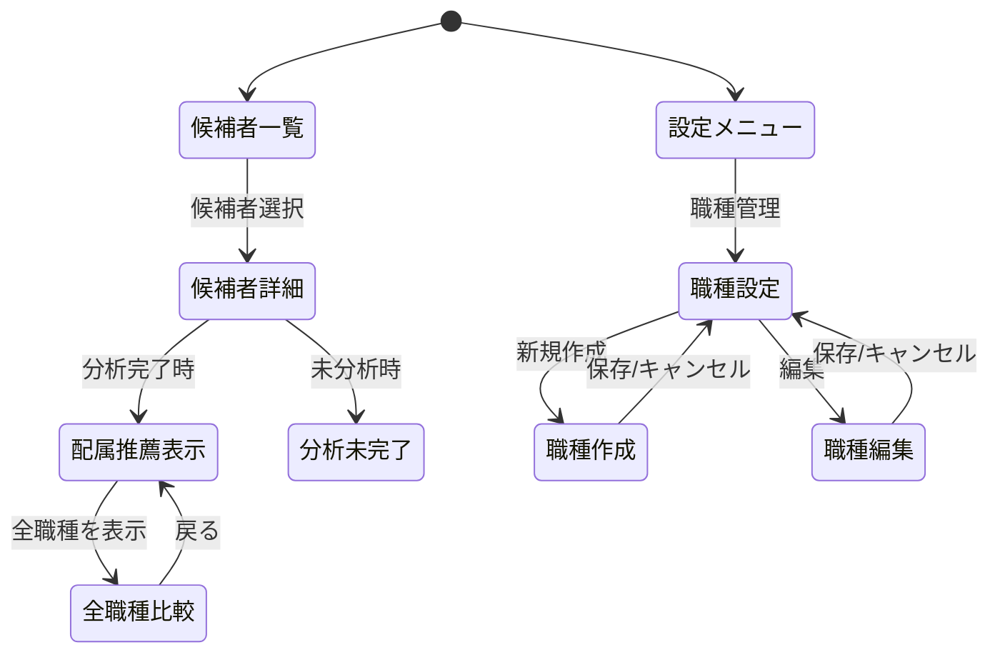

# Issue #149: 配属先推薦機能 - 職種・部署マッチングシステム

## 1. 調査レポート

**調査レポートリンク**: [競合分析レポート](https://github.com/PROLE-ISLAND/hy-assessment/blob/main/docs/COMPETITIVE_ANALYSIS.md)

### Investigation Report v1 要約

| 項目 | 内容 |
|------|------|
| 既存システム名 | HY Assessment 候補者分析機能 |
| エントリーポイント | UI: `/admin/candidates/[id]` / API: `/api/candidates/[id]` / 設定: `/admin/settings/*` |
| 主要データモデル | `candidates`, `assessments`, `ai_analyses`, `organizations`, `persons` |
| キーファイル（10） | `src/app/admin/candidates/[id]/page.tsx`, `src/components/candidates/CandidateDetailTabs.tsx`, `src/app/api/analysis/[assessmentId]/route.ts`, `src/lib/analysis/ai-analyzer.ts`, `src/types/database.ts`, `supabase/migrations/*`, `src/app/admin/settings/organization/page.tsx`, `src/lib/design-system/index.ts`, `src/lib/supabase/server.ts`, `src/components/analysis/AnalysisResultsClient.tsx` |
| 拡張ポイント | `candidates.desired_positions`フィールド（既存）、`ai_analyses.scores`（Big5スコア）、設定画面パターン（`/admin/settings/*`）、デザインシステム色定義 |
| 破壊ポイント | RLSポリシー追加時の既存クエリへの影響、candidates型定義変更時の型エラー |
| やりたいこと（1行） | 候補者の性格検査結果から最適な職種・部署を推薦し、配属ミスマッチを低減する |

### 競合サービス調査結果

| サービス | 実装状況 |
|---------|---------|
| Predictive Index | 職務適合度スコア表示、推奨職種提案 |
| ミキワメ | カルチャーフィット分析、部署相性評価 |
| SPI3 | 職務適性レポート（オプション） |

---

## 2. Phase 2: 要件定義・ユースケース

### 2.1 機能概要

| 項目 | 内容 |
|------|------|
| **なぜ必要か（Why）** | 検査結果を見ても「どこに配属すべきか」の判断材料がなく、配置ミスマッチによる早期離職リスクがある |
| **誰が使うか（Who）** | 人事担当者（admin/recruiter ロール） |
| **何を達成するか（What）** | 候補者の性格特性と職種要件のマッチングにより、最適な配属先を可視化・推薦する |

### 2.2 ユースケース定義（Role × Outcome）

> UC-ID命名規則: `UC-{DOMAIN}-{ROLE}-{OUTCOME}-{CHANNEL}`

| UC-ID | Role | Outcome | Channel | 説明 |
|-------|------|---------|---------|------|
| UC-MATCH-HR-VIEW-RECOMMEND-WEB | 人事担当者 | 候補者の配属推薦を確認する | WEB | 候補者詳細画面で推薦TOP3を表示 |
| UC-MATCH-HR-SETUP-JOBTYPE-WEB | 人事担当者 | 職種プロファイルを設定する | WEB | 職種マスター画面でBig5理想値を設定 |
| UC-MATCH-HR-UPDATE-JOBTYPE-WEB | 人事担当者 | 職種プロファイルを更新する | WEB | 既存職種の理想値・重みを調整 |
| UC-MATCH-HR-DELETE-JOBTYPE-WEB | 人事担当者 | 職種プロファイルを削除する | WEB | 不要な職種を論理削除 |
| UC-MATCH-HR-COMPARE-WEB | 人事担当者 | 複数職種との適合度を比較する | WEB | 全職種一覧でスコア比較 |

### 2.3 Role × Value マトリクス

| Role | 提供する価値 | 受け取る価値 | 関連Outcome |
|------|-------------|-------------|-------------|
| Admin | 職種プロファイル設定・管理 | 配属最適化による離職率低減 | VIEW-RECOMMEND, SETUP-JOBTYPE |
| Recruiter | 候補者の配属推薦確認 | 採用判断の精度向上 | VIEW-RECOMMEND, COMPARE |
| System | マッチングスコア算出 | — | 全UC |

### 2.4 カバレッジマトリクス（MECE証明）

> **空白セル禁止**: ✅ Gold E2E / 🟡 Bronze/Silver / — 対象外（理由必須）

| Role＼Outcome | VIEW-RECOMMEND | SETUP-JOBTYPE | UPDATE-JOBTYPE | DELETE-JOBTYPE | COMPARE |
|---------------|----------------|---------------|----------------|----------------|---------|
| Admin | ✅ Gold E2E | ✅ Gold E2E | 🟡 Silver | 🟡 Silver | 🟡 Silver |
| Recruiter | ✅ Gold E2E | — 権限なし | — 権限なし | — 権限なし | 🟡 Silver |
| Viewer | — 読み取りのみ | — 権限なし | — 権限なし | — 権限なし | — 読み取りのみ |

### 2.5 入力ソースチェックリスト（要件網羅性証明）

| 入力ソース | 確認状態 | 抽出UC数 | 備考 |
|-----------|---------|---------|------|
| FEATURES.md / 機能一覧 | ✅ | 2 | 配属推薦・職種設定 |
| ルーティング定義（app/構造） | ✅ | 2 | settings/job-types, candidates/[id] |
| DBスキーマ（主要テーブル） | ✅ | 3 | job_types, candidates, ai_analyses |
| 既存テストファイル | ✅ | 1 | 分析E2Eパターン参照 |
| Issue/PR履歴 | ✅ | 1 | #148, #153 性格検査関連 |

### 2.6 外部整合性チェック

- [x] FEATURES.md記載の全機能にUCが対応している
- [x] DBスキーマの主要テーブルがUCでカバーされている
- [x] ルーティング定義と画面一覧が整合している
- [x] 既存テストでカバーされている機能がUCに含まれている

---

## 3. Phase 3: 品質基準

### 3.1 DoD Level 選択

- [ ] Bronze (27観点: 80%カバレッジ)
- [x] Silver (31観点: 85%カバレッジ) ← 選択
- [ ] Gold (19観点: 95%カバレッジ)

**選定理由**: 新規機能追加でビジネスインパクト大（配属最適化）だが、既存パターンの拡張で技術リスクは中程度。Gold E2Eは主要フローのみ対象。

### 3.2 Pre-mortem（失敗シナリオ）

| # | 失敗シナリオ | 発生確率 | 対策 | 確認方法 |
|---|-------------|---------|------|---------|
| 1 | マッチングスコアが常に同じ値になる（アルゴリズムバグ） | 中 | 単体テストで境界値・極端値をカバー | 異なるプロファイルで異なるスコアが出ることをE2Eで検証 |
| 2 | RLSポリシー漏れで他組織の職種が見える | 低 | RLS統合テストでマルチテナント検証 | 異なる組織IDでの分離テスト |
| 3 | Big5スコアがnullの場合にクラッシュ | 中 | Null safe処理とEmpty状態バリアント | 未分析候補者での推薦表示テスト |
| 4 | 職種が0件の場合にUIが壊れる | 中 | Empty状態バリアントの実装 | 職種未設定時の画面表示テスト |
| 5 | 大量職種（100件以上）でパフォーマンス劣化 | 低 | ページネーション・インデックス | 負荷テスト（100職種でのレスポンス計測） |

---

## 4. Phase 4: 技術設計

### 4.1 データベース設計

**新規テーブル:**

| テーブル名 | 用途 | RLSポリシー |
|-----------|------|------------|
| `job_types` | 職種マスター（Big5理想プロファイル） | organization_id分離 |
| `departments` | 部署（Phase 4で実装、オプション） | organization_id分離 |

#### job_types テーブル定義

```sql
CREATE TABLE job_types (
    id UUID PRIMARY KEY DEFAULT gen_random_uuid(),
    organization_id UUID NOT NULL REFERENCES organizations(id) ON DELETE CASCADE,
    name VARCHAR(100) NOT NULL,
    description TEXT,
    -- 理想プロファイル（Big5基準値 0.00-1.00）
    ideal_openness DECIMAL(3,2),
    ideal_conscientiousness DECIMAL(3,2),
    ideal_extraversion DECIMAL(3,2),
    ideal_agreeableness DECIMAL(3,2),
    ideal_neuroticism DECIMAL(3,2),
    -- 重み付け（デフォルト1.0）
    weight_openness DECIMAL(3,2) DEFAULT 1.0,
    weight_conscientiousness DECIMAL(3,2) DEFAULT 1.0,
    weight_extraversion DECIMAL(3,2) DEFAULT 1.0,
    weight_agreeableness DECIMAL(3,2) DEFAULT 1.0,
    weight_neuroticism DECIMAL(3,2) DEFAULT 1.0,
    is_active BOOLEAN NOT NULL DEFAULT true,
    created_at TIMESTAMPTZ NOT NULL DEFAULT NOW(),
    updated_at TIMESTAMPTZ NOT NULL DEFAULT NOW(),
    deleted_at TIMESTAMPTZ
);

-- インデックス
CREATE INDEX idx_job_types_org ON job_types(organization_id) WHERE deleted_at IS NULL;
```

#### CRUD操作マトリクス

| テーブル | Create | Read | Update | Delete | 担当API |
|---------|:------:|:----:|:------:|:------:|---------|
| job_types | ✅ | ✅ | ✅ | ✅（論理） | POST/GET/PUT/DELETE /api/settings/job-types |
| candidates | ❌ | ✅ | ❌ | ❌ | GET /api/candidates/[id]/recommendations |
| ai_analyses | ❌ | ✅ | ❌ | ❌ | GET /api/candidates/[id]/recommendations |

#### RLSテスト観点

| ポリシー名 | 対象操作 | 許可条件 | テストケース |
|-----------|---------|---------|-------------|
| job_types_select | SELECT | organization_id = get_organization_id() AND deleted_at IS NULL | 自組織の職種のみ取得できる |
| job_types_insert | INSERT | organization_id = get_organization_id() | 自組織にのみ職種作成できる |
| job_types_update | UPDATE | organization_id = get_organization_id() | 他組織の職種は更新できない |
| job_types_delete | DELETE | organization_id = get_organization_id() | 他組織の職種は削除できない |

### 4.2 API設計

| Method | Path | 説明 | 認証 |
|--------|------|------|------|
| GET | `/api/settings/job-types` | 職種一覧取得 | 必要 |
| POST | `/api/settings/job-types` | 職種作成 | 必要（admin/recruiter） |
| PUT | `/api/settings/job-types/:id` | 職種更新 | 必要（admin/recruiter） |
| DELETE | `/api/settings/job-types/:id` | 職種削除（論理） | 必要（admin） |
| GET | `/api/candidates/:id/recommendations` | 配属推薦取得 | 必要 |

#### エラーハンドリング設計

| API | エラーケース | HTTPステータス | レスポンス |
|-----|------------|--------------|-----------|
| POST /api/settings/job-types | バリデーションエラー | 400 | `{ error: "validation_error", details: { name: "必須" } }` |
| POST /api/settings/job-types | 認証エラー | 401 | `{ error: "unauthorized" }` |
| POST /api/settings/job-types | 権限エラー（viewer） | 403 | `{ error: "forbidden" }` |
| GET /api/settings/job-types/:id | 存在しない | 404 | `{ error: "not_found" }` |
| GET /api/candidates/:id/recommendations | 分析未完了 | 400 | `{ error: "analysis_not_completed" }` |
| GET /api/candidates/:id/recommendations | 職種未設定 | 200 | `{ recommendations: [], message: "no_job_types_configured" }` |

#### 非機能要件（API）

| 観点 | 要件 | 検証方法 |
|------|------|---------|
| **レート制限** | 60req/min | 負荷テストで確認 |
| **タイムアウト** | 10秒 | 負荷テストで確認 |
| **最大ペイロード** | 1MB | 境界値テストで確認 |
| **レスポンスサイズ** | 推薦最大20件 | 大量職種でのレスポンス確認 |

### 4.3 UI設計

#### 画面一覧

| 画面名 | パス | コンポーネント | 説明 |
|-------|------|---------------|------|
| 職種設定 | /admin/settings/job-types | JobTypeManagement | 職種マスター管理 |
| 候補者詳細（拡張） | /admin/candidates/[id] | JobRecommendation | 推薦セクション追加 |

#### v0リンク・プレビュー

| 項目 | 値 |
|------|-----|
| **v0 Link** | TBD（/v0-generate で生成予定） |
| **Preview URL** | TBD（PR作成後にVercelから取得） |

#### バリアント実装チェック

**JobRecommendation コンポーネント:**

| バリアント | 用途 | data-testid |
|-----------|------|-------------|
| Default | 推薦TOP3表示 | `job-recommendation` |
| Loading | スケルトンUI | `job-recommendation-skeleton` |
| Empty | 職種未設定 | `job-recommendation-empty` |
| Error | API失敗 + 再試行 | `job-recommendation-error` |
| NoAnalysis | 分析未完了 | `job-recommendation-no-analysis` |

**JobTypeForm コンポーネント:**

| バリアント | 用途 | data-testid |
|-----------|------|-------------|
| Create | 新規作成フォーム | `job-type-form-create` |
| Edit | 編集フォーム | `job-type-form-edit` |
| Loading | 送信中 | `job-type-form-loading` |

#### data-testid命名規則

```
data-testid="job-type-{action}-{element}"
例:
- job-type-create-button
- job-type-name-input
- job-type-row-{id}
- job-recommendation-score-{jobTypeId}
- job-recommendation-reason-{jobTypeId}
```

#### 画面遷移図（State Machine）



| 遷移元 | 遷移先 | トリガー | 条件 | テストケース |
|-------|-------|---------|------|-------------|
| 候補者詳細 | 配属推薦表示 | ページ読み込み | ai_analyses.is_latest = true | 分析完了候補者で推薦表示 |
| 候補者詳細 | 分析未完了 | ページ読み込み | ai_analyses なし | 未分析候補者でEmpty表示 |
| 職種設定 | 職種作成 | 新規作成ボタン | admin/recruiter | 作成フォーム表示 |
| 職種作成 | 職種設定 | 保存 | バリデーション通過 | 一覧に追加 |

### 4.4 マッチングアルゴリズム

```typescript
// src/lib/matching/calculator.ts

interface Big5Profile {
  openness: number;          // 開放性 0-100
  conscientiousness: number; // 誠実性 0-100
  extraversion: number;      // 外向性 0-100
  agreeableness: number;     // 協調性 0-100
  neuroticism: number;       // 神経症傾向 0-100
}

interface JobTypeProfile {
  ideal: Big5Profile;
  weights: Big5Profile;
}

/**
 * 重み付きユークリッド距離の逆数でマッチングスコアを算出
 * スコア: 0-100（高いほど適合）
 */
function calculateMatchScore(
  candidate: Big5Profile,
  jobType: JobTypeProfile
): number {
  const dimensions = ['openness', 'conscientiousness', 'extraversion', 'agreeableness', 'neuroticism'];

  let weightedSumOfSquares = 0;
  let totalWeight = 0;

  for (const dim of dimensions) {
    const diff = (candidate[dim] - jobType.ideal[dim]) / 100;
    const weight = jobType.weights[dim];
    weightedSumOfSquares += weight * diff * diff;
    totalWeight += weight;
  }

  const normalizedDistance = Math.sqrt(weightedSumOfSquares / totalWeight);
  const score = Math.round((1 - normalizedDistance) * 100);

  return Math.max(0, Math.min(100, score));
}
```

### 4.5 変更ファイル一覧

| ファイルパス | 変更種別 | 概要 |
|-------------|---------|------|
| `supabase/migrations/xxx_create_job_types.sql` | 新規 | 職種マスターテーブル |
| `src/types/database.ts` | 修正 | JobType型定義追加 |
| `src/app/admin/settings/job-types/page.tsx` | 新規 | 職種設定ページ |
| `src/components/settings/JobTypeManagement.tsx` | 新規 | 職種管理コンポーネント |
| `src/components/settings/JobTypeForm.tsx` | 新規 | 職種作成/編集フォーム |
| `src/components/settings/JobTypeTable.tsx` | 新規 | 職種一覧テーブル |
| `src/app/api/settings/job-types/route.ts` | 新規 | 職種CRUD API |
| `src/app/api/settings/job-types/[id]/route.ts` | 新規 | 個別職種API |
| `src/app/api/candidates/[id]/recommendations/route.ts` | 新規 | 推薦API |
| `src/components/candidates/JobRecommendation.tsx` | 新規 | 推薦表示コンポーネント |
| `src/lib/matching/calculator.ts` | 新規 | マッチングアルゴリズム |
| `src/lib/matching/reason-generator.ts` | 新規 | 推薦理由生成 |

---

## 5. Phase 5: テスト設計

### 5.1 Gold E2E候補評価（4つのレンズ）

> 全て「はい」の場合のみGold E2E対象

| レンズ | 質問 | 回答 |
|--------|------|------|
| 行動フォーカス | 実装ではなくユーザー目標を検証しているか？ | はい（職種設定→推薦表示のフロー） |
| 欺瞞耐性 | モック/スタブでは通過できないか？ | はい（実際のスコア計算が必要） |
| 明確な失敗説明 | 失敗理由を1文で説明できるか？ | はい（「推薦が表示されない」） |
| リスク明示 | このテストがないと何を犠牲にするか説明できるか？ | はい（配属最適化機能の信頼性） |

### 5.2 トリアージスコアリング（Gold候補のみ）

> 16-20点 = Gold E2E必須、12-15点 = 推奨採用

| 軸 | 説明 | 評価（1-5） | 理由 |
|----|------|-----------|------|
| **Impact（影響度）** | 壊れた時の影響 | 4 | 配属ミスマッチは離職・生産性に直結 |
| **Frequency（頻度）** | どれくらい使われるか | 4 | 全候補者の配属判断で利用 |
| **Detectability（検知性）** | 他で検知できるか | 3 | 単体テストでは検知困難な統合問題 |
| **Recovery Cost（復旧コスト）** | 壊れた時の修復難易度 | 4 | 誤配属の修正コスト高 |
| **合計** | | 15/20 | → **Gold E2E推奨採用** |

### 5.3 GWT仕様（Gold E2E対象）

```gherkin
# =============================================================================
# Gold E2E: 配属推薦表示
# =============================================================================
# Role: 人事担当者
# Outcome: 候補者の配属推薦を確認する
# Triage Score: 15 (I:4/F:4/D:3/R:4)
# =============================================================================

Feature: 配属推薦機能

  Background:
    Given 管理者としてログインしている
      And 組織に職種「営業職」「企画職」「エンジニア」が設定されている

  Scenario: 分析完了候補者の配属推薦を確認する
    Given 候補者「山田太郎」の検査が完了している
      And AI分析が完了している
    When 候補者詳細画面を開く
    Then 「配属推薦」セクションが表示される
      And 推薦TOP3が適合度順に表示される
      And 各職種にマッチングスコアが表示される
      And 推薦理由が表示される

  Scenario: 職種を新規作成する
    Given 設定メニューを開いている
    When 「職種設定」をクリック
      And 「新規作成」ボタンをクリック
      And 職種名「カスタマーサクセス」を入力
      And Big5理想値を設定（外向性:高、協調性:高）
      And 「保存」をクリック
    Then 職種一覧に「カスタマーサクセス」が追加される
      And 成功メッセージが表示される
```

#### Playwrightマッピング

| GWT Step | Playwright実装 | data-testid |
|----------|---------------|-------------|
| Given 管理者としてログインしている | `await loginAsAdmin(page)` | - |
| When 候補者詳細画面を開く | `await page.goto('/admin/candidates/{id}')` | - |
| Then 「配属推薦」セクションが表示される | `await expect(page.getByTestId('job-recommendation')).toBeVisible()` | job-recommendation |
| And 推薦TOP3が適合度順に表示される | `await expect(page.getByTestId('recommendation-rank-1')).toBeVisible()` | recommendation-rank-{n} |
| When 「新規作成」ボタンをクリック | `await page.getByTestId('job-type-create-button').click()` | job-type-create-button |
| And 職種名を入力 | `await page.getByTestId('job-type-name-input').fill('カスタマーサクセス')` | job-type-name-input |

### 5.4 単体テスト設計

| 対象関数/コンポーネント | テストケース | 期待結果 |
|----------------------|------------|---------|
| `calculateMatchScore` | 正常系: 完全一致プロファイル | 100 |
| `calculateMatchScore` | 正常系: 完全不一致プロファイル | 0に近い値 |
| `calculateMatchScore` | 境界値: 全スコア0 | 有効なスコア |
| `calculateMatchScore` | 境界値: 全スコア100 | 有効なスコア |
| `calculateMatchScore` | 重み付け: 特定次元のみ高重み | 重み反映したスコア |
| `generateRecommendationReason` | 正常系: 高スコア | ポジティブな理由文 |
| `generateRecommendationReason` | 正常系: 低スコア | 改善提案を含む理由文 |
| `JobRecommendation` | Default状態 | 推薦リスト表示 |
| `JobRecommendation` | Loading状態 | スケルトン表示 |
| `JobRecommendation` | Empty状態 | 職種未設定メッセージ |
| `JobRecommendation` | Error状態 | エラー + 再試行ボタン |

### 5.5 トレーサビリティ（UC → テスト追跡）

| UC-ID | GS-ID | PW File | CI Stage |
|-------|-------|---------|----------|
| UC-MATCH-HR-VIEW-RECOMMEND-WEB | GS-001 | job-recommendations.spec.ts | Gold E2E |
| UC-MATCH-HR-SETUP-JOBTYPE-WEB | GS-002 | job-recommendations.spec.ts | Gold E2E |
| UC-MATCH-HR-UPDATE-JOBTYPE-WEB | - | job-types.integration.spec.ts | Silver |
| UC-MATCH-HR-DELETE-JOBTYPE-WEB | - | job-types.integration.spec.ts | Silver |
| UC-MATCH-HR-COMPARE-WEB | - | job-recommendations.spec.ts | Silver |

### 5.6 統合テスト設計

#### 5.6.1 DB統合テスト（Phase 4.1 CRUD操作マトリクス対応）

| テスト対象 | テスト内容 | 前提条件 | 期待結果 |
|-----------|-----------|---------|---------|
| Create操作 | job_typesにレコード挿入 | 認証済みadmin | 201 Created + DB反映 |
| Read操作 | job_typesからレコード取得 | レコード存在 | 200 OK + 正しいデータ |
| Update操作 | job_typesのレコード更新 | 所有組織として認証 | 200 OK + 更新反映 |
| Delete操作 | job_typesのレコード論理削除 | adminとして認証 | 200 OK + deleted_at設定 |
| RLS検証 | 他組織のjob_types操作 | 異なる組織IDで認証 | 0件取得 / 403 Forbidden |
| マルチテナント | 組織A/Bで別データ | 両組織にデータ存在 | 各組織で自分のデータのみ |

#### 5.6.2 API統合テスト（Phase 4.2 API設計対応）

| テスト対象 | テスト内容 | 入力 | 期待結果 |
|-----------|-----------|------|---------|
| 認証フロー | 未認証アクセス | Authヘッダーなし | 401 Unauthorized |
| 権限チェック | viewer による作成 | viewerトークン | 403 Forbidden |
| バリデーション | 職種名空 | `{ name: "" }` | 400 + エラー詳細 |
| バリデーション | Big5値範囲外 | `{ ideal_openness: 1.5 }` | 400 + エラー詳細 |
| 推薦API | 分析未完了候補者 | 未分析candidate_id | 400 + analysis_not_completed |
| 推薦API | 職種0件時 | 職種未設定組織 | 200 + 空配列 + メッセージ |

#### 5.6.3 UI統合テスト（Phase 4.3 画面遷移対応）

| テスト対象 | テスト内容 | 操作 | 期待結果 |
|-----------|-----------|------|---------|
| 画面遷移 | 候補者詳細→推薦表示 | 分析完了候補者を開く | 推薦セクション表示 |
| 画面遷移 | 設定→職種設定 | サイドバーから遷移 | 職種一覧表示 |
| フォーム→API | 職種作成 | フォーム入力→保存 | API呼出→一覧更新 |
| API→UI反映 | 推薦データ表示 | 詳細画面表示 | APIデータがUI反映 |
| ローディング | 推薦取得中 | 画面表示直後 | スケルトン表示 |
| エラー表示 | API失敗時 | ネットワークエラー | エラーUI + 再試行 |

#### 5.6.4 統合テスト実装ファイル

| カテゴリ | ファイルパス | フレームワーク |
|---------|-------------|---------------|
| DB統合 | `src/lib/matching/__tests__/calculator.integration.test.ts` | Vitest + Supabase Test |
| API統合 | `src/app/api/settings/job-types/__tests__/route.integration.test.ts` | Vitest + MSW |
| UI統合 | `e2e/integration/job-types.spec.ts` | Playwright |
| Gold E2E | `e2e/gold/job-recommendations.spec.ts` | Playwright |

---

## 6. 受け入れ条件

### Phase 1: 職種マスター設定
- [ ] job_typesテーブルが作成されている
- [ ] RLSポリシーで組織分離されている
- [ ] 職種一覧・作成・編集・削除UIが動作する
- [ ] Big5理想プロファイル設定UIが動作する

### Phase 2: マッチングアルゴリズム
- [ ] 候補者Big5スコアと職種プロファイルの類似度が算出される
- [ ] マッチングスコア（0-100）が正しく計算される
- [ ] 推薦理由テキストが生成される

### Phase 3: 推薦表示UI
- [ ] 候補者詳細画面に「配属推薦」セクションが表示される
- [ ] 推薦TOP3が適合度順に表示される
- [ ] 各バリアント（Loading/Empty/Error）が正しく表示される

### 共通
- [ ] 全単体テストがパス
- [ ] Gold E2Eテストがパス
- [ ] DoD Silver基準を満たす

---

## 7. 依存関係

**先行（このPRの前提）:**
- なし（独立して開発可能）

**後続（このPRに依存）:**
- Phase 4: 部署推薦（オプション機能）

**関連Issue:**
- #148 性格検査拡張（より精度向上）
- #153 性格分析カード追加（Big5データ提供）

**マージ順序（Stacked PR）:**
```
#xxx (DB: job_types) → #xxx (API: CRUD + 推薦) → #xxx (UI: 設定 + 推薦表示) → #xxx (E2E)
```

---

## 8. 実装フェーズ分割（Sub-Issue推奨）

| Phase | 内容 | 変更ドメイン | 推奨Issue分割 |
|-------|------|-------------|--------------|
| Phase 1 | 職種マスター | DB + API + UI | Sub-Issue #1 |
| Phase 2 | マッチングアルゴリズム | Lib | Sub-Issue #2 |
| Phase 3 | 推薦表示UI | UI | Sub-Issue #3 |
| E2E | Gold E2Eテスト | Test | Sub-Issue #4 |

> **注**: 本Issueは4つのドメイン（DB/API/UI/Test）を含むため、Sub-Issue分割を推奨
