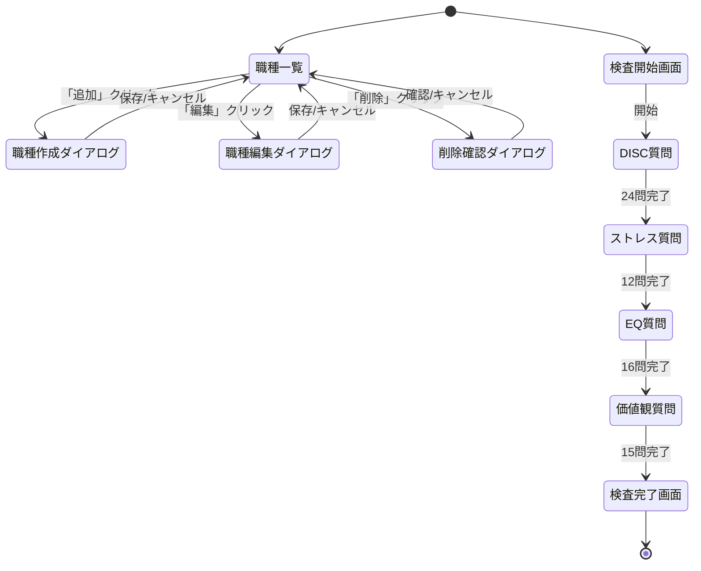

# Issue #192: [Phase 1] 職種マスター設定機能 - 実装計画

> **Phase 1 of 4**: 配属先推薦機能（親Issue #149）

---

## 1. 調査レポート

**調査レポートリンク**: 親Issue #149 で調査済み

### Investigation Report v1 要約

| 項目 | 内容 |
|------|------|
| 既存システム名 | HY Assessment 組織設定機能 |
| エントリーポイント | UI: `/admin/settings/` / API: `/api/settings/` |
| 主要データモデル | organizations, users, candidates, ai_analyses |
| キーファイル | `src/lib/analysis/personality-prompts.ts`, `src/lib/templates/gfd-gate-v1.ts` |
| 拡張ポイント | 設定画面に新規カード追加、新規APIルート追加、検査テンプレート追加 |
| 破壊ポイント | RLSポリシー設計ミス → データ漏洩リスク |
| やりたいこと（1行） | 職種マスターを作成し、4カテゴリパーソナリティ検査で配属マッチングを実現する |

### 設計方針の決定

**選択したアプローチ**: **検査分割 + 4カテゴリ直接測定 + 理想プロファイル**

| 検討アプローチ | 採否 | 理由 |
|---------------|------|------|
| GFD-Gateドメイン重み | ❌ | リスク評価向き、職種適性には不向き |
| パーソナリティ分析（AI推定） | ❌ | GFD-Gateからの間接推定で精度に課題 |
| **4カテゴリ直接測定 + 理想プロファイル** | ✅ | 専用質問で直接測定、精度向上 |

### 検査アーキテクチャ（分割設計）

```
┌─────────────────────────────────────────────────────────────────────┐
│                         検査システム                                  │
├─────────────────────────────────────────────────────────────────────┤
│                                                                     │
│  【検査1】GFD-Gate検査（既存・変更なし）                              │
│  ├─ 目的: リスク評価・適合性判定                                    │
│  ├─ 質問: 46 Likert + 6 SJT + 1 自由記述                           │
│  ├─ 時間: 15-20分                                                  │
│  └─ 出力: 6ドメインスコア（GOV/CONFLICT/REL/COG/WORK/VALID）        │
│                                                                     │
│  【検査2】パーソナリティ検査（新規追加）★ このIssueのスコープ        │
│  ├─ 目的: 職務適性・配属マッチング                                  │
│  ├─ 内容: 以下4カテゴリを測定                                       │
│  │   ├─ DISC（行動特性）: 24問（強制選択式）、D/I/S/C各0-100       │
│  │   ├─ ストレス耐性: 12問（Likert式）、総合+4下位指標             │
│  │   ├─ EQ（感情知性）: 16問（Likert式）、総合+4下位指標           │
│  │   └─ 価値観: 15問（順位付け式）、5価値観スコア                  │
│  └─ 合計: 約67問、15-24分                                           │
│                                                                     │
├─────────────────────────────────────────────────────────────────────┤
│                                                                     │
│  【職種マスタ設定】★ このIssueのスコープ                            │
│  ├─ 4カテゴリ理想プロファイル（各指標に理想値 + 重み）               │
│  │   ├─ DISC: D/I/S/C 理想値・重み                                 │
│  │   ├─ ストレス耐性: 理想総合スコア・重み                          │
│  │   ├─ EQ: 理想総合スコア・重み                                    │
│  │   └─ 価値観: 各価値観の理想スコア・重み                          │
│  └─ マッチング計算: 全指標の重み付き距離計算                         │
│                                                                     │
└─────────────────────────────────────────────────────────────────────┘
```

### パーソナリティ4カテゴリ詳細

#### 1. DISC（行動特性）

| 因子 | 名称 | 行動特性 | 高スコアの特徴 |
|------|------|----------|---------------|
| **D** | Dominance（主導性） | 結果志向、決断力、競争心 | リーダーシップ、目標達成志向 |
| **I** | Influence（影響力） | 社交性、説得力、楽観性 | コミュニケーション、チームビルディング |
| **S** | Steadiness（安定性） | 協調性、忍耐力、支援志向 | サポート、継続性、安定した業務 |
| **C** | Conscientiousness（慎重性） | 分析力、正確性、質への拘り | 品質管理、専門性、正確な業務 |

#### 2. ストレス耐性

| 指標 | 名称 | 測定内容 |
|------|------|----------|
| **pressureHandling** | プレッシャー耐性 | 締め切り・責任下でのパフォーマンス維持能力 |
| **recoverySpeed** | 回復速度 | ストレス後の立ち直り・リカバリー速度 |
| **emotionalStability** | 感情安定性 | 感情の波に左右されずに行動できる度合い |
| **adaptability** | 適応力 | 変化や予期せぬ状況への対応能力 |
| **overallScore** | 総合スコア | 上記4指標の加重平均 |

**リスクレベル判定**: low（70-100）、medium（40-69）、high（0-39）

#### 3. EQ（感情知性）

| 指標 | 名称 | 測定内容 |
|------|------|----------|
| **selfAwareness** | 自己認識 | 自分の感情・強み・弱みを正確に理解する能力 |
| **selfManagement** | 自己管理 | 感情・衝動をコントロールし、誠実に行動する能力 |
| **socialAwareness** | 社会的認識 | 他者の感情・ニーズ・組織力学を読み取る能力 |
| **relationshipManagement** | 関係管理 | 他者と効果的に協働し、影響を与える能力 |

#### 4. 価値観

| 指標 | 名称 | 測定内容 |
|------|------|----------|
| **achievement** | 達成志向 | 目標達成・成果・昇進を重視する度合い |
| **stability** | 安定志向 | 安定した環境・予測可能性を重視する度合い |
| **growth** | 成長志向 | 学習・スキルアップ・挑戦を重視する度合い |
| **socialContribution** | 社会貢献志向 | 社会への貢献・意義ある仕事を重視する度合い |
| **autonomy** | 自律志向 | 自己決定・独立性・裁量を重視する度合い |

---

## 2. Phase 2: 要件定義・ユースケース

### 2.1 機能概要

| 項目 | 内容 |
|------|------|
| **なぜ必要か（Why）** | 配属推薦の精度向上のため、4カテゴリパーソナリティ直接測定と理想プロファイル設定が必要 |
| **誰が使うか（Who）** | 人事担当者（Admin/Recruiter）+ 候補者（パーソナリティ検査受験） |
| **何を達成するか（What）** | 4カテゴリ検査で直接測定 + 職種ごとの理想プロファイルでマッチング |

### 2.2 ユースケース定義（Role × Outcome）

| UC-ID | Role | Outcome | Channel | 説明 |
|-------|------|---------|---------|------|
| UC-JOB-ADMIN-LIST-WEB | Admin | 職種一覧を確認する | WEB | 職種一覧画面表示 |
| UC-JOB-ADMIN-CREATE-WEB | Admin | 職種を新規作成する | WEB | 職種追加ダイアログ |
| UC-JOB-ADMIN-UPDATE-WEB | Admin | 職種プロファイルを編集する | WEB | 理想スコア・重みの変更 |
| UC-JOB-ADMIN-DELETE-WEB | Admin | 職種を削除する | WEB | 論理削除 |
| UC-PERSONALITY-CANDIDATE-TAKE-WEB | Candidate | パーソナリティ検査を受験する | WEB | 67問複合検査 |
| UC-PERSONALITY-ADMIN-VIEW-WEB | Admin | パーソナリティ結果を確認する | WEB | 4カテゴリプロファイル表示 |

### 2.3 Role × Value マトリクス

| Role | 提供する価値 | 受け取る価値 | 関連Outcome |
|------|-------------|-------------|-------------|
| Admin | 職種設定・検査結果分析 | 配属判断の根拠データ | LIST, CREATE, UPDATE, DELETE, VIEW |
| Candidate | 検査回答 | — | TAKE |
| System | データ処理・スコアリング | — | 全UC |

### 2.4 カバレッジマトリクス（MECE証明）

| Role＼Outcome | LIST | CREATE | UPDATE | DELETE | TAKE | VIEW |
|---------------|:----:|:------:|:------:|:------:|:----:|:----:|
| Admin | ✅ Silver | ✅ Silver | ✅ Silver | ✅ Silver | — | ✅ Silver |
| Candidate | — | — | — | — | ✅ Silver | — |

### 2.5 入力ソースチェックリスト（要件網羅性証明）

| 入力ソース | 確認状態 | 抽出UC数 | 備考 |
|-----------|---------|---------|------|
| FEATURES.md / 機能一覧 | ✅ | 2 | 職種マスター、パーソナリティ検査 |
| ルーティング定義（app/構造） | ✅ | 3 | /admin/settings, /assessment, /admin/candidates |
| DBスキーマ（主要テーブル） | ✅ | 2 | job_types, personality_assessments |
| 既存テストファイル | N/A | 0 | 新規機能 |
| Issue/PR履歴 | ✅ | 1 | #149 配属先推薦機能 |

### 2.6 外部整合性チェック

- [x] 親Issue #149 の要件と整合している
- [x] 既存検査（GFD-Gate）との併存設計を確認
- [x] 組織設定画面の拡張パターンと整合している
- [x] 候補者詳細画面の拡張パターンと整合している

---

## 3. Phase 3: 品質基準

### 3.1 DoD Level 選択

- [ ] Bronze (27観点: 80%カバレッジ)
- [x] Silver (31観点: 85%カバレッジ) ← 選択
- [ ] Gold (19観点: 95%カバレッジ)

**選定理由**: 後続Phase（マッチングアルゴリズム #193）の基盤となるため、Silver品質を担保。特にDB設計の品質がPhase 2-4全体に影響する。

### 3.2 Pre-mortem（失敗シナリオ）

| # | 失敗シナリオ | 発生確率 | 対策 | 確認方法 |
|---|-------------|---------|------|---------|
| 1 | **RLSポリシー漏れ** - 他組織の職種・検査結果が見える | 中 | organization_id必須、全クエリにRLS適用 | 統合テストで他組織アクセス検証 |
| 2 | **スコアリング計算誤り** - 4カテゴリの計算ロジックバグ | 中 | 各カテゴリの計算を独立関数化、境界値テスト | 単体テストで全パターン検証 |
| 3 | **検査途中離脱** - 67問で離脱率増加 | 高 | 進捗バー表示、自動保存、セクション分割 | E2Eで離脱→復帰フロー検証 |
| 4 | **理想プロファイル未設定** - 職種登録時にプロファイル未入力 | 中 | デフォルト値設定、バリデーション警告 | フォームバリデーションテスト |
| 5 | **マイグレーション失敗** - 本番環境でのテーブル作成失敗 | 低 | ローカル→Staging→本番の段階デプロイ | Staging環境で事前検証 |

---

## 4. Phase 4: 技術設計

### 4.1 データベース設計

**新規テーブル:**

| テーブル名 | 用途 | RLSポリシー |
|-----------|------|------------|
| job_types | 職種マスター（4カテゴリ理想プロファイル） | organization_id ベース |
| personality_assessments | パーソナリティ検査結果（4カテゴリ） | organization_id ベース |

#### CRUD操作マトリクス

| テーブル | Create | Read | Update | Delete | 担当API |
|---------|:------:|:----:|:------:|:------:|---------|
| job_types | ✅ | ✅ | ✅ | ✅（論理削除） | POST/GET/PUT/DELETE `/api/settings/job-types` |
| personality_assessments | ✅ | ✅ | ❌ | ❌ | POST/GET `/api/assessments/personality` |

#### RLSテスト観点

| ポリシー名 | 対象操作 | 許可条件 | テストケース |
|-----------|---------|---------|-------------|
| job_types_select | SELECT | auth.uid() in org_users | 自組織の職種のみ取得可能 |
| job_types_insert | INSERT | is_admin(auth.uid()) | 管理者のみ作成可能 |
| job_types_update | UPDATE | is_admin(auth.uid()) | 管理者のみ更新可能 |
| job_types_delete | DELETE | is_admin(auth.uid()) | 管理者のみ削除可能 |
| personality_select | SELECT | auth.uid() in org_users | 自組織の結果のみ取得可能 |
| personality_insert | INSERT | true (検査システム経由) | 検査完了時に自動作成 |

#### 4.1.1 職種マスタースキーマ（4カテゴリ対応）

```sql
CREATE TABLE job_types (
    id UUID PRIMARY KEY DEFAULT gen_random_uuid(),
    organization_id UUID NOT NULL REFERENCES organizations(id) ON DELETE CASCADE,
    name VARCHAR(100) NOT NULL,
    description TEXT,

    -- DISC理想プロファイル
    ideal_dominance INTEGER CHECK (ideal_dominance IS NULL OR ideal_dominance BETWEEN 0 AND 100),
    weight_dominance DECIMAL(3,2) DEFAULT 0.5 CHECK (weight_dominance BETWEEN 0.0 AND 1.0),
    ideal_influence INTEGER CHECK (ideal_influence IS NULL OR ideal_influence BETWEEN 0 AND 100),
    weight_influence DECIMAL(3,2) DEFAULT 0.5 CHECK (weight_influence BETWEEN 0.0 AND 1.0),
    ideal_steadiness INTEGER CHECK (ideal_steadiness IS NULL OR ideal_steadiness BETWEEN 0 AND 100),
    weight_steadiness DECIMAL(3,2) DEFAULT 0.5 CHECK (weight_steadiness BETWEEN 0.0 AND 1.0),
    ideal_conscientiousness INTEGER CHECK (ideal_conscientiousness IS NULL OR ideal_conscientiousness BETWEEN 0 AND 100),
    weight_conscientiousness DECIMAL(3,2) DEFAULT 0.5 CHECK (weight_conscientiousness BETWEEN 0.0 AND 1.0),

    -- ストレス耐性理想プロファイル
    ideal_stress INTEGER CHECK (ideal_stress IS NULL OR ideal_stress BETWEEN 0 AND 100),
    weight_stress DECIMAL(3,2) DEFAULT 0.5 CHECK (weight_stress BETWEEN 0.0 AND 1.0),
    max_stress_risk VARCHAR(10) DEFAULT 'medium' CHECK (max_stress_risk IN ('low', 'medium', 'high')),

    -- EQ理想プロファイル
    ideal_eq INTEGER CHECK (ideal_eq IS NULL OR ideal_eq BETWEEN 0 AND 100),
    weight_eq DECIMAL(3,2) DEFAULT 0.5 CHECK (weight_eq BETWEEN 0.0 AND 1.0),

    -- 価値観理想プロファイル
    ideal_achievement INTEGER CHECK (ideal_achievement IS NULL OR ideal_achievement BETWEEN 0 AND 100),
    weight_achievement DECIMAL(3,2) DEFAULT 0.2 CHECK (weight_achievement BETWEEN 0.0 AND 1.0),
    ideal_stability INTEGER CHECK (ideal_stability IS NULL OR ideal_stability BETWEEN 0 AND 100),
    weight_stability DECIMAL(3,2) DEFAULT 0.2 CHECK (weight_stability BETWEEN 0.0 AND 1.0),
    ideal_growth INTEGER CHECK (ideal_growth IS NULL OR ideal_growth BETWEEN 0 AND 100),
    weight_growth DECIMAL(3,2) DEFAULT 0.2 CHECK (weight_growth BETWEEN 0.0 AND 1.0),
    ideal_social_contribution INTEGER CHECK (ideal_social_contribution IS NULL OR ideal_social_contribution BETWEEN 0 AND 100),
    weight_social_contribution DECIMAL(3,2) DEFAULT 0.2 CHECK (weight_social_contribution BETWEEN 0.0 AND 1.0),
    ideal_autonomy INTEGER CHECK (ideal_autonomy IS NULL OR ideal_autonomy BETWEEN 0 AND 100),
    weight_autonomy DECIMAL(3,2) DEFAULT 0.2 CHECK (weight_autonomy BETWEEN 0.0 AND 1.0),

    -- メタデータ
    is_active BOOLEAN NOT NULL DEFAULT true,
    created_at TIMESTAMPTZ NOT NULL DEFAULT NOW(),
    updated_at TIMESTAMPTZ NOT NULL DEFAULT NOW(),
    deleted_at TIMESTAMPTZ,

    UNIQUE(organization_id, name)
);

-- RLSポリシー
ALTER TABLE job_types ENABLE ROW LEVEL SECURITY;

CREATE POLICY job_types_select ON job_types FOR SELECT
    USING (organization_id IN (SELECT organization_id FROM users WHERE id = auth.uid()));

CREATE POLICY job_types_insert ON job_types FOR INSERT
    WITH CHECK (organization_id IN (SELECT organization_id FROM users WHERE id = auth.uid() AND role = 'admin'));

CREATE POLICY job_types_update ON job_types FOR UPDATE
    USING (organization_id IN (SELECT organization_id FROM users WHERE id = auth.uid() AND role = 'admin'));

CREATE POLICY job_types_delete ON job_types FOR DELETE
    USING (organization_id IN (SELECT organization_id FROM users WHERE id = auth.uid() AND role = 'admin'));
```

#### 4.1.2 パーソナリティ検査結果スキーマ

```sql
CREATE TABLE personality_assessments (
    id UUID PRIMARY KEY DEFAULT gen_random_uuid(),
    organization_id UUID NOT NULL REFERENCES organizations(id) ON DELETE CASCADE,
    candidate_id UUID NOT NULL REFERENCES candidates(id) ON DELETE CASCADE,

    -- DISC
    disc_dominance INTEGER NOT NULL CHECK (disc_dominance BETWEEN 0 AND 100),
    disc_influence INTEGER NOT NULL CHECK (disc_influence BETWEEN 0 AND 100),
    disc_steadiness INTEGER NOT NULL CHECK (disc_steadiness BETWEEN 0 AND 100),
    disc_conscientiousness INTEGER NOT NULL CHECK (disc_conscientiousness BETWEEN 0 AND 100),
    disc_primary_factor CHAR(1) NOT NULL CHECK (disc_primary_factor IN ('D', 'I', 'S', 'C')),
    disc_profile_pattern VARCHAR(4) NOT NULL,

    -- ストレス耐性
    stress_overall INTEGER NOT NULL CHECK (stress_overall BETWEEN 0 AND 100),
    stress_details JSONB NOT NULL DEFAULT '{}',
    stress_risk_level VARCHAR(10) NOT NULL CHECK (stress_risk_level IN ('low', 'medium', 'high')),

    -- EQ
    eq_overall INTEGER NOT NULL CHECK (eq_overall BETWEEN 0 AND 100),
    eq_details JSONB NOT NULL DEFAULT '{}',

    -- 価値観
    values_achievement INTEGER NOT NULL CHECK (values_achievement BETWEEN 0 AND 100),
    values_stability INTEGER NOT NULL CHECK (values_stability BETWEEN 0 AND 100),
    values_growth INTEGER NOT NULL CHECK (values_growth BETWEEN 0 AND 100),
    values_social_contribution INTEGER NOT NULL CHECK (values_social_contribution BETWEEN 0 AND 100),
    values_autonomy INTEGER NOT NULL CHECK (values_autonomy BETWEEN 0 AND 100),
    values_primary VARCHAR(30) NOT NULL,

    -- メタデータ
    responses JSONB NOT NULL DEFAULT '{}',
    completed_at TIMESTAMPTZ NOT NULL DEFAULT NOW(),
    duration_seconds INTEGER,
    created_at TIMESTAMPTZ NOT NULL DEFAULT NOW(),

    UNIQUE(candidate_id)
);

-- RLSポリシー
ALTER TABLE personality_assessments ENABLE ROW LEVEL SECURITY;

CREATE POLICY personality_select ON personality_assessments FOR SELECT
    USING (organization_id IN (SELECT organization_id FROM users WHERE id = auth.uid()));

CREATE POLICY personality_insert ON personality_assessments FOR INSERT
    WITH CHECK (true);  -- 検査システム経由で挿入
```

#### 職種プロファイル例

| 職種 | D理想 | I理想 | S理想 | C理想 | ストレス | EQ | 主要価値観 |
|------|-------|-------|-------|-------|---------|-----|-----------|
| 営業職 | 70 | 80 | 50 | 40 | 70 | 75 | achievement |
| エンジニア | 50 | 40 | 60 | 80 | 60 | 55 | growth |
| CS | 40 | 70 | 80 | 60 | 65 | 85 | socialContribution |
| 管理職 | 80 | 70 | 50 | 60 | 80 | 80 | achievement |

### 4.2 API設計

| Method | Path | 説明 | 認証 |
|--------|------|------|------|
| GET | `/api/settings/job-types` | 職種一覧取得 | 必要 |
| POST | `/api/settings/job-types` | 職種作成 | 必要（Admin） |
| PUT | `/api/settings/job-types/:id` | 職種更新 | 必要（Admin） |
| DELETE | `/api/settings/job-types/:id` | 職種削除 | 必要（Admin） |
| GET | `/api/assessments/personality/template` | 検査テンプレート取得 | 不要 |
| POST | `/api/assessments/personality/:candidateId` | 検査結果保存 | 不要（トークン認証） |
| GET | `/api/candidates/:id/personality` | 候補者パーソナリティ取得 | 必要 |

#### エラーハンドリング設計

| API | エラーケース | HTTPステータス | レスポンス |
|-----|------------|--------------|-----------|
| POST /api/settings/job-types | バリデーションエラー | 400 | `{ error: "validation_error", details: {...} }` |
| POST /api/settings/job-types | 認証エラー | 401 | `{ error: "unauthorized" }` |
| POST /api/settings/job-types | 権限エラー（非Admin） | 403 | `{ error: "forbidden" }` |
| POST /api/settings/job-types | 重複職種名 | 409 | `{ error: "duplicate_name" }` |
| GET /api/settings/job-types/:id | 存在しない | 404 | `{ error: "not_found" }` |
| POST /api/assessments/personality | トークン無効 | 401 | `{ error: "invalid_token" }` |
| POST /api/assessments/personality | 既に受験済み | 409 | `{ error: "already_completed" }` |

#### 非機能要件（API）

| 観点 | 要件 | 検証方法 |
|------|------|---------|
| **レート制限** | 60回/min | 負荷テストで確認 |
| **タイムアウト** | 30秒 | 負荷テストで確認 |
| **最大ペイロード** | 1MB | 境界値テストで確認 |
| **リトライポリシー** | 3回、1秒間隔 | 障害注入テストで確認 |

### 4.3 UI設計

#### 画面一覧

| 画面名 | パス | コンポーネント | 説明 |
|-------|------|---------------|------|
| 職種設定 | /admin/settings/job-types | JobTypesSettings | 職種一覧・CRUD（4タブ） |
| パーソナリティ検査 | /assessment/personality/:token | PersonalityAssessment | 候補者向け67問検査 |
| 結果表示 | /admin/candidates/:id | CandidatePersonalityTab | パーソナリティタブ追加 |

#### V0リンク・プレビュー

| 項目 | 値 |
|------|-----|
| **V0 Link** | https://v0.app/chat/dKKC2svn36k |
| **Preview URL** | https://demo-kzmiiguzj97ageuvaxx2.vusercontent.net |

#### バリアント実装チェック

| コンポーネント | Default | Loading | Empty | Error |
|---------------|:-------:|:-------:|:-----:|:-----:|
| JobTypesList | [ ] | [ ] | [ ] | [ ] |
| JobTypeForm | [ ] | [ ] | — | [ ] |
| PersonalityAssessment | [ ] | [ ] | — | [ ] |
| PersonalityResults | [ ] | [ ] | [ ] | [ ] |

#### data-testid命名規則

```
data-testid="job-type-list"                 # 職種一覧
data-testid="job-type-row-{id}"             # 職種行
data-testid="job-type-create-button"        # 作成ボタン
data-testid="job-type-edit-button-{id}"     # 編集ボタン
data-testid="job-type-delete-button-{id}"   # 削除ボタン
data-testid="job-type-form"                 # フォーム
data-testid="job-type-name-input"           # 名前入力
data-testid="disc-tab"                      # DISCタブ
data-testid="stress-tab"                    # ストレスタブ
data-testid="eq-tab"                        # EQタブ
data-testid="values-tab"                    # 価値観タブ
data-testid="personality-question-{n}"      # 検査質問
data-testid="personality-progress"          # 進捗バー
data-testid="personality-submit"            # 送信ボタン
```

#### 画面遷移図（State Machine）



| 遷移元 | 遷移先 | トリガー | 条件 | テストケース |
|-------|-------|---------|------|-------------|
| 職種一覧 | 職種作成ダイアログ | 追加ボタンクリック | Admin権限 | ダイアログ表示確認 |
| 職種編集ダイアログ | 職種一覧 | 保存ボタンクリック | バリデーション通過 | 一覧に反映確認 |
| DISC質問 | ストレス質問 | 24問回答完了 | 全問回答済み | 自動遷移確認 |
| 検査完了画面 | — | — | — | 完了メッセージ表示 |

### 4.4 変更ファイル一覧

| ファイルパス | 変更種別 | 概要 |
|-------------|---------|------|
| `supabase/migrations/xxx_create_job_types.sql` | 新規 | job_typesテーブル作成 |
| `supabase/migrations/xxx_create_personality_assessments.sql` | 新規 | personality_assessmentsテーブル作成 |
| `src/types/database.types.ts` | 修正 | 型定義追加 |
| `src/app/api/settings/job-types/route.ts` | 新規 | 職種CRUD API |
| `src/app/api/settings/job-types/[id]/route.ts` | 新規 | 職種個別API |
| `src/app/api/assessments/personality/route.ts` | 新規 | 検査テンプレートAPI |
| `src/app/api/assessments/personality/[candidateId]/route.ts` | 新規 | 検査結果保存API |
| `src/app/api/candidates/[id]/personality/route.ts` | 新規 | 候補者パーソナリティ取得API |
| `src/app/admin/settings/job-types/page.tsx` | 新規 | 職種設定ページ |
| `src/components/settings/JobTypesList.tsx` | 新規 | 職種一覧コンポーネント |
| `src/components/settings/JobTypeForm.tsx` | 新規 | 職種フォームコンポーネント |
| `src/app/assessment/personality/[token]/page.tsx` | 新規 | パーソナリティ検査ページ |
| `src/components/assessment/PersonalityAssessment.tsx` | 新規 | 検査コンポーネント |
| `src/components/candidates/PersonalityTab.tsx` | 新規 | 結果表示タブ |
| `src/lib/assessments/personality-scoring.ts` | 新規 | スコアリングロジック |
| `src/lib/templates/personality-questions.ts` | 新規 | 検査質問テンプレート |

---

## 5. Phase 5: テスト設計

### 5.1 Gold E2E候補評価（4つのレンズ）

| レンズ | 質問 | 回答 |
|--------|------|------|
| 行動フォーカス | 実装ではなくユーザー目標を検証しているか？ | はい（職種設定・検査完了） |
| 欺瞞耐性 | モック/スタブでは通過できないか？ | はい（DB・API統合必須） |
| 明確な失敗説明 | 失敗理由を1文で説明できるか？ | はい |
| リスク明示 | このテストがないと何を犠牲にするか説明できるか？ | はい（配属推薦基盤） |

**結論**: Silver E2E対象（Gold候補ではないが統合テスト必須）

### 5.2 単体テスト設計

| 対象関数/コンポーネント | テストケース | 期待結果 |
|----------------------|------------|---------|
| `calculateDiscScores()` | 正常系: 24問全回答 | D/I/S/C各スコア算出 |
| `calculateDiscScores()` | 境界値: 全問同一選択 | スコア偏り検出 |
| `calculateStressScore()` | 正常系: 12問全回答 | 総合スコア + リスクレベル |
| `calculateStressScore()` | 境界値: 70点境界 | リスクレベル判定確認 |
| `calculateEqScore()` | 正常系: 16問全回答 | 4指標スコア算出 |
| `calculateValuesScore()` | 正常系: 15問ランキング | 5価値観スコア + 主要価値観 |
| `JobTypeForm` | バリデーション: 名前空 | エラー表示 |
| `JobTypeForm` | バリデーション: 重み合計 > 1 | 警告表示 |

### 5.3 統合テスト設計

#### 5.3.1 DB統合テスト

| テスト対象 | テスト内容 | 前提条件 | 期待結果 |
|-----------|-----------|---------|---------|
| job_types Create | 職種作成 | Admin認証済み | 201 + DB反映 |
| job_types Read | 職種一覧取得 | 認証済み | 200 + 自組織のみ |
| job_types Update | 職種更新 | Admin認証済み | 200 + 更新反映 |
| job_types Delete | 職種論理削除 | Admin認証済み | 200 + deleted_at設定 |
| job_types RLS | 他組織アクセス | 他組織ユーザー | 空配列（アクセス不可） |
| personality Create | 検査結果保存 | トークン有効 | 201 + 全スコア保存 |
| personality Read | 結果取得 | 認証済み | 200 + 4カテゴリ全て |

#### 5.3.2 API統合テスト

| テスト対象 | テスト内容 | 入力 | 期待結果 |
|-----------|-----------|------|---------|
| 認証フロー | 未認証アクセス | Authヘッダーなし | 401 Unauthorized |
| 権限チェック | 非Adminが職種作成 | 一般ユーザートークン | 403 Forbidden |
| バリデーション | 不正スコア値 | ideal_dominance: 150 | 400 + エラー詳細 |
| 重複チェック | 同名職種作成 | 既存名と同一 | 409 Conflict |
| トークン検証 | 無効トークンで検査 | 期限切れトークン | 401 Invalid Token |

#### 5.3.3 UI統合テスト（E2E）

| テスト対象 | テスト内容 | 操作 | 期待結果 |
|-----------|-----------|------|---------|
| 職種CRUD | 作成→編集→削除 | フォーム操作 | 一覧に反映 |
| 検査フロー | 67問完了 | 全質問回答 | 完了画面表示 |
| 離脱→復帰 | 途中離脱→再開 | ブラウザ閉じ→再アクセス | 途中から再開 |
| 結果表示 | 4カテゴリ表示 | 候補者詳細→タブ | 全スコア表示 |

### 5.4 トレーサビリティ（UC → テスト追跡）

| UC-ID | テスト種別 | テストファイル | CI Stage |
|-------|----------|---------------|----------|
| UC-JOB-ADMIN-LIST-WEB | E2E | job-types.spec.ts | Silver |
| UC-JOB-ADMIN-CREATE-WEB | E2E | job-types.spec.ts | Silver |
| UC-JOB-ADMIN-UPDATE-WEB | E2E | job-types.spec.ts | Silver |
| UC-JOB-ADMIN-DELETE-WEB | E2E | job-types.spec.ts | Silver |
| UC-PERSONALITY-CANDIDATE-TAKE-WEB | E2E | personality-assessment.spec.ts | Silver |
| UC-PERSONALITY-ADMIN-VIEW-WEB | E2E | personality-results.spec.ts | Silver |

---

## 6. 受け入れ条件

### データベース
- [ ] job_types テーブル作成（4カテゴリ理想プロファイル）
- [ ] personality_assessments テーブル作成
- [ ] CHECK制約・RLSポリシー設定
- [ ] マイグレーション成功（Staging環境）

### API
- [ ] 職種マスターCRUD API（4エンドポイント）
- [ ] パーソナリティ検査API（2エンドポイント）
- [ ] 候補者パーソナリティ取得API
- [ ] エラーハンドリング実装

### 検査
- [ ] 検査テンプレート（67問）作成
- [ ] 4カテゴリスコアリングロジック実装
- [ ] 自動保存・離脱復帰機能

### UI
- [ ] 職種設定画面（4タブ切り替え）
- [ ] パーソナリティ検査画面（進捗バー付き）
- [ ] 候補者詳細パーソナリティタブ
- [ ] 全バリアント実装（Default/Loading/Empty/Error）

### テスト
- [ ] 単体テスト（スコアリングロジック）
- [ ] 統合テスト（DB・API）
- [ ] E2E テスト（Silver）

---

## 7. 依存関係

**先行（このPRの前提）:**
- なし（Phase 1 = 最初の実装）

**後続（このPRに依存）:**
- #193 Phase 2 マッチングアルゴリズム
- #194 Phase 3 配属推薦表示UI
- #195 Phase 4 部署推薦機能

**マージ順序:**
```
#192 (Phase 1: 職種マスター)
  → #193 (Phase 2: マッチングアルゴリズム)
  → #194 (Phase 3: 配属推薦UI)
  → #195 (Phase 4: 部署推薦)
```

---

## 8. 実装PR分割計画

Phase 1 は以下のPRに分割して実装:

| PR | ブランチ | 内容 | 依存 |
|----|---------|------|------|
| PR1 | `feature/issue-192-db` | DB: マイグレーション + RLS | なし |
| PR2 | `feature/issue-192-api` | API: 職種CRUD + 検査API | PR1 |
| PR3 | `feature/issue-192-ui` | UI: 職種設定 + 検査画面 + 結果表示 | PR2 |
