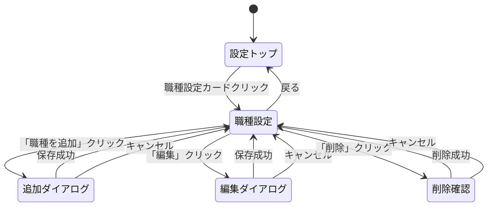

## 1. 調査レポート

**調査レポートリンク**: 親Issue #149 で調査済み

### Investigation Report v1 要約

| 項目 | 内容 |
|------|------|
| 既存システム名 | HY Assessment 組織設定機能 |
| エントリーポイント | UI: `/admin/settings/` / API: `/api/settings/` |
| 主要データモデル | organizations, users, candidates, ai_analyses |
| キーファイル（3-10） | `src/lib/analysis/types.ts`, `src/lib/templates/gfd-gate-v1.ts`, `src/lib/analysis/personality-prompts.ts` |
| 拡張ポイント | 設定画面に新規カード追加、新規APIルート追加 |
| 破壊ポイント | RLSポリシー設計ミス → データ漏洩リスク |
| やりたいこと（1行） | 職種マスターを作成し、GFD-Gateドメインの重み付けを設定可能にする |

### 設計方針の決定

**選択したアプローチ**: **GFD-Gateドメイン重み付け + パーソナリティ要件**

#### システム調査結果

システムはBig5を使用**していません**。以下の独自指標を使用:

| カテゴリ | 指標 | 説明 |
|---------|------|------|
| **GFD-Gate 6ドメイン** | GOV | ガバナンス適合（ルール遵守、責任感、誠実性） |
| | CONFLICT | 対立処理（意見表明、エスカレーション） |
| | REL | 対人態度（敬意、フィードバック受容性） |
| | COG | 認知スタイル（被害者意識、感情的反応の低さ） |
| | WORK | 業務遂行（勤勉さ、計画性、学習意欲） |
| | VALID | 妥当性（回答の一貫性と信頼性） |
| **パーソナリティ分析** | DISC | dominance, influence, steadiness, conscientiousness |
| | ストレス耐性 | pressureHandling, recoverySpeed, emotionalStability, adaptability |
| | EQ | selfAwareness, selfManagement, socialAwareness, relationshipManagement |
| | 価値観 | achievement, stability, growth, socialContribution, autonomy |

**設計根拠**:
- 実際に測定しているデータ（GFD-Gateドメイン）を使用
- Big5への変換不要（科学的整合性）
- 既存の全候補者データで即座に利用可能

---

## 2. Phase 2: 要件定義・ユースケース

### 2.1 機能概要

| 項目 | 内容 |
|------|------|
| **なぜ必要か（Why）** | 配属推薦機能の基盤として「職種ごとのドメイン重み付け」を定義する必要がある |
| **誰が使うか（Who）** | 人事担当者（Admin/Recruiter） |
| **何を達成するか（What）** | 組織ごとにカスタマイズ可能な職種マスターを設定・管理できる |

### 2.2 ユースケース定義（Role × Outcome）

| UC-ID | Role | Outcome | Channel | 説明 |
|-------|------|---------|---------|------|
| UC-JOB-ADMIN-LIST-WEB | Admin | 職種一覧を確認する | WEB | 職種一覧画面表示 |
| UC-JOB-ADMIN-CREATE-WEB | Admin | 職種を新規作成する | WEB | 職種追加ダイアログから登録 |
| UC-JOB-ADMIN-UPDATE-WEB | Admin | 職種プロファイルを編集する | WEB | ドメイン重み・要件の変更 |
| UC-JOB-ADMIN-DELETE-WEB | Admin | 職種を削除する | WEB | 論理削除（ソフトデリート） |
| UC-JOB-RECRUITER-LIST-WEB | Recruiter | 職種一覧を確認する | WEB | 閲覧のみ（編集不可） |

### 2.3 Role × Value マトリクス

| Role | 提供する価値 | 受け取る価値 | 関連Outcome |
|------|-------------|-------------|-------------|
| Admin | 職種プロファイル設定 | 配属推薦の参考情報 | LIST, CREATE, UPDATE, DELETE |
| Recruiter | — | 職種一覧の閲覧 | LIST |
| System | データ永続化 | — | — |

### 2.4 カバレッジマトリクス（MECE証明）

| Role＼Outcome | LIST | CREATE | UPDATE | DELETE |
|---------------|------|--------|--------|--------|
| Admin | ✅ Gold | 🟡 Silver | 🟡 Silver | 🟡 Silver |
| Recruiter | 🟡 Silver | — (権限なし) | — (権限なし) | — (権限なし) |
| Viewer | — (アクセス不可) | — | — | — |

### 2.5 外部整合性チェック

- [x] 既存設定画面（`/admin/settings/`）のUI/UXパターンに準拠
- [x] 既存RLSポリシーパターン（`organization_id`ベース）に準拠
- [x] 既存API設計パターン（Zod バリデーション、エラーレスポンス形式）に準拠
- [x] 既存スコアリングシステム（GFD-Gateドメイン）との整合性

---

## 3. Phase 3: 品質基準

### 3.1 DoD Level 選択

- [ ] Bronze (27観点: 80%カバレッジ)
- [x] Silver (31観点: 85%カバレッジ)
- [ ] Gold (19観点: 95%カバレッジ)

**選定理由**: 新規マスターテーブル＋CRUD APIの基盤機能。後続Phase（マッチングアルゴリズム）の基盤となるため、Silver品質を担保。

### 3.2 Pre-mortem（失敗シナリオ）

| # | 失敗シナリオ | 発生確率 | 対策 | 確認方法 |
|---|-------------|---------|------|---------|
| 1 | RLS設定ミスで他組織のデータが見える | 中 | 既存RLSパターン踏襲 + 統合テスト | RLS境界テストケース実施 |
| 2 | weight値の不正値が保存される | 高 | CHECK制約 + Zodバリデーション | 境界値テスト |
| 3 | ソフトデリート後のデータが一覧に表示される | 中 | `deleted_at IS NULL` 条件 | E2Eテスト |
| 4 | 同一組織内で職種名が重複登録される | 低 | ユニーク制約 | 重複テスト |

---

## 4. Phase 4: 技術設計

### 4.1 データベース設計

**新規テーブル:**

| テーブル名 | 用途 | RLSポリシー |
|-----------|------|------------|
| job_types | 職種マスター | organization_id ベース |

#### スキーマ定義（GFD-Gateドメインベース）

```sql
CREATE TABLE job_types (
    id UUID PRIMARY KEY DEFAULT gen_random_uuid(),
    organization_id UUID NOT NULL REFERENCES organizations(id) ON DELETE CASCADE,
    name VARCHAR(100) NOT NULL,
    description TEXT,

    -- GFD-Gate 6ドメインの重み（0.0-1.0）
    -- 高い重みほど、そのドメインのスコアがマッチングに強く影響
    weight_gov DECIMAL(3,2) NOT NULL DEFAULT 0.5 CHECK (weight_gov BETWEEN 0.0 AND 1.0),
    weight_conflict DECIMAL(3,2) NOT NULL DEFAULT 0.5 CHECK (weight_conflict BETWEEN 0.0 AND 1.0),
    weight_rel DECIMAL(3,2) NOT NULL DEFAULT 0.5 CHECK (weight_rel BETWEEN 0.0 AND 1.0),
    weight_cog DECIMAL(3,2) NOT NULL DEFAULT 0.5 CHECK (weight_cog BETWEEN 0.0 AND 1.0),
    weight_work DECIMAL(3,2) NOT NULL DEFAULT 0.5 CHECK (weight_work BETWEEN 0.0 AND 1.0),

    -- パーソナリティ要件（オプション）
    -- DISCタイプ: 'high-D', 'high-I', 'high-S', 'high-C', 'balanced', null
    required_disc_type VARCHAR(20) CHECK (required_disc_type IN ('high-D', 'high-I', 'high-S', 'high-C', 'balanced') OR required_disc_type IS NULL),
    -- 最低ストレス耐性スコア（0-100）
    min_stress_score INTEGER CHECK (min_stress_score IS NULL OR min_stress_score BETWEEN 0 AND 100),
    -- 最低EQスコア（0-100）
    min_eq_score INTEGER CHECK (min_eq_score IS NULL OR min_eq_score BETWEEN 0 AND 100),
    -- 重視する価値観: '達成志向', '安定志向', '成長志向', '社会貢献志向', '自律志向', null
    primary_value VARCHAR(50) CHECK (primary_value IN ('達成志向', '安定志向', '成長志向', '社会貢献志向', '自律志向') OR primary_value IS NULL),

    is_active BOOLEAN NOT NULL DEFAULT true,
    created_at TIMESTAMPTZ NOT NULL DEFAULT NOW(),
    updated_at TIMESTAMPTZ NOT NULL DEFAULT NOW(),
    deleted_at TIMESTAMPTZ,

    UNIQUE(organization_id, name)
);

-- インデックス
CREATE INDEX idx_job_types_organization ON job_types(organization_id) WHERE deleted_at IS NULL;

-- updated_at トリガー
CREATE TRIGGER update_job_types_updated_at
    BEFORE UPDATE ON job_types
    FOR EACH ROW
    EXECUTE FUNCTION update_updated_at_column();

-- RLS
ALTER TABLE job_types ENABLE ROW LEVEL SECURITY;

CREATE POLICY "Users can view job types in their org" ON job_types
    FOR SELECT USING (organization_id = public.get_organization_id() AND deleted_at IS NULL);

CREATE POLICY "Admins can insert job types" ON job_types
    FOR INSERT WITH CHECK (organization_id = public.get_organization_id());

CREATE POLICY "Admins can update job types" ON job_types
    FOR UPDATE USING (organization_id = public.get_organization_id())
    WITH CHECK (organization_id = public.get_organization_id());

CREATE POLICY "Admins can delete job types" ON job_types
    FOR DELETE USING (organization_id = public.get_organization_id());
```

#### GFD-Gateドメインの説明

| ドメイン | 日本語名 | 説明 | 重みが高い職種例 |
|---------|---------|------|----------------|
| GOV | ガバナンス適合 | ルール遵守、責任感、誠実性 | 経理、法務、品質管理 |
| CONFLICT | 対立処理 | 意見表明と適切なエスカレーション | 管理職、プロジェクトリーダー |
| REL | 対人態度 | 他者への敬意とフィードバック受容性 | 営業、カスタマーサポート |
| COG | 認知スタイル | 被害者意識の低さ、感情的安定性 | 全職種で重要 |
| WORK | 業務遂行 | 勤勉さ、計画性、学習意欲 | エンジニア、研究職 |

#### CRUD操作マトリクス

| テーブル | Create | Read | Update | Delete | 担当API |
|---------|:------:|:----:|:------:|:------:|---------|
| job_types | ✅ | ✅ | ✅ | ✅ (論理) | POST/GET/PUT/DELETE /api/settings/job-types |

#### RLSテスト観点

| ポリシー名 | 対象操作 | 許可条件 | テストケース |
|-----------|---------|---------|-------------|
| job_types_select | SELECT | organization_id = get_organization_id() AND deleted_at IS NULL | 他組織データ非表示、削除済み非表示 |
| job_types_insert | INSERT | organization_id = get_organization_id() | 自組織のみ作成可能 |
| job_types_update | UPDATE | organization_id = get_organization_id() | 自組織のみ更新可能 |
| job_types_delete | DELETE | organization_id = get_organization_id() | 自組織のみ削除可能 |

### 4.2 API設計

| Method | Path | 説明 | 認証 |
|--------|------|------|------|
| GET | `/api/settings/job-types` | 職種一覧取得 | 必要 |
| POST | `/api/settings/job-types` | 職種作成 | 必要（Admin） |
| PUT | `/api/settings/job-types/:id` | 職種更新 | 必要（Admin） |
| DELETE | `/api/settings/job-types/:id` | 職種削除（論理） | 必要（Admin） |

#### リクエスト/レスポンス例

**POST /api/settings/job-types**
```json
{
  "name": "営業職",
  "description": "顧客折衝・提案営業を担当",
  "weights": {
    "gov": 0.4,
    "conflict": 0.6,
    "rel": 0.9,
    "cog": 0.7,
    "work": 0.5
  },
  "requirements": {
    "disc_type": "high-I",
    "min_stress_score": 60,
    "min_eq_score": 70,
    "primary_value": "達成志向"
  }
}
```

**GET /api/settings/job-types**
```json
{
  "job_types": [
    {
      "id": "uuid",
      "name": "営業職",
      "description": "顧客折衝・提案営業を担当",
      "weights": {
        "gov": 0.4,
        "conflict": 0.6,
        "rel": 0.9,
        "cog": 0.7,
        "work": 0.5
      },
      "requirements": {
        "disc_type": "high-I",
        "min_stress_score": 60,
        "min_eq_score": 70,
        "primary_value": "達成志向"
      },
      "is_active": true,
      "created_at": "2026-01-07T00:00:00Z"
    }
  ]
}
```

#### エラーハンドリング設計

| API | エラーケース | HTTPステータス | レスポンス |
|-----|------------|--------------|-----------|
| POST /api/settings/job-types | バリデーションエラー | 400 | `{ error: "validation_error", details: {...} }` |
| POST /api/settings/job-types | 認証エラー | 401 | `{ error: "unauthorized" }` |
| POST /api/settings/job-types | 権限エラー（非Admin） | 403 | `{ error: "forbidden" }` |
| POST /api/settings/job-types | 名前重複 | 409 | `{ error: "duplicate_name" }` |
| PUT /api/settings/job-types/:id | 存在しない | 404 | `{ error: "not_found" }` |

#### 非機能要件（API）

| 観点 | 要件 | 検証方法 |
|------|------|---------|
| **レート制限** | 60/min | Supabase標準設定 |
| **タイムアウト** | 30秒 | Vercel標準設定 |
| **最大ペイロード** | 1MB | Next.js標準設定 |

### 4.3 UI設計

#### 画面一覧

| 画面名 | パス | コンポーネント | 説明 |
|-------|------|---------------|------|
| 職種設定 | /admin/settings/job-types | JobTypeList | 職種一覧・CRUD |

#### v0リンク・プレビュー

| 項目 | 値 |
|------|-----|
| **v0 Link** | https://v0.app/chat/eVWQ1bhjePV |
| **デモURL** | https://demo-kzmp6dny0ctarlg2i2x7.vusercontent.net |

> ⚠️ **注意**: V0生成済みUIはBig5スライダーベース。
> GFD-Gateドメインスライダーへの修正が必要

#### UI修正案（GFD-Gateドメインベース）

```
┌─────────────────────────────────────────────────────────────┐
│  職種を編集: 営業職                                  [×]   │
├─────────────────────────────────────────────────────────────┤
│  職種名 *                                                   │
│  ┌─────────────────────────────────────────────────────┐   │
│  │ 営業職                                              │   │
│  └─────────────────────────────────────────────────────┘   │
│                                                             │
│  説明                                                       │
│  ┌─────────────────────────────────────────────────────┐   │
│  │ 顧客折衝・提案営業を担当                            │   │
│  └─────────────────────────────────────────────────────┘   │
│                                                             │
│  ── ドメイン重み付け ───────────────────────────────────   │
│  （重要なドメインほど高い値に設定）                         │
│                                                             │
│  ガバナンス適合（GOV）                                      │
│  ルール遵守、責任感、誠実性                                 │
│  └──────────●──────────────────┘ 0.4                       │
│                                                             │
│  対立処理（CONFLICT）                                       │
│  意見表明と適切なエスカレーション                           │
│  └────────────●────────────────┘ 0.6                       │
│                                                             │
│  対人態度（REL）                                            │
│  他者への敬意とフィードバック受容性                         │
│  └───────────────────────●─────┘ 0.9                       │
│                                                             │
│  認知スタイル（COG）                                        │
│  被害者意識の低さ、感情的安定性                             │
│  └──────────────●──────────────┘ 0.7                       │
│                                                             │
│  業務遂行（WORK）                                           │
│  勤勉さ、計画性、学習意欲                                   │
│  └──────────●──────────────────┘ 0.5                       │
│                                                             │
│  ── パーソナリティ要件（オプション）───────────────────   │
│                                                             │
│  DISCタイプ                                                 │
│  ┌─────────────────────────────────────────────────────┐   │
│  │ high-I（影響力タイプ）                         ▼   │   │
│  └─────────────────────────────────────────────────────┘   │
│                                                             │
│  最低ストレス耐性スコア                                     │
│  ┌─────────────────────────────────────────────────────┐   │
│  │ 60                                                  │   │
│  └─────────────────────────────────────────────────────┘   │
│                                                             │
│  最低EQスコア                                               │
│  ┌─────────────────────────────────────────────────────┐   │
│  │ 70                                                  │   │
│  └─────────────────────────────────────────────────────┘   │
│                                                             │
│  重視する価値観                                             │
│  ┌─────────────────────────────────────────────────────┐   │
│  │ 達成志向                                       ▼   │   │
│  └─────────────────────────────────────────────────────┘   │
│                                                             │
│                              [キャンセル] [保存]           │
└─────────────────────────────────────────────────────────────┘
```

#### バリアント実装チェック

| バリアント | 用途 | 実装確認 |
|-----------|------|---------|
| Default | 正常データ表示 | [x] V0生成済み（ドメイン修正必要） |
| Loading | スケルトンUI | [x] V0生成済み |
| Empty | データなし状態 | [x] V0生成済み |
| Error | エラー + 再試行ボタン | [x] V0生成済み |

#### data-testid命名規則

```
data-testid="job-type-list"                    # 一覧コンテナ
data-testid="add-job-type-button"              # 追加ボタン
data-testid="job-type-form"                    # フォームダイアログ
data-testid="job-type-name-input"              # 名前入力
data-testid="weight-{domain}-slider"           # ドメイン重みスライダー
data-testid="disc-type-select"                 # DISCタイプ選択
data-testid="min-stress-input"                 # 最低ストレススコア
data-testid="min-eq-input"                     # 最低EQスコア
data-testid="primary-value-select"             # 価値観選択
data-testid="edit-button-{id}"                 # 編集ボタン
data-testid="delete-button-{id}"               # 削除ボタン
```

#### 画面遷移図（State Machine）



### 4.4 変更ファイル一覧

| ファイルパス | 変更種別 | 概要 |
|-------------|---------|------|
| `supabase/migrations/20260107000001_create_job_types.sql` | 新規 | 職種テーブル・RLS |
| `src/types/database.ts` | 修正 | JobType型定義追加 |
| `src/types/job-type.ts` | 新規 | 職種関連型定義（weights/requirements） |
| `src/lib/validations/job-type.ts` | 新規 | Zodスキーマ |
| `src/app/admin/settings/page.tsx` | 修正 | 職種設定カード追加 |
| `src/app/admin/settings/job-types/page.tsx` | 新規 | 職種設定画面 |
| `src/components/settings/JobTypeList.tsx` | 新規 | 職種一覧コンポーネント |
| `src/components/settings/JobTypeForm.tsx` | 新規 | 職種フォーム（ドメイン重み/要件UI） |
| `src/components/settings/DomainWeightSlider.tsx` | 新規 | ドメイン重みスライダー |
| `src/app/api/settings/job-types/route.ts` | 新規 | 職種一覧取得・作成API |
| `src/app/api/settings/job-types/[id]/route.ts` | 新規 | 職種更新・削除API |

---

## 5. Phase 5: テスト設計

### 5.1 Gold E2E候補評価（4つのレンズ）

| レンズ | 質問 | 回答 |
|--------|------|------|
| 行動フォーカス | 実装ではなくユーザー目標を検証しているか？ | はい |
| 欺瞞耐性 | モック/スタブでは通過できないか？ | はい（DB操作必須） |
| 明確な失敗説明 | 失敗理由を1文で説明できるか？ | はい |
| リスク明示 | このテストがないと何を犠牲にするか説明できるか？ | はい（配属推薦の基盤） |

### 5.2 トリアージスコアリング（Gold候補のみ）

| 軸 | 説明 | 評価（1-5） | 理由 |
|----|------|-----------|------|
| **Impact（影響度）** | 壊れた時の影響 | 4 | 配属推薦機能が使用不可 |
| **Frequency（頻度）** | どれくらい使われるか | 3 | 初期設定時に使用 |
| **Detectability（検知性）** | 他で検知できるか | 2 | 単体テストでは検知困難 |
| **Recovery Cost（復旧コスト）** | 壊れた時の修復難易度 | 3 | DB/API両方の修正必要 |
| **合計** | | 12/20 | → Silver推奨（条件付きGold） |

### 5.3 GWT仕様（Silver対象）

```gherkin
Feature: 職種マスター管理

  Background:
    Given Admin権限を持つユーザーでログイン済み
      And 職種設定画面（/admin/settings/job-types）を表示している

  Scenario: 職種を新規作成する（ドメイン重み付け）
    When 「職種を追加」ボタンをクリック
      And 職種名「営業職」を入力
      And 対人態度（REL）の重みを「0.9」に設定
      And DISCタイプで「high-I」を選択
      And 「保存」ボタンをクリック
    Then ダイアログが閉じる
      And 一覧に「営業職」が表示される

  Scenario: 職種プロファイルを編集する
    Given 「営業職」が登録されている
    When 「営業職」の編集ボタンをクリック
      And ガバナンス適合（GOV）の重みを「0.8」に変更
      And 「保存」ボタンをクリック
    Then 一覧の「営業職」の設定が更新される

  Scenario: 職種を削除する
    Given 「営業職」が登録されている
    When 「営業職」の削除ボタンをクリック
      And 削除確認ダイアログで「削除」をクリック
    Then 一覧から「営業職」が消える
```

### 5.4 単体テスト設計

| 対象関数/コンポーネント | テストケース | 期待結果 |
|----------------------|------------|---------|
| JobTypeForm | 正常系: 必須項目入力で送信可能 | 送信コールバック発火 |
| JobTypeForm | 異常系: 名前空で送信不可 | バリデーションエラー表示 |
| DomainWeightSlider | 重み値変更 | 0.0-1.0の範囲で更新 |
| DomainWeightSlider | 範囲外値入力 | 自動クランプ |
| JobTypeList | Loading状態 | スケルトン表示 |
| JobTypeList | Empty状態 | 空メッセージ表示 |
| JobTypeList | Error状態 | エラー + 再試行ボタン |
| validateJobType (Zod) | weight範囲外 | バリデーションエラー |
| validateJobType (Zod) | disc_type不正値 | バリデーションエラー |

### 5.5 トレーサビリティ（UC → テスト追跡）

| UC-ID | GS-ID | PW File | CI Stage |
|-------|-------|---------|----------|
| UC-JOB-ADMIN-LIST-WEB | GS-JOB-001 | job-types.spec.ts | Silver |
| UC-JOB-ADMIN-CREATE-WEB | GS-JOB-002 | job-types.spec.ts | Silver |
| UC-JOB-ADMIN-UPDATE-WEB | GS-JOB-003 | job-types.spec.ts | Silver |
| UC-JOB-ADMIN-DELETE-WEB | GS-JOB-004 | job-types.spec.ts | Silver |

### 5.6 統合テスト設計

#### 5.6.1 DB統合テスト

| テスト対象 | テスト内容 | 前提条件 | 期待結果 |
|-----------|-----------|---------|---------|
| Create | job_typesにレコード挿入 | 認証済みAdmin | 201 Created + DB反映 |
| Read | job_typesからレコード取得 | レコード存在 | 200 OK + weights正しくパース |
| Update | job_typesのレコード更新 | 所有者として認証 | 200 OK + 更新反映 |
| Delete | job_typesの論理削除 | Adminとして認証 | 200 OK + deleted_at設定 |
| RLS検証 | 他組織のデータ操作 | 他組織ユーザー | データ取得不可 |
| CHECK制約 | weight範囲外 | Admin | DBエラー |
| CHECK制約 | disc_type不正値 | Admin | DBエラー |

#### 5.6.2 API統合テスト

| テスト対象 | テスト内容 | 入力 | 期待結果 |
|-----------|-----------|------|---------|
| 認証フロー | 未認証アクセス | Authヘッダーなし | 401 Unauthorized |
| 権限チェック | Recruiterで作成試行 | Recruiterトークン | 403 Forbidden |
| バリデーション | 不正なweight | weight: 1.5 | 400 + エラー詳細 |
| バリデーション | 不正なdisc_type | disc_type: "invalid" | 400 + エラー詳細 |
| 重複チェック | 同名職種作成 | 既存名 | 409 Conflict |

#### 5.6.3 UI統合テスト

| テスト対象 | テスト内容 | 操作 | 期待結果 |
|-----------|-----------|------|---------|
| 画面遷移 | 設定トップ → 職種設定 | カードクリック | 遷移成功 |
| フォーム→API | 職種作成 | フォーム入力 + 保存 | API呼出 + 一覧更新 |
| API→UI反映 | 一覧表示 | 画面表示 | DBデータがUI反映 |
| スライダー | ドメイン重み変更 | スライダー操作 | 値が正しく反映 |

---

## 6. 受け入れ条件

### データベース
- [ ] job_types テーブル作成（GFD-Gateドメイン重み設計）
- [ ] CHECK制約設定（weight: 0.0-1.0, disc_type/primary_value: 列挙値）
- [ ] RLSポリシー設定（organization_id ベース）
- [ ] インデックス作成（organization_id）
- [ ] ユニーク制約（organization_id, name）

### API
- [ ] GET /api/settings/job-types 実装（weights/requirements形式でレスポンス）
- [ ] POST /api/settings/job-types 実装
- [ ] PUT /api/settings/job-types/:id 実装
- [ ] DELETE /api/settings/job-types/:id 実装
- [ ] Zod バリデーション実装（weights/requirements）
- [ ] エラーハンドリング（401/403/400/404/409）

### UI
- [ ] 職種設定画面実装
- [ ] 職種一覧表示（DataTable）
- [ ] 職種追加ダイアログ
- [ ] 職種編集フォーム（ドメイン重みスライダー + 要件セレクト）
- [ ] DomainWeightSlider コンポーネント
- [ ] 削除確認ダイアログ
- [ ] 4バリアント実装（Default/Loading/Empty/Error）
- [ ] 設定トップにカード追加

### テスト
- [ ] API単体テスト
- [ ] UI単体テスト（Vitest）
- [ ] RLS境界テスト
- [ ] E2Eテスト（Silver）

---

## 7. 依存関係

**先行（このPRの前提）:**
- なし（Phase 1 = 最初の実装）

**後続（このPRに依存）:**
- #193 Phase 2 マッチングアルゴリズム（GFD-Gateドメイン重みベースのスコア算出）
- #194 Phase 3 配属推薦表示UI
- #195 Phase 4 部署推薦機能

**マージ順序（Stacked PR）:**
#192 (DB + API + UI) → #193 (アルゴリズム) → #194 (UI) → #195 (拡張)
