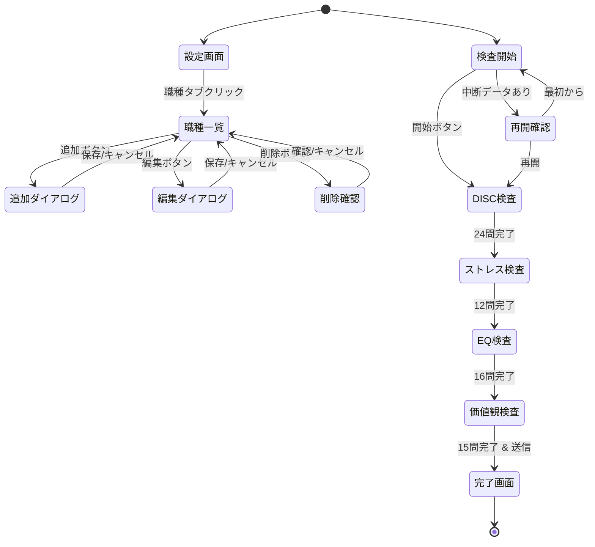

## 1. 調査レポート

**調査レポートリンク**: 親Issue #149 で調査済み、#192 Phase 1-5 統合要件定義で詳細設計完了

### Investigation Report v1 要約

| 項目 | 内容 |
|------|------|
| 既存システム名 | HY Assessment 組織設定機能 |
| エントリーポイント | UI: `/admin/settings/` |
| 主要データモデル | organizations, users, candidates, ai_analyses, job_types, personality_assessments |
| キーファイル | `src/app/admin/settings/**`, `src/components/settings/**`, `src/app/assessment/**` |
| 拡張ポイント | 設定画面に職種タブ追加、候補者詳細にパーソナリティタブ追加、検査画面新規追加 |
| 破壊ポイント | UIバリアント不足、a11y違反、検査途中離脱時のデータ消失 |
| やりたいこと（1行） | 職種設定UI + パーソナリティ検査UI + 結果表示UIを実装する |

---

## 2. Phase 2: 要件定義・ユースケース

### 2.1 機能概要

| 項目 | 内容 |
|------|------|
| **なぜ必要か（Why）** | 職種マスター管理、候補者パーソナリティ検査、結果表示のUIが必要 |
| **誰が使うか（Who）** | 人事担当者（Admin）+ 候補者 |
| **何を達成するか（What）** | 直感的なUI、全バリアント対応、a11y準拠、レスポンシブ対応 |

### 2.2 ユースケース定義（UI スコープ）

| UC-ID | Role | Outcome | Channel | 説明 |
|-------|------|---------|---------|------|
| UC-UI-JOB-LIST | Admin | 職種一覧を確認する | WEB | 職種一覧画面表示 |
| UC-UI-JOB-CREATE | Admin | 職種を新規作成する | WEB | 職種追加ダイアログ |
| UC-UI-JOB-UPDATE | Admin | 職種プロファイルを編集する | WEB | 4カテゴリタブ編集 |
| UC-UI-JOB-DELETE | Admin | 職種を削除する | WEB | 削除確認ダイアログ |
| UC-UI-PERSONALITY-TAKE | Candidate | パーソナリティ検査を受験する | WEB | 67問複合検査フォーム |
| UC-UI-PERSONALITY-VIEW | Admin | パーソナリティ結果を確認する | WEB | 候補者詳細パーソナリティタブ |

### 2.3 カバレッジマトリクス（UI）

| Role＼Outcome | 職種一覧 | 職種作成 | 職種編集 | 職種削除 | 検査受験 | 結果表示 |
|---------------|:--------:|:--------:|:--------:|:--------:|:--------:|:--------:|
| Admin | ✅ Gold | ✅ | ✅ | ✅ | — | ✅ Gold |
| Candidate | — | — | — | — | ✅ Gold | — |

---

## 3. Phase 3: 品質基準

### 3.1 DoD Level: Silver

**選定理由**: ユーザーが直接操作するUIのため、バリアント・a11y・レスポンシブ対応が必須。

### 3.2 Pre-mortem（失敗シナリオ）⚠️

| # | 失敗シナリオ | 発生確率 | 対策 | 確認方法 |
|---|-------------|---------|------|---------|
| 1 | 検査途中でブラウザ閉じ、回答消失 | 高 | localStorage自動保存 + 再開機能 | 途中離脱→再アクセスで復元確認 |
| 2 | Loading表示中に操作してエラー | 中 | Loading中はボタン無効化 | Loading時のボタン状態確認 |
| 3 | スコアスライダーで細かい値設定困難 | 中 | 数値入力フィールド併設 | 数値直接入力の動作確認 |
| 4 | 67問検査で離脱率高い | 高 | 進捗バー + セクション分割 + 中断再開 | UX改善後の完了率計測 |
| 5 | a11y違反でスクリーンリーダー使用不可 | 低 | axe-core監査 + aria属性設定 | Vercel Toolbar a11y監査 |

---

## 4. Phase 4: 技術設計

### 4.1 画面一覧

| 画面名 | パス | コンポーネント | 説明 |
|-------|------|---------------|------|
| 職種設定 | /admin/settings/job-types | JobTypesSettings | 職種一覧 + CRUD |
| 職種追加ダイアログ | (モーダル) | JobTypeCreateDialog | 基本情報入力 |
| 職種編集ダイアログ | (モーダル) | JobTypeEditDialog | 4カテゴリタブ編集 |
| パーソナリティ検査 | /assessment/personality/:token | PersonalityAssessment | 67問検査フォーム |
| パーソナリティ結果 | (タブ) | PersonalityResultsTab | 候補者詳細内タブ |

### 4.2 V0 UIリンク

| 項目 | URL |
|------|-----|
| **V0 Chat（DISC版）** | https://v0.app/chat/dKKC2svn36k |
| **Demo Preview** | https://demo-kzmiiguzj97ageuvaxx2.vusercontent.net |

### 4.3 コンポーネント構成

```
src/components/
├── job-types/
│   ├── JobTypesSettings.tsx        # 職種一覧（Default/Loading/Empty/Error）
│   ├── JobTypeCreateDialog.tsx     # 職種追加ダイアログ
│   ├── JobTypeEditDialog.tsx       # 職種編集ダイアログ（4タブ）
│   ├── JobTypeRow.tsx              # 職種行コンポーネント
│   └── profile-tabs/
│       ├── DISCProfileTab.tsx      # DISC理想プロファイル設定
│       ├── StressProfileTab.tsx    # ストレス耐性設定
│       ├── EQProfileTab.tsx        # EQ設定
│       └── ValuesProfileTab.tsx    # 価値観設定
│
├── personality-assessment/
│   ├── PersonalityAssessment.tsx   # 検査メイン（Default/Loading/Error/Completed）
│   ├── AssessmentProgress.tsx      # 進捗バー
│   ├── questions/
│   │   ├── DISCQuestions.tsx       # DISC 24問（強制選択式）
│   │   ├── StressQuestions.tsx     # ストレス 12問（Likert）
│   │   ├── EQQuestions.tsx         # EQ 16問（Likert）
│   │   └── ValuesQuestions.tsx     # 価値観 15問（ランキング）
│   └── AssessmentResults.tsx       # 完了画面
│
└── candidates/
    └── PersonalityResultsTab.tsx   # 候補者詳細内パーソナリティ結果表示
```

### 4.4 バリアント実装チェック

#### JobTypesSettings

| バリアント | 用途 | data-testid |
|-----------|------|-------------|
| Default | 職種一覧表示 | `job-types-settings` |
| Loading | スケルトンUI | `job-types-settings-skeleton` |
| Empty | 「職種がありません」+ 追加ボタン | `job-types-settings-empty` |
| Error | エラー + 再読み込みボタン | `job-types-settings-error` |

#### PersonalityAssessment

| バリアント | 用途 | data-testid |
|-----------|------|-------------|
| Default | 検査フォーム表示 | `personality-assessment` |
| Loading | 検査読み込み中 | `personality-assessment-skeleton` |
| Error | エラー + 再読み込み | `personality-assessment-error` |
| Completed | 完了画面 | `personality-assessment-completed` |
| Resuming | 中断再開確認 | `personality-assessment-resume` |

#### PersonalityResultsTab

| バリアント | 用途 | data-testid |
|-----------|------|-------------|
| Default | 4カテゴリ結果表示 | `personality-results` |
| Loading | スケルトンUI | `personality-results-skeleton` |
| Empty | 「検査未実施」表示 | `personality-results-empty` |
| Error | エラー + 再読み込み | `personality-results-error` |

### 4.5 data-testid命名規則

```
# 職種設定
data-testid="job-types-settings"
data-testid="add-job-type-button"
data-testid="job-type-row-{id}"
data-testid="edit-job-type-button-{id}"
data-testid="delete-job-type-button-{id}"

# 職種ダイアログ
data-testid="job-type-name-input"
data-testid="job-type-description-input"
data-testid="disc-tab"
data-testid="stress-tab"
data-testid="eq-tab"
data-testid="values-tab"
data-testid="ideal-dominance-slider"
data-testid="weight-dominance-slider"

# パーソナリティ検査
data-testid="personality-assessment"
data-testid="assessment-progress-bar"
data-testid="disc-question-{index}"
data-testid="stress-question-{index}"
data-testid="eq-question-{index}"
data-testid="values-question-{index}"
data-testid="submit-assessment-button"

# パーソナリティ結果
data-testid="personality-results"
data-testid="disc-profile-chart"
data-testid="stress-score-display"
data-testid="eq-score-display"
data-testid="values-profile-chart"
```

### 4.6 画面遷移図（State Machine）⚠️



#### 画面遷移テスト観点

| 遷移パターン | 説明 | テスト必須度 |
|-------------|------|-------------|
| 正常遷移 | 想定通りの画面移動 | ✅ 必須 |
| 戻る操作 | ブラウザバック、戻るボタン | ✅ 必須 |
| 直接アクセス | URL直接入力 | ✅ 必須 |
| 検査中断→再開 | ブラウザ閉じ→再アクセス | ✅ 必須 |
| セクション間遷移 | DISC→ストレス→EQ→価値観 | ✅ 必須 |

### 4.7 Feature Flags定義

```typescript
// src/flags/index.ts
export const personalityAssessmentEnabled = flag<boolean>({
  key: 'personality-assessment-enabled',
  defaultValue: false,
  description: 'パーソナリティ検査機能の有効化',
});

export const jobTypeProfileTabs = flag<'collapsed' | 'expanded'>({
  key: 'job-type-profile-tabs',
  defaultValue: 'collapsed',
  options: [
    { value: 'collapsed', label: '折りたたみ表示' },
    { value: 'expanded', label: '展開表示' },
  ],
});
```

### 4.8 変更ファイル一覧

| ファイルパス | 変更種別 | 概要 |
|-------------|---------|------|
| `src/app/admin/settings/job-types/page.tsx` | 新規 | 職種設定ページ |
| `src/components/job-types/JobTypesSettings.tsx` | 新規 | 職種一覧コンポーネント |
| `src/components/job-types/JobTypeCreateDialog.tsx` | 新規 | 職種追加ダイアログ |
| `src/components/job-types/JobTypeEditDialog.tsx` | 新規 | 職種編集ダイアログ |
| `src/components/job-types/JobTypeRow.tsx` | 新規 | 職種行コンポーネント |
| `src/components/job-types/profile-tabs/*.tsx` | 新規 | 4カテゴリタブ（4ファイル） |
| `src/app/assessment/personality/[token]/page.tsx` | 新規 | パーソナリティ検査ページ |
| `src/components/personality-assessment/*.tsx` | 新規 | 検査関連コンポーネント |
| `src/components/candidates/PersonalityResultsTab.tsx` | 新規 | 結果表示タブ |
| `src/app/admin/candidates/[id]/page.tsx` | 修正 | パーソナリティタブ追加 |
| `src/app/admin/settings/page.tsx` | 修正 | 職種タブ追加 |
| `src/hooks/usePersonalityAssessment.ts` | 新規 | 検査状態管理フック |
| `src/hooks/useLocalStoragePersist.ts` | 新規 | localStorage永続化フック |

---

## 5. Phase 5: テスト設計

### 5.1 Gold E2E候補評価（4つのレンズ）

| UC-ID | 行動フォーカス | 欺瞞耐性 | 明確な失敗説明 | リスク明示 | 結論 |
|-------|:-------------:|:--------:|:-------------:|:----------:|------|
| UC-UI-JOB-LIST | ✅ | ✅ | ✅ | ✅ | Gold E2E |
| UC-UI-PERSONALITY-TAKE | ✅ | ✅ | ✅ | ✅ | Gold E2E |
| UC-UI-PERSONALITY-VIEW | ✅ | ✅ | ✅ | ✅ | Gold E2E |

### 5.2 トリアージスコアリング（Gold候補）

#### UC-UI-JOB-LIST

| 軸 | 評価 | 理由 |
|----|------|------|
| Impact | 4 | 配属推薦の基盤データ |
| Frequency | 3 | 初期設定時に使用 |
| Detectability | 2 | 手動テスト可能だが見落としやすい |
| Recovery Cost | 3 | データ不整合の修復が必要 |
| **合計** | **12/20** | Gold E2E採用 |

#### UC-UI-PERSONALITY-TAKE

| 軸 | 評価 | 理由 |
|----|------|------|
| Impact | 5 | 候補者評価の核心機能 |
| Frequency | 5 | 全候補者が使用 |
| Detectability | 4 | 検査中断・データ消失は即座に問題 |
| Recovery Cost | 4 | 再検査必要、候補者体験悪化 |
| **合計** | **18/20** | Gold E2E必須 |

### 5.3 GWT仕様（Gold E2E対象）

#### Gold E2E: 職種設定

```gherkin
# =============================================================================
# Gold E2E: 職種マスター管理
# =============================================================================
# Role: Admin
# Outcome: 職種マスターを管理できる
# Triage Score: 12 (I:4/F:3/D:2/R:3)
# =============================================================================

Feature: 職種マスター管理

  Background:
    Given 管理者としてログイン済み
    And 設定画面の職種タブを表示

  Scenario: 職種を新規作成する
    Given 職種が0件の状態
    When 「職種を追加」ボタンをクリック
    And 職種名に「営業職」を入力
    And DISCタブでD理想値を70に設定
    And 「保存」をクリック
    Then 職種一覧に「営業職」が表示される
    And 成功メッセージが表示される

  Scenario: 職種を編集する
    Given 「営業職」が登録済み
    When 「営業職」の編集ボタンをクリック
    And EQタブでEQ理想値を80に変更
    And 「保存」をクリック
    Then 更新成功メッセージが表示される

  Scenario: 職種を削除する
    Given 「営業職」が登録済み
    When 「営業職」の削除ボタンをクリック
    And 削除確認ダイアログで「削除」をクリック
    Then 職種一覧から「営業職」が消える
```

#### Gold E2E: パーソナリティ検査

```gherkin
# =============================================================================
# Gold E2E: パーソナリティ検査受験
# =============================================================================
# Role: Candidate
# Outcome: パーソナリティ検査を完了できる
# Triage Score: 18 (I:5/F:5/D:4/R:4)
# =============================================================================

Feature: パーソナリティ検査

  Background:
    Given 有効な検査トークンでアクセス

  Scenario: 67問検査を完了する
    When 検査を開始
    And DISC 24問に回答（強制選択式）
    And ストレス耐性 12問に回答（Likert式）
    And EQ 16問に回答（Likert式）
    And 価値観 15問に回答（ランキング式）
    And 「送信」をクリック
    Then 完了画面が表示される
    And 検査結果がサーバーに保存される

  Scenario: 検査を中断して再開する
    When 検査を開始
    And DISC 10問に回答
    And ブラウザを閉じる
    And 再度検査URLにアクセス
    Then 再開確認ダイアログが表示される
    When 「続きから再開」をクリック
    Then DISC 11問目から再開される
```

### 5.4 Playwrightマッピング

| GWT Step | Playwright実装 | data-testid |
|----------|---------------|-------------|
| Given 管理者としてログイン済み | `await loginAsAdmin(page)` | - |
| Given 設定画面の職種タブを表示 | `await page.goto('/admin/settings/job-types')` | - |
| When 「職種を追加」ボタンをクリック | `await page.click('[data-testid="add-job-type-button"]')` | add-job-type-button |
| And 職種名に「営業職」を入力 | `await page.fill('[data-testid="job-type-name-input"]', '営業職')` | job-type-name-input |
| And DISCタブでD理想値を70に設定 | `await page.click('[data-testid="disc-tab"]'); await setSliderValue(page, 'ideal-dominance-slider', 70)` | disc-tab, ideal-dominance-slider |
| Then 職種一覧に「営業職」が表示される | `await expect(page.getByText('営業職')).toBeVisible()` | - |
| When 検査を開始 | `await page.click('[data-testid="start-assessment-button"]')` | start-assessment-button |
| Then 完了画面が表示される | `await expect(page.locator('[data-testid="personality-assessment-completed"]')).toBeVisible()` | personality-assessment-completed |

### 5.5 単体テスト設計

| 対象 | テストケース | 期待結果 |
|------|------------|---------|
| `JobTypeRow` | 正常: データ表示 | 職種名・説明表示 |
| `JobTypeRow` | バリアント: inactive状態 | 非アクティブバッジ表示 |
| `AssessmentProgress` | 正常: 進捗計算 | 正しい%表示 |
| `AssessmentProgress` | 境界値: 0/67問 | 0%表示 |
| `AssessmentProgress` | 境界値: 67/67問 | 100%表示 |
| `DISCQuestions` | 正常: 強制選択 | 1つのみ選択可能 |
| `ValuesQuestions` | 正常: ランキング | ドラッグ&ドロップで順位変更 |
| `useLocalStoragePersist` | 正常: 保存 | localStorageに保存 |
| `useLocalStoragePersist` | 正常: 復元 | 保存データを復元 |

### 5.6 統合テスト設計（Phase 5.6対応）⚠️ 必須

#### 5.6.1 UI統合テスト

| テスト対象 | テスト内容 | 操作 | 期待結果 |
|-----------|-----------|------|---------|
| 職種設定 | 画面遷移 | 設定→職種タブ | 職種一覧表示 |
| 職種設定 | 追加フロー | ダイアログ→入力→保存 | API呼出→一覧更新 |
| 職種設定 | 編集フロー | 編集ダイアログ→タブ切替→保存 | API呼出→一覧更新 |
| 職種設定 | 削除フロー | 削除確認→削除実行 | API呼出→一覧から削除 |
| パーソナリティ検査 | セクション遷移 | DISC→ストレス→EQ→価値観 | 進捗バー更新 |
| パーソナリティ検査 | 中断再開 | 途中離脱→再アクセス | ダイアログ表示→状態復元 |
| パーソナリティ検査 | 送信フロー | 67問回答→送信 | API呼出→完了画面 |
| 結果表示 | データ表示 | 候補者詳細→パーソナリティタブ | 4カテゴリスコア表示 |

#### 5.6.2 a11y統合テスト

| テスト対象 | テスト内容 | 検証ツール |
|-----------|-----------|-----------|
| 全画面 | axe-core監査 | @axe-core/playwright |
| フォーム | aria-label存在 | Playwright assertion |
| ダイアログ | フォーカストラップ | Playwright keyboard navigation |
| スライダー | キーボード操作 | Playwright keyboard |

### 5.7 トレーサビリティ

| UC-ID | GS-ID | PW File | CI Stage |
|-------|-------|---------|----------|
| UC-UI-JOB-LIST | GS-JOB-001 | job-types.spec.ts | Gold E2E |
| UC-UI-JOB-CREATE | GS-JOB-002 | job-types.spec.ts | Gold E2E |
| UC-UI-PERSONALITY-TAKE | GS-PERS-001 | personality-assessment.spec.ts | Gold E2E |
| UC-UI-PERSONALITY-VIEW | GS-PERS-002 | personality-results.spec.ts | Gold E2E |

---

## 6. 受け入れ条件

### 必須
- [ ] 職種設定画面（一覧 + CRUD ダイアログ）
- [ ] 4カテゴリプロファイル設定タブ（DISC/ストレス/EQ/価値観）
- [ ] パーソナリティ検査画面（67問 + 進捗バー）
- [ ] 検査中断・再開機能（localStorage永続化）
- [ ] 候補者詳細パーソナリティ結果タブ
- [ ] 全コンポーネントで4バリアント実装（Default/Loading/Empty/Error）
- [ ] data-testid命名規則準拠
- [ ] a11y基本準拠（axe-core監査パス）

### テスト
- [ ] 単体テスト（コンポーネント・フック）
- [ ] Gold E2E（職種設定・パーソナリティ検査・結果表示）
- [ ] a11y統合テスト

### V0ワークフロー
- [ ] `/v0-generate` でコンポーネント生成
- [ ] `/v0-validate` で検証パス
- [ ] Vercel Preview確認
- [ ] `/design-approve` でデザイン承認

---

## 7. 依存関係

**先行（このPRの前提）:**
- PR#205 DB: マイグレーション + RLS
- PR#206 API: 職種マスターCRUD + パーソナリティ検査API

**後続（このPRに依存）:**
- #193 Phase 2 マッチングアルゴリズム
- #194 Phase 3 配属推薦表示UI

**マージ順序:**
PR#205 (DB) → PR#206 (API) → **このPR (UI)** → #193 → #194
