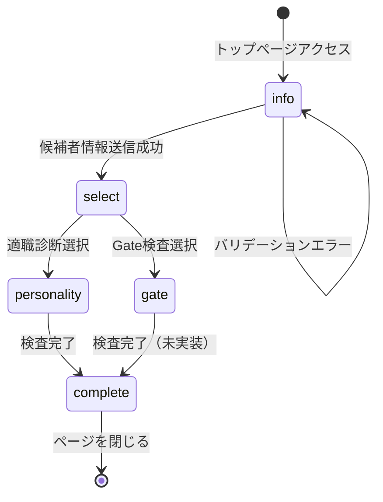

# Issue #215: トップページを直接検査開始UIに変更

## 1. 調査レポート

**調査レポートリンク**: Issue #215 本文に記載

### Investigation Report v1 要約

| 項目 | 内容 |
|------|------|
| 既存システム名 | HY Assessment トップページ |
| エントリーポイント | UI: `/` (src/app/page.tsx) |
| 主要データモデル | candidates, persons, assessments |
| キーファイル（3-10） | `src/app/page.tsx`, `src/app/assessment/[token]/CandidateInfoForm.tsx`, `src/app/assessment/[token]/AssessmentSelector.tsx`, `src/components/personality/PersonalityAssessment.tsx` |
| 拡張ポイント | page.tsx のクライアントコンポーネント化、新規API追加 |
| 破壊ポイント | なし（既存トークンフローは維持） |
| やりたいこと（1行） | 検査コード入力を廃止し、直接検査を開始できるUIに変更 |

---

## 2. Phase 2: 要件定義・ユースケース

### 2.1 機能概要

| 項目 | 内容 |
|------|------|
| **なぜ必要か（Why）** | 検査コードの事前発行・送付という運用負担を軽減し、候補者がURLアクセスだけで検査を開始できるUXを実現するため |
| **誰が使うか（Who）** | 採用候補者（検査受験者） |
| **何を達成するか（What）** | gfd.prole.co.jp にアクセスするだけで、名前・メール入力 → 検査選択 → 検査開始の流れを完了できる |

### 2.2 ユースケース定義（Role × Outcome）

| UC-ID | Role | Outcome | Channel | 説明 |
|-------|------|---------|---------|------|
| UC-ASSESS-CANDIDATE-DIRECT-WEB | 候補者 | URLアクセスで直接検査を開始できる | WEB | トップページから検査コードなしで検査開始 |
| UC-ASSESS-CANDIDATE-INFO-WEB | 候補者 | 候補者情報を入力して登録できる | WEB | 名前・メール・希望職種の入力 |
| UC-ASSESS-CANDIDATE-SELECT-WEB | 候補者 | Gate検査と適職診断を選択できる | WEB | 検査タイプの選択 |
| UC-ASSESS-CANDIDATE-COMPLETE-WEB | 候補者 | 検査を完了して結果を保存できる | WEB | 検査回答の送信・保存 |

### 2.3 Role × Value マトリクス

| Role | 提供する価値 | 受け取る価値 | 関連Outcome |
|------|-------------|-------------|-------------|
| 候補者 | 回答データ | スムーズな検査体験、結果フィードバック | DIRECT, INFO, SELECT, COMPLETE |
| 企業（間接） | — | 候補者データ取得の簡易化 | DIRECT |
| System | 検査基盤 | — | — |

### 2.4 カバレッジマトリクス（MECE証明）

| Role＼Outcome | DIRECT | INFO | SELECT | COMPLETE |
|---------------|--------|------|--------|----------|
| 候補者 | ✅ Gold E2E | ✅ Gold E2E | ✅ Gold E2E | ✅ Gold E2E |

### 2.5 入力ソースチェックリスト（要件網羅性証明）

| 入力ソース | 確認状態 | 抽出UC数 | 備考 |
|-----------|---------|---------|------|
| Issue #215 本文 | ✅ | 4 | 主要ユースケース抽出済み |
| ルーティング定義（app/構造） | ✅ | 0 | 既存 /assessment/[token] フローは維持 |
| DBスキーマ（主要テーブル） | ✅ | 0 | candidates, persons 既存スキーマ流用 |
| 既存テストファイル | ✅ | 0 | 既存E2Eは /assessment/[token] 向け |
| Issue/PR履歴 | ✅ | 0 | PR#207 で AssessmentSelector 作成済み |

### 2.6 外部整合性チェック

- [x] Issue記載の全機能にUCが対応している
- [x] DBスキーマの主要テーブル（candidates, persons）がUCでカバーされている
- [x] 既存の /assessment/[token] フローは維持（破壊変更なし）
- [x] 既存コンポーネント（CandidateInfoForm, AssessmentSelector）を流用

---

## 3. Phase 3: 品質基準

### 3.1 DoD Level 選択

- [ ] Bronze (27観点: 80%カバレッジ)
- [x] Silver (31観点: 85%カバレッジ)
- [ ] Gold (19観点: 95%カバレッジ)

**選定理由**: 候補者向けメインフローの新規追加だが、既存フローは維持するため影響範囲が限定的。ただしユーザーインパクトが高いためSilver以上が必要。

### 3.2 Pre-mortem（失敗シナリオ）

| # | 失敗シナリオ | 発生確率 | 対策 | 確認方法 |
|---|-------------|---------|------|---------|
| 1 | DEFAULT_ORGANIZATION_ID 未設定で500エラー | 高 | 環境変数チェック + エラーメッセージ明確化 | E2Eテストで検証 |
| 2 | 候補者登録API失敗時にフォームがリセットされる | 中 | エラー時は入力値を保持、リトライ可能に | 手動テスト + E2E |
| 3 | 既存トークンフロー（/assessment/[token]）が動作しなくなる | 低 | 既存フローには変更を加えない、リグレッションテスト | E2Eテスト |
| 4 | 検査完了後のデータ保存失敗 | 中 | トランザクション + エラーハンドリング | 統合テスト |

---

## 4. Phase 4: 技術設計

### 4.1 データベース設計

**新規テーブル:** なし（既存スキーマ流用）

**環境変数追加:**

| 変数名 | 用途 | デフォルト値 |
|--------|------|-------------|
| DEFAULT_ORGANIZATION_ID | 直接アクセス候補者のデフォルト組織ID | なし（必須） |

#### CRUD操作マトリクス

| テーブル | Create | Read | Update | Delete | 担当API |
|---------|:------:|:----:|:------:|:------:|---------|
| persons | ✅ | ❌ | ❌ | ❌ | POST /api/candidates/register |
| candidates | ✅ | ❌ | ❌ | ❌ | POST /api/candidates/register |

#### RLSテスト観点

| ポリシー名 | 対象操作 | 許可条件 | テストケース |
|-----------|---------|---------|-------------|
| (既存) | INSERT | organization_id 指定 | デフォルト組織での登録成功 |

### 4.2 API設計

| Method | Path | 説明 | 認証 |
|--------|------|------|------|
| POST | /api/candidates/register | 匿名候補者の新規登録 | 不要 |

#### エラーハンドリング設計

| API | エラーケース | HTTPステータス | レスポンス |
|-----|------------|--------------|-----------|
| POST /api/candidates/register | バリデーションエラー | 400 | `{ error: "お名前は必須です" }` |
| POST /api/candidates/register | 環境変数未設定 | 500 | `{ error: "システム設定エラーです" }` |
| POST /api/candidates/register | DB登録失敗 | 500 | `{ error: "登録に失敗しました" }` |

#### 非機能要件（API）

| 観点 | 要件 | 検証方法 |
|------|------|---------|
| **レート制限** | 10回/min（ブルートフォース対策） | 負荷テストで確認 |
| **タイムアウト** | 10秒 | 統合テストで確認 |
| **最大ペイロード** | 1KB | バリデーションで制限 |

### 4.3 UI設計

#### 画面一覧

| 画面名 | パス | コンポーネント | 説明 |
|-------|------|---------------|------|
| トップページ（新） | / | DirectAssessmentFlow | 直接検査開始フロー |
| 候補者情報入力 | / (step: info) | DirectAssessmentFlow内 | 名前・メール・希望職種入力 |
| 検査選択 | / (step: select) | DirectAssessmentFlow内 | Gate/適職診断選択 |
| 検査実行 | / (step: personality) | DirectAssessmentFlow内 | PersonalityAssessment流用 |
| 完了 | / (step: complete) | DirectAssessmentFlow内 | 完了メッセージ表示 |

#### v0リンク・プレビュー

| 項目 | 値 |
|------|-----|
| **v0 Link** | Step 4.5 で生成 |
| **Preview URL** | PR作成後にVercelから取得 |

#### バリアント実装チェック

| バリアント | 用途 | 実装確認 |
|-----------|------|---------|
| Default | 正常データ表示 | [ ] |
| Loading | API呼び出し中 | [ ] |
| Empty | N/A（フォーム画面のため） | — |
| Error | API失敗時 | [ ] |

#### data-testid命名規則

```
data-testid="direct-assessment-info"           # 候補者情報入力ステップ
data-testid="direct-assessment-name-input"     # 名前入力
data-testid="direct-assessment-email-input"    # メール入力
data-testid="direct-assessment-position-{id}"  # 希望職種チェックボックス
data-testid="direct-assessment-submit"         # 送信ボタン
data-testid="direct-assessment-select"         # 検査選択ステップ
data-testid="direct-assessment-option-gate"    # Gate検査オプション
data-testid="direct-assessment-option-personality" # 適職診断オプション
data-testid="direct-assessment-complete"       # 完了ステップ
```

#### 画面遷移図（State Machine）



| 遷移元 | 遷移先 | トリガー | 条件 | テストケース |
|-------|-------|---------|------|-------------|
| info | select | フォーム送信 | API成功 | E2E-001 |
| info | info | フォーム送信 | バリデーション失敗 | E2E-002 |
| select | personality | 適職診断クリック | — | E2E-003 |
| personality | complete | 検査完了 | 全問回答 | E2E-004 |

### 4.4 変更ファイル一覧

| ファイルパス | 変更種別 | 概要 |
|-------------|---------|------|
| `src/app/page.tsx` | 修正 | DirectAssessmentFlowを使用するよう変更 |
| `src/components/direct-assessment/DirectAssessmentFlow.tsx` | 新規 | 直接検査フロー制御コンポーネント |
| `src/app/api/candidates/register/route.ts` | 新規 | 匿名候補者登録API |
| `.env.example` | 修正 | DEFAULT_ORGANIZATION_ID 追加 |

---

## 5. Phase 5: テスト設計

### 5.1 Gold E2E候補評価（4つのレンズ）

| レンズ | 質問 | 回答 |
|--------|------|------|
| 行動フォーカス | 実装ではなくユーザー目標を検証しているか？ | はい（候補者が検査を完了できる） |
| 欺瞞耐性 | モック/スタブでは通過できないか？ | はい（実DB操作・UI操作必要） |
| 明確な失敗説明 | 失敗理由を1文で説明できるか？ | はい（「直接検査フローが動作しない」） |
| リスク明示 | このテストがないと何を犠牲にするか説明できるか？ | はい（候補者UXの品質保証） |

### 5.2 トリアージスコアリング（Gold候補のみ）

| 軸 | 説明 | 評価（1-5） | 理由 |
|----|------|-----------|------|
| **Impact（影響度）** | 壊れた時の影響 | 5 | 候補者が検査を受けられなくなる |
| **Frequency（頻度）** | どれくらい使われるか | 5 | 全候補者が使用 |
| **Detectability（検知性）** | 他で検知できるか | 2 | UIテストでないと検知困難 |
| **Recovery Cost（復旧コスト）** | 壊れた時の修復難易度 | 3 | 比較的シンプルなフロー |
| **合計** | | 15/20 | Gold E2E推奨採用 |

### 5.3 GWT仕様（Gold E2E対象の場合）

```gherkin
# =============================================================================
# Gold E2E: 直接検査開始フロー
# =============================================================================
# Role: 候補者
# Outcome: URLアクセスで直接検査を開始・完了できる
# Triage Score: 15 (I:5/F:5/D:2/R:3)
# =============================================================================

Feature: 直接検査開始フロー

  Background:
    Given DEFAULT_ORGANIZATION_ID が設定されている

  Scenario: 候補者が直接検査を完了する
    Given 候補者がトップページにアクセスする
    When 名前に "テスト太郎" を入力する
      And メールに "test@example.com" を入力する
      And 希望職種 "エンジニア" を選択する
      And "次へ進む" ボタンをクリックする
    Then 検査選択画面が表示される
    When "適職診断" をクリックする
    Then 適職診断が開始される
    When 全問に回答して送信する
    Then 完了画面が表示される
      And "ご回答いただきありがとうございました" が表示される

  Scenario: バリデーションエラー表示
    Given 候補者がトップページにアクセスする
    When "次へ進む" ボタンをクリックする
    Then "お名前を入力してください" エラーが表示される
```

#### Playwrightマッピング

| GWT Step | Playwright実装 | data-testid |
|----------|---------------|-------------|
| トップページにアクセス | `await page.goto('/')` | - |
| 名前に入力 | `await page.fill('[data-testid="direct-assessment-name-input"]', 'テスト太郎')` | direct-assessment-name-input |
| 次へ進むクリック | `await page.click('[data-testid="direct-assessment-submit"]')` | direct-assessment-submit |
| 検査選択画面が表示 | `await expect(page.getByTestId('direct-assessment-select')).toBeVisible()` | direct-assessment-select |
| 適職診断クリック | `await page.click('[data-testid="direct-assessment-option-personality"]')` | direct-assessment-option-personality |
| 完了画面が表示 | `await expect(page.getByTestId('direct-assessment-complete')).toBeVisible()` | direct-assessment-complete |

#### E2Eテストデータ要件（ファクトリーパターン）

| テストID | テストシナリオ | 必要なデータ | ファクトリー | 依存関係 |
|---------|--------------|-------------|-------------|---------|
| E2E-001 | 直接検査完了フロー | なし（API経由で作成） | — | DEFAULT_ORGANIZATION_ID |

### 5.4 単体テスト設計

| 対象関数/コンポーネント | テストケース | 期待結果 |
|----------------------|------------|---------|
| POST /api/candidates/register | 正常系: 有効な入力 | 201 + candidateId返却 |
| POST /api/candidates/register | 異常系: 名前なし | 400 エラー |
| POST /api/candidates/register | 異常系: メールなし | 400 エラー |
| POST /api/candidates/register | 異常系: 希望職種なし | 400 エラー |
| POST /api/candidates/register | 異常系: 環境変数未設定 | 500 エラー |
| DirectAssessmentFlow | 正常系: ステップ遷移 | info → select → personality → complete |
| DirectAssessmentFlow | 異常系: API失敗 | エラー表示、入力値保持 |

### 5.5 トレーサビリティ（UC → テスト追跡）

| UC-ID | GS-ID | PW File | CI Stage |
|-------|-------|---------|----------|
| UC-ASSESS-CANDIDATE-DIRECT-WEB | GS-001 | direct-assessment.spec.ts | Gold E2E |
| UC-ASSESS-CANDIDATE-INFO-WEB | GS-001 | direct-assessment.spec.ts | Gold E2E |
| UC-ASSESS-CANDIDATE-SELECT-WEB | GS-001 | direct-assessment.spec.ts | Gold E2E |
| UC-ASSESS-CANDIDATE-COMPLETE-WEB | GS-001 | direct-assessment.spec.ts | Gold E2E |

### 5.6 統合テスト設計

#### 5.6.1 DB統合テスト

| テスト対象 | テスト内容 | 前提条件 | 期待結果 |
|-----------|-----------|---------|---------|
| Create操作 | persons + candidates 同時作成 | DEFAULT_ORGANIZATION_ID設定 | 両テーブルにレコード作成 |
| トランザクション | candidates作成失敗時 | persons作成成功後 | personsもロールバック |

#### 5.6.2 API統合テスト

| テスト対象 | テスト内容 | 入力 | 期待結果 |
|-----------|-----------|------|---------|
| バリデーション | 不正入力 | 空オブジェクト | 400 + エラー詳細 |
| レート制限 | 過剰リクエスト | 11回/min | 429 Too Many Requests |

#### 5.6.3 UI統合テスト

| テスト対象 | テスト内容 | 操作 | 期待結果 |
|-----------|-----------|------|---------|
| 画面遷移 | info → select | フォーム送信 | 検査選択画面表示 |
| 画面遷移 | select → personality | 適職診断選択 | PersonalityAssessment表示 |
| エラー表示 | API 500時 | フォーム送信 | エラーメッセージ表示 |

---

## 6. 受け入れ条件

- [ ] gfd.prole.co.jp にアクセスすると、候補者情報入力フォームが表示される
- [ ] 名前・メール・希望職種を入力後、検査選択画面が表示される
- [ ] Gate検査または適職診断を選択して検査を開始できる
- [ ] 検査完了後、結果が保存される
- [ ] 既存の /assessment/[token] フローは引き続き動作する
- [ ] E2Eテストが追加されている
- [ ] 単体テストがカバレッジ85%以上

## 7. 依存関係

**先行（このPRの前提）:**
- PR#207: AssessmentSelector コンポーネント（マージ済み）

**後続（このPRに依存）:**
- なし

**マージ順序:**
このPR単独でマージ可能
