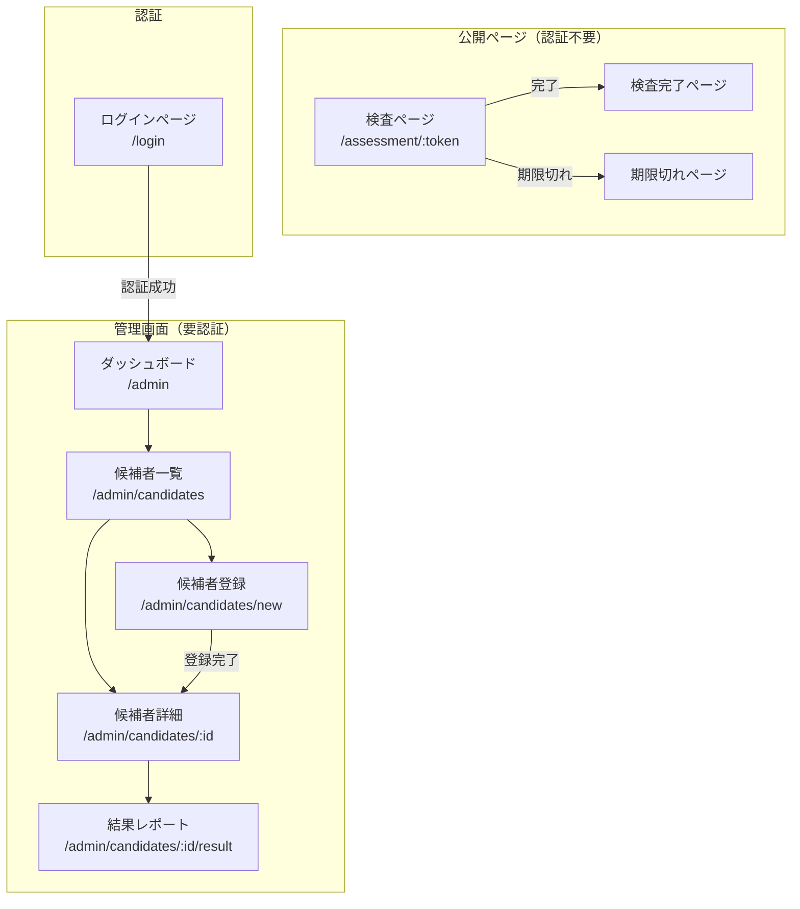

# 画面遷移図

## 全体構成



## 画面一覧

### 公開ページ（候補者向け）

| 画面 | パス | 説明 |
|------|------|------|
| 検査ページ | `/assessment/:token` | SurveyJSで検査を実施 |
| 完了ページ | - | 検査完了後に表示 |
| 期限切れ | - | 有効期限切れ時に表示 |

### 管理画面（管理者向け）

| 画面 | パス | 説明 |
|------|------|------|
| ログイン | `/login` | Supabase Auth認証 |
| ダッシュボード | `/admin` | 統計・概要表示 |
| 候補者一覧 | `/admin/candidates` | 候補者リスト・検索・フィルタ |
| 候補者登録 | `/admin/candidates/new` | 新規候補者登録フォーム |
| 候補者詳細 | `/admin/candidates/:id` | 候補者情報・検査状況 |
| 結果レポート | `/admin/candidates/:id/result` | AI分析結果・グラフ・PDF出力 |

---

## ワイヤーフレーム

### 1. ログインページ `/login`

```
┌─────────────────────────────────────┐
│           hy-assessment             │
│                                     │
│  ┌─────────────────────────────┐   │
│  │  メールアドレス              │   │
│  └─────────────────────────────┘   │
│  ┌─────────────────────────────┐   │
│  │  パスワード                  │   │
│  └─────────────────────────────┘   │
│                                     │
│  ┌─────────────────────────────┐   │
│  │        ログイン             │   │
│  └─────────────────────────────┘   │
└─────────────────────────────────────┘
```

### 2. ダッシュボード `/admin`

```
┌─────────────────────────────────────────────────────┐
│  hy-assessment                    [ユーザー名] ▼   │
├──────────┬──────────────────────────────────────────┤
│          │                                          │
│  Dashboard│  ┌────────┐ ┌────────┐ ┌────────┐      │
│  候補者   │  │ 未受験  │ │ 受験中 │ │ 完了   │      │
│          │  │   12   │ │   3    │ │   45   │      │
│          │  └────────┘ └────────┘ └────────┘      │
│          │                                          │
│          │  最近の候補者                            │
│          │  ┌──────────────────────────────────┐   │
│          │  │ 山田太郎  営業職  完了  12/20    │   │
│          │  │ 鈴木花子  開発職  受験中 12/21   │   │
│          │  │ ...                              │   │
│          │  └──────────────────────────────────┘   │
└──────────┴──────────────────────────────────────────┘
```

### 3. 候補者一覧 `/admin/candidates`

```
┌─────────────────────────────────────────────────────┐
│  hy-assessment                    [ユーザー名] ▼   │
├──────────┬──────────────────────────────────────────┤
│          │  候補者一覧            [+ 新規登録]     │
│  Dashboard│                                         │
│  候補者   │  検索: [____________] ステータス: [全て▼]│
│          │                                          │
│          │  ┌─────────────────────────────────────┐│
│          │  │ 名前      職種    ステータス  登録日 ││
│          │  ├─────────────────────────────────────┤│
│          │  │ 山田太郎  営業職  ✅完了     12/20  ││
│          │  │ 鈴木花子  開発職  🔄受験中   12/21  ││
│          │  │ 佐藤次郎  企画職  ⏳未受験   12/22  ││
│          │  │ 田中美咲  デザイン ❌期限切れ 12/10  ││
│          │  └─────────────────────────────────────┘│
└──────────┴──────────────────────────────────────────┘
```

### 4. 候補者登録 `/admin/candidates/new`

```
┌─────────────────────────────────────────────────────┐
│  hy-assessment                    [ユーザー名] ▼   │
├──────────┬──────────────────────────────────────────┤
│          │  新規候補者登録                          │
│  Dashboard│                                         │
│  候補者   │  氏名 *                                 │
│          │  ┌─────────────────────────────────┐    │
│          │  │                                 │    │
│          │  └─────────────────────────────────┘    │
│          │  メールアドレス *                        │
│          │  ┌─────────────────────────────────┐    │
│          │  │                                 │    │
│          │  └─────────────────────────────────┘    │
│          │  電話番号                                │
│          │  ┌─────────────────────────────────┐    │
│          │  │                                 │    │
│          │  └─────────────────────────────────┘    │
│          │  応募職種 *                              │
│          │  ┌─────────────────────────────────┐    │
│          │  │ 選択してください            ▼  │    │
│          │  └─────────────────────────────────┘    │
│          │                                          │
│          │  [キャンセル]  [登録して検査URLを発行]   │
└──────────┴──────────────────────────────────────────┘
```

### 5. 候補者詳細 `/admin/candidates/:id`

```
┌─────────────────────────────────────────────────────┐
│  hy-assessment                    [ユーザー名] ▼   │
├──────────┬──────────────────────────────────────────┤
│          │  ← 一覧に戻る                            │
│  Dashboard│                                         │
│  候補者   │  山田太郎                               │
│          │  営業職 | 登録日: 2024/12/20            │
│          │                                          │
│          │  ステータス: ✅ 検査完了                 │
│          │                                          │
│          │  検査URL:                                │
│          │  ┌──────────────────────────────[コピー]│
│          │  │ https://xxx.vercel.app/assessment/...│
│          │  └─────────────────────────────────────┘│
│          │                                          │
│          │  有効期限: 2024/12/27                    │
│          │                                          │
│          │  [結果を見る]                            │
└──────────┴──────────────────────────────────────────┘
```

### 6. 結果レポート `/admin/candidates/:id/result`

```
┌─────────────────────────────────────────────────────┐
│  hy-assessment                    [ユーザー名] ▼   │
├──────────┬──────────────────────────────────────────┤
│          │  ← 詳細に戻る           [PDF出力]       │
│  Dashboard│                                         │
│  候補者   │  山田太郎 - 検査結果レポート            │
│          │                                          │
│          │  ┌─────────────────────────────────────┐│
│          │  │    [レーダーチャート/棒グラフ]      ││
│          │  │                                     ││
│          │  │  コミュニケーション ████████░░ 80   ││
│          │  │  論理的思考       ██████░░░░ 60    ││
│          │  │  ストレス耐性     ███████░░░ 70    ││
│          │  │  ...                                ││
│          │  └─────────────────────────────────────┘│
│          │                                          │
│          │  AI分析コメント                          │
│          │  ┌─────────────────────────────────────┐│
│          │  │ この候補者は営業職として高い適性が   ││
│          │  │ あります。特にコミュニケーション...  ││
│          │  └─────────────────────────────────────┘│
│          │                                          │
│          │  強み                 課題               │
│          │  • 対人スキル         • 細部への注意     │
│          │  • 積極性             • 計画性           │
└──────────┴──────────────────────────────────────────┘
```

### 7. 検査ページ `/assessment/:token`（候補者向け）

```
┌─────────────────────────────────────────────────────┐
│                   適性検査                          │
│                                                     │
│  山田太郎 様                                        │
│                                                     │
│  ページ 1 / 5                    ████████░░ 80%    │
│                                                     │
│  ┌─────────────────────────────────────────────┐   │
│  │                                             │   │
│  │  Q1. あなたは初対面の人と話すのが...       │   │
│  │                                             │   │
│  │  ○ とても得意                              │   │
│  │  ○ やや得意                                │   │
│  │  ○ どちらでもない                          │   │
│  │  ○ やや苦手                                │   │
│  │  ○ とても苦手                              │   │
│  │                                             │   │
│  └─────────────────────────────────────────────┘   │
│                                                     │
│               [← 前へ]  [次へ →]                   │
└─────────────────────────────────────────────────────┘
```
