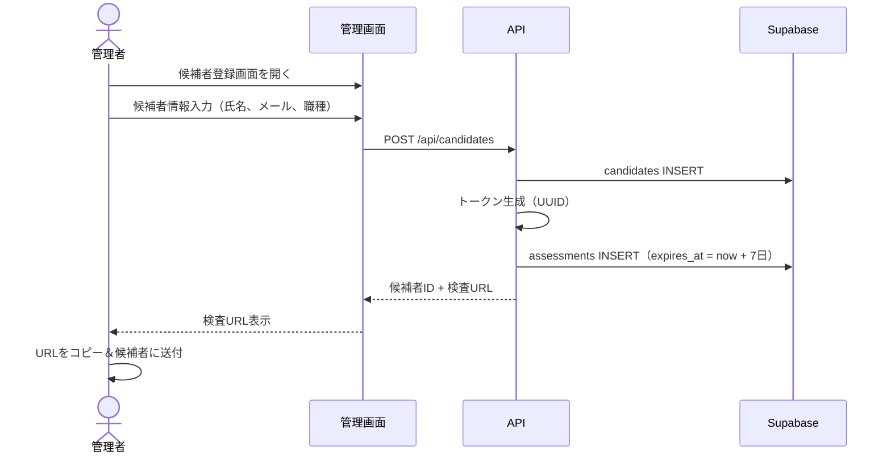
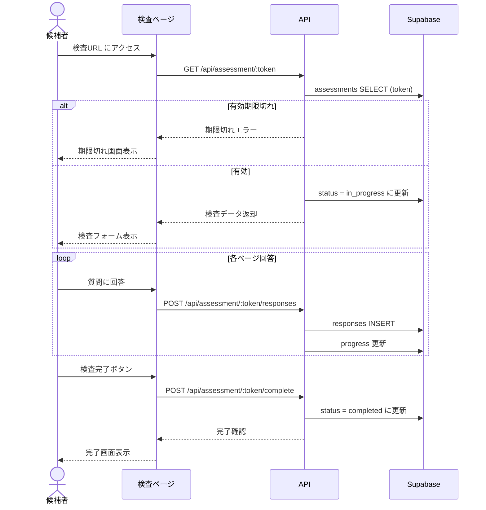
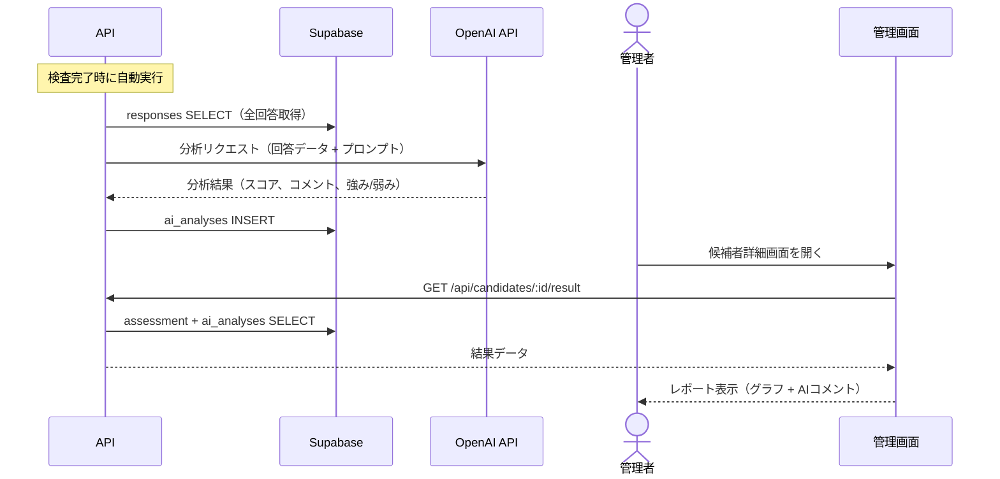
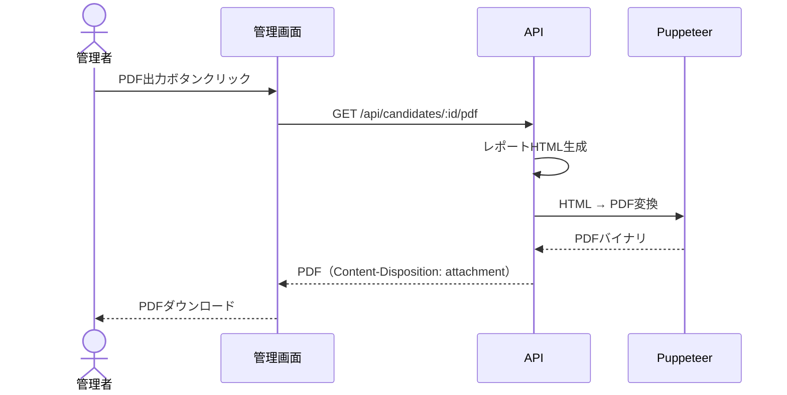
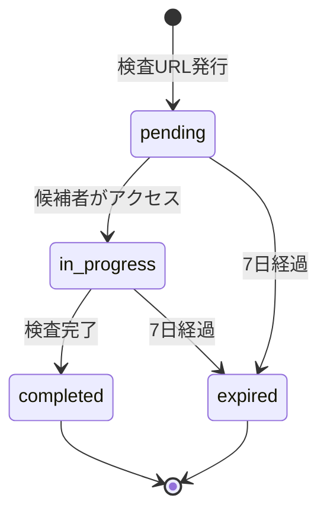

# シーケンス図（処理フロー）

## 1. 候補者登録〜検査URL発行

```mermaid
sequenceDiagram
    actor Admin as 管理者
    participant Web as 管理画面
    participant API as API
    participant DB as Supabase

    Admin->>Web: 候補者登録画面を開く
    Admin->>Web: 候補者情報入力（氏名、メール、職種）
    Web->>API: POST /api/candidates
    API->>DB: candidates INSERT
    API->>API: トークン生成（UUID）
    API->>DB: assessments INSERT（expires_at = now + 7日）
    API-->>Web: 候補者ID + 検査URL
    Web-->>Admin: 検査URL表示
    Admin->>Admin: URLをコピー＆候補者に送付
```

## 2. 候補者が検査を受ける

```mermaid
sequenceDiagram
    actor Candidate as 候補者
    participant Web as 検査ページ
    participant API as API
    participant DB as Supabase

    Candidate->>Web: 検査URL にアクセス
    Web->>API: GET /api/assessment/:token
    API->>DB: assessments SELECT (token)

    alt 有効期限切れ
        API-->>Web: 期限切れエラー
        Web-->>Candidate: 期限切れ画面表示
    else 有効
        API->>DB: status = in_progress に更新
        API-->>Web: 検査データ返却
        Web-->>Candidate: 検査フォーム表示
    end

    loop 各ページ回答
        Candidate->>Web: 質問に回答
        Web->>API: POST /api/assessment/:token/responses
        API->>DB: responses INSERT
        API->>DB: progress 更新
    end

    Candidate->>Web: 検査完了ボタン
    Web->>API: POST /api/assessment/:token/complete
    API->>DB: status = completed に更新
    API-->>Web: 完了確認
    Web-->>Candidate: 完了画面表示
```

## 3. AI分析〜レポート閲覧

```mermaid
sequenceDiagram
    participant API as API
    participant DB as Supabase
    participant AI as OpenAI API
    actor Admin as 管理者
    participant Web as 管理画面

    Note over API: 検査完了時に自動実行

    API->>DB: responses SELECT（全回答取得）
    API->>AI: 分析リクエスト（回答データ + プロンプト）
    AI-->>API: 分析結果（スコア、コメント、強み/弱み）
    API->>DB: ai_analyses INSERT

    Admin->>Web: 候補者詳細画面を開く
    Web->>API: GET /api/candidates/:id/result
    API->>DB: assessment + ai_analyses SELECT
    API-->>Web: 結果データ
    Web-->>Admin: レポート表示（グラフ + AIコメント）
```

## 4. PDFレポート出力

```mermaid
sequenceDiagram
    actor Admin as 管理者
    participant Web as 管理画面
    participant API as API
    participant Puppeteer as Puppeteer

    Admin->>Web: PDF出力ボタンクリック
    Web->>API: GET /api/candidates/:id/pdf
    API->>API: レポートHTML生成
    API->>Puppeteer: HTML → PDF変換
    Puppeteer-->>API: PDFバイナリ
    API-->>Web: PDF（Content-Disposition: attachment）
    Web-->>Admin: PDFダウンロード
```

## 状態遷移

```mermaid
stateDiagram-v2
    [*] --> pending: 検査URL発行
    pending --> in_progress: 候補者がアクセス
    pending --> expired: 7日経過
    in_progress --> completed: 検査完了
    in_progress --> expired: 7日経過
    completed --> [*]
    expired --> [*]
```
