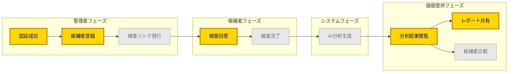
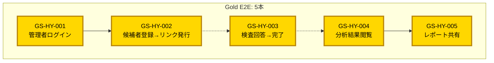
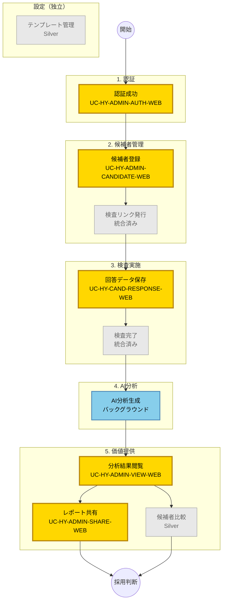
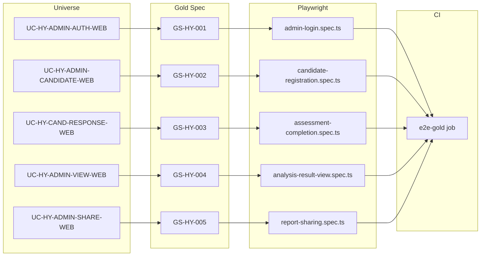

# HY Assessment - 価値フローマップ

**価値が確定する瞬間（Outcome）を可視化**

---

## 主要価値フロー

---

## Gold E2Eテスト対象フロー

---

## 詳細フロー（全Outcome）

---

## フロー説明

### 価値チェーン

1. **認証** → システムへのアクセス権確保
2. **候補者登録** → 検査対象者の特定
3. **検査リンク発行** → 検査実施の準備完了
4. **検査回答** → 候補者からのデータ収集
5. **AI分析** → データから洞察生成
6. **分析閲覧** → 採用判断材料の提供
7. **レポート共有** → 意思決定者への価値配信

### Gold対象の選定理由

| Outcome | Gold理由 |
|---------|---------|
| 認証成功 | 全機能の入口。失敗するとサービス利用不可 |
| 候補者登録 | 事業フローの起点。候補者なしでは検査不可 |
| 回答保存 | 検査の本質。データなしでは分析不可 |
| 分析閲覧 | 価値提供の核心。採用判断の材料提供 |
| レポート共有 | 価値の外部配信。採用プロセスの完結 |

### Non-Gold理由

| Outcome | 理由 |
|---------|------|
| 検査リンク発行 | 候補者登録と統合テスト |
| 検査完了 | 回答保存と統合テスト |
| AI分析生成 | バックグラウンド処理。E2E不適 |
| テンプレート管理 | 初期設定のみ。Silver十分 |
| 候補者比較 | 付加価値機能。Silver十分 |

---

## トレーサビリティ

---

## 更新履歴

| 日付 | 内容 |
|------|------|
| 2025-12-30 | 初版作成（価値フロー図、トレーサビリティ図） |
